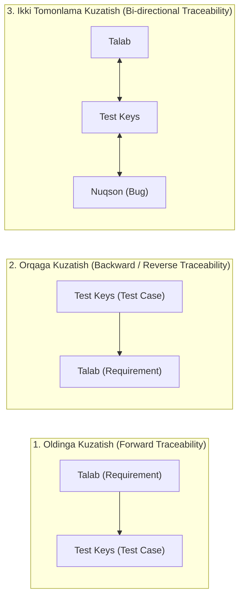

import { Callout } from 'nextra/components'

# Talablar Kuzatuvchanlik Matritsasi (Requirement Traceability Matrix — RTM)

**Talablar Kuzatuvchanlik Matritsasi (Requirement Traceability Matrix — RTM)** — foydalanuvchi va biznes talablarini sinov holatlari (*Test Cases*) hamda aniqlangan nuqsonlar (*Defects*) bilan to'g'ridan-to'g'ri o'zaro bog'lovchi ikki o'lchamli jadval ko'rinishidagi test boshqaruv hujjatidir.

RTM ning asosiy vazifasi — loyihada **birorta ham talab sinovdan chetda qolib ketmasligini (100% test qamrovini)** va dasturga kiritilmagan keraksiz funksiyalar yozilmasligini kafolatlashdir.

---

## 1. RTM Ning Asosiy Turlari

Talablarni kuzatish yo'nalishiga qarab RTM ning 3 ta turi mavjud:

1. **Oldinga kuzatish (Forward Traceability):**
   - Talabdan test keyslar tomon harakatlanadi.
   - *Maqsadi:* Loyihadagi har bir talab uchun test keys yozilganmi yoki yo'qligini tekshirish (Yetishmayotgan testlarni topish).
2. **Orqaga kuzatish (Backward / Reverse Traceability):**
   - Test keysdan talab tomon harakatlanadi.
   - *Maqsadi:* Biz yozgan test keyslar haqiqatan ham tasdiqlangan talabga asoslanganmi yoki jamoa loyihada mavjud bo'lmagan "ortiqcha" funksiyalarni sinayaptimi (Scope Creep-ni aniqlash).
3. **Ikki tomonlama kuzatish (Bi-directional Traceability):**
   - Eng mukammal va professional yondashuv.
   - Talab ↔ Test Keys ↔ Kod ↔ Bug Report o'rtasida to'liq ikki tomonlama aloqani ta'minlaydi.

---

## 2. Namunaviy RTM Jadvali (Amaliy Misol)

Quyida autentifikatsiya va to'lov moduli uchun tuzilgan RTM jadvali keltirilgan:

| Talab ID (Req ID) | Talab Tavsifi (Requirement Description) | Test Case ID | Test Case Tavsifi | Test Status | Defect ID (Agar xato bo'lsa) |
| :--- | :--- | :--- | :--- | :---: | :--- |
| **REQ_AUTH_01** | Foydalanuvchi email va parol bilan tizimga kira olishi kerak. | `TC_LOGIN_01` `TC_LOGIN_02` | To'g'ri login-parol bilan kirish. Noto'g'ri parol kiritilganda xato chiqishi. | Pass Pass | — |
| **REQ_AUTH_02** | 5 marta ketma-ket xato parol terilganda akkaunt 15 daqiqaga bloklanishi kerak. | `TC_LOCK_01` | Brute-force blokirovkasini tekshirish. | Fail | `BUG-405` |
| **REQ_PAY_01** | Xaridor Humo kartasi orqali to'lovni tasdiqlashi lozim. | `TC_PAY_01` `TC_PAY_02` | Muvaffaqiyatli Humo to'lovi. Balans yetarli bo'lmaganda rad etilishi. | Pass Pass | — |
| **REQ_PAY_02** | To'lovdan so'ng xaridorga PDF formatida kvitansiya generatsiya bo'lishi kerak. | `TC_REC_01` | PDF kvitansiyaning yuklanishini tekshirish. | Blocked | `BUG-412` |

---

## 3. RTM Ning Loyihaga Keltiradigan Foydalari

- **Qamrov tahlili (Test Coverage):** Qaysi talablar to'liq tekshirilgan va qaysilari hali sinovdan o'tmaganini bir qarashda ko'rish mumkin;
- **O'zgarishlar ta'sirini baholash (Impact Analysis):** Agar buyurtmachi biror talabni o'zgartirsa, RTM orqali darhol qaysi test keyslar va qaysi modullarni qayta tekshirish kerakligi aniqlanadi;
- **Auditorlik tekshiruvlari:** Xalqaro sertifikatlash (masalan, ISO 29119, CMMI) jarayonlarida RTM loyiha intizomining asosiy isboti hisoblanadi.
