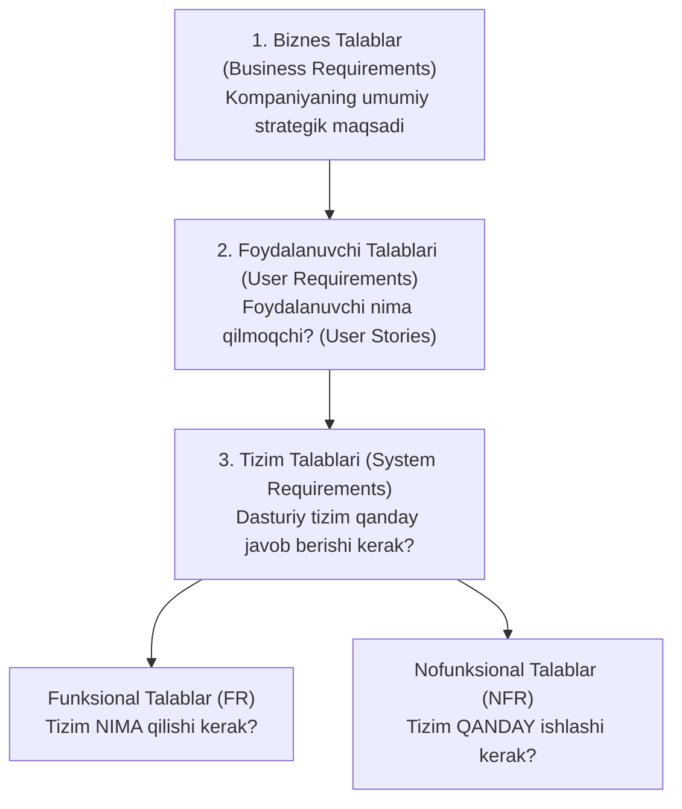
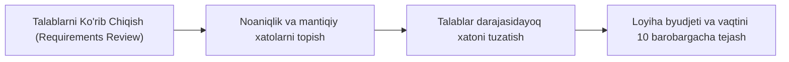

import { Callout } from 'nextra/components'

# Talablar (Requirements)

**Talablar (Requirements)** — ishlab chiqilayotgan dasturiy ta'minot yoki uning alohida komponenti qanday vazifani bajarishi, qanday texnik va funksional xususiyatlarga ega bo'lishi hamda qanday cheklovlar doirasida ishlashi kerakligini belgilovchi qoidalar, shartlar va mezonlar to'plamidir.

Dasturiy ta'minotni sinashda barcha test faoliyati aynan **talablarga** asoslanadi. Agar talab bo'lmasa, dastur to'g'ri yoki noto'g'ri ishlayotganini xolis baholashning imkoni bo'lmaydi.

---

## 1. Talablar Ierarxiyasi va Turlari

Talablar o'z darajasi va qaratilgan sohasiga ko'ra quyidagi guruhlarga bo'linadi:

### 1. Funksional Talablar (Functional Requirements — FR)
Tizimning to'g'ridan-to'g'ri xatti-harakati, funksiyalari va foydalanuvchi bilan o'zaro ta'sirini tavsiflaydi:
- *"Foydalanuvchi o'z parolini SMS orqali tiklay olishi kerak."*
- *"Tizim har bir muvaffaqiyatli to'lovdan so'ng xaridor pochtasiga elektron chek yuborishi shart."*

### 2. Nofunksional Talablar (Non-Functional Requirements — NFR)
Tizimning sifati, xavfsizligi, tezligi va ishonchlilik xususiyatlarini belgilaydi:
- **Unumdorlik (Performance):** *"Sahifa 10 000 ta bir vaqtning o'zidagi so'rovda 1.5 soniyadan kechikmasdan ochilishi kerak."*
- **Xavfsizlik (Security):** *"Barcha parollar ma'lumotlar bazasida bcrypt (kamida 12 raund) bilan xeshlangan holda saqlanishi shart."*
- **Ishonchlilik (Reliability):** *"Tizimning uzluksiz ishlash ko'rsatkichi yiliga 99.9% (Uptime) dan kam bo'lmasligi lozim."*
- **Moslashuvchanlik (Compatibility):** *"Sayt Chrome, Safari, Firefox va Edge brauzerlarida bir xil to'g'ri aks etishi kerak."*

---

## 2. Sifatli Talablarning Mezonlari (SMART & INVEST)

Dasturdagi xatoliklarning 50% dan ortig'i aynan talablardagi noaniqliklar va kamchiliklar sababli yuzaga keladi. Sifatli talab quyidagi mezonlarga javob berishi shart:

- **Aniq va bir ma'noli (Unambiguous):** Matnni ikki xil tushunish imkoni bo'lmasligi kerak (*"Tizim tez ishlashi kerak"* degan noaniq iboralar o'rniga *"Javob vaqti 200 ms dan oshmasligi kerak"* deb yoziladi).
- **To'liq (Complete):** Barcha shartlar, cheklovlar va kutilmagan holatlar (Edge Cases) inobatga olingan bo'lishi lozim.
- **Zidsiz (Consistent):** Bitta talab ikkinchi talabga zid kelmasligi shart.
- **Sinovchan (Testable / Verifiable):** QA muhandisi ushbu talabning bajarilganligini aniq test orqali tekshira olishi kerak.
- **Kuzatiluvchan (Traceable):** Har bir talabning unikal ID raqami bo'lishi va u kod hamda test keyslar bilan bog'lana olishi zarur.

---

## 3. QA Muhandisining Talablar Bosqichidagi O'rni (Static Testing)

Zamonaviy **Shift-Left Testing** konsepsiyasiga binoan, QA muhandisi dasturlash boshlanmasidanoq talablar hujjatini (SRS — *Software Requirements Specification*) sinchiklab tahlil qiladi:

Talablarni erta bosqichda tahlil qilish (Statik Sinov) ishlab chiqish yakunlangach topiladigan qimmat xatolarning oldini oladi.
