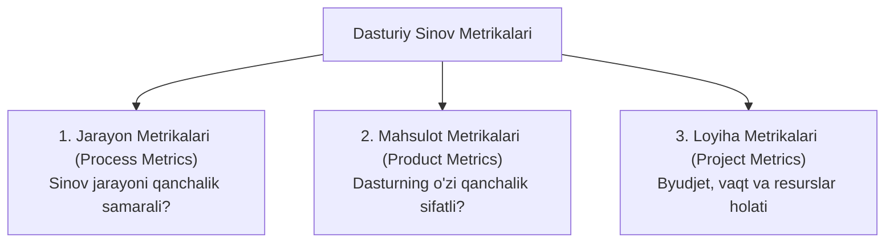

import { Callout } from 'nextra/components'

# Dasturiy Sinov Metrikalari (Software Test Metrics)

**Dasturiy Sinov Metrikalari (Software Test Metrics)** — sinov jarayonining borishi, dasturiy ta'minotning sifati, samaradorligi va test jamoasining mahsuldorligini miqdoriy jihatdan baholash uchun foydalaniladigan raqamli ko'rsatkichlar va o'lchovlar tizimidir.

Menejmentning mashhur qoidasida aytilganidek:
> *"Agar siz biror narsani o'lchay olmasangiz, uni nazorat qila olmaysiz va yaxshilay olmaysiz."*

Metrikalar QA Lead va loyiha rahbariyatiga xolis ma'lumotlar asosida to'g'ri strategik qarorlar qabul qilishga yordam beradi.

---

## 1. Test Metrikalarining Asosiy Guruhlari

Test metrikalari odatda 3 ta katta toifaga bo'linadi:



---

## 2. Eng Muhim Dasturiy Sinov Formulalari

Quyidagi metrikalar har qanday professional QA jamoasining asosiy ko'rsatkichlari hisoblanadi:

### 1. Test Keyslar Ijro Qamrovi (Test Execution Coverage)
Rejalashtirilgan testlarning qancha qismi amalda bajarilganini ko'rsatadi:
```text
Test Execution Coverage (%) = (Bajarilgan Test Keyslar / Jami Rejalashtirilgan Test Keyslar) * 100
```

### 2. Test Keyslarning O'tish Ko'rsatkichi (Test Pass Rate)
Bajarilgan testlarning qanchasi muvaffaqiyatli yakunlanganini bildiradi:
```text
Test Pass Rate (%) = (Muvaffaqiyatli O'tgan Testlar (Passed) / Jami Bajarilgan Testlar) * 100
```

### 3. Nuqsonlar Zichligi (Defect Density)
Dastur kodining ma'lum bir hajmiga (KLOC — ming satr kodga) yoki modulga to'g'ri keladigan nuqsonlar soni:
```text
Defect Density = Topilgan Jami Nuqsonlar Soni / Dastur Hajmi (KLOC yoki Modullar Soni)
```
*Bu ko'rsatkich qaysi modul eng ko'p muammoga egaligini aniqlashga xizmat qiladi.*

### 4. Ishlab Chiqarishga Qochib O'tgan Nuqsonlar (Defect Leakage / Slippage)
QA jamoasi o'tkazib yuborgan va mijozlar tomonidan ishlab chiqarishda (*Production*) topilgan xatolar nisbati:
```text
Defect Leakage (%) = (Production'da Topilgan Nuqsonlar / QA Tomonidan Topilgan Jami Nuqsonlar) * 100
```
*Bu ko'rsatkich qanchalik past bo'lsa (idealda 0-5%), QA jamoasi shunchalik sifatli ishlagan bo'ladi.*

### 5. Nuqsonlarni Bartaraf Qilish Samaradorligi (Defect Removal Efficiency — DRE)
Dastur foydalanuvchilarga berilishidan oldin QA jamoasi xatolarning qancha qismini ushlab qolganligini baholovchi asosiy ko'rsatkich:
```text
DRE (%) = (Relizgacha Topilgan Nuqsonlar / (Relizgacha Topilgan + Relizdan Keyin Topilgan)) * 100
```

---

## 3. Metrikalardan Foydalanishda QA Muhandisi E'tibor Berishi Kerak Bo'lgan Qoidalar

- **Faqat raqam ortidan quvmaslik:** Masalan, agar sinovchi qancha ko'p bug topsa shuncha mukofot olsa, u mayda va ahamiyatsiz xatolarni ko'paytirib, jiddiy arxitektura muammolarini e'tibordan chetda qoldirishi mumkin (Gudxart qonuni — *Goodhart's Law*);
- **Dinamikani kuzatish:** Yagona raqam emas, sprintdan sprintga tendentsiya (Trend) qanday o'zgarayotgani muhim (masalan: Defect Density kamayib bormoqdami?);
- **Avtomatlashtirish:** Metrikalarni qo'lda hisoblab o'tirmasdan, Jira, Allure yoki maxsus QA Dashboard (Grafana) orqali real-vaqtda kuzatish tavsiya etiladi.
