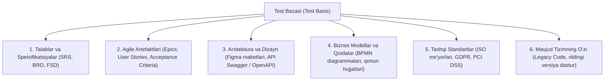
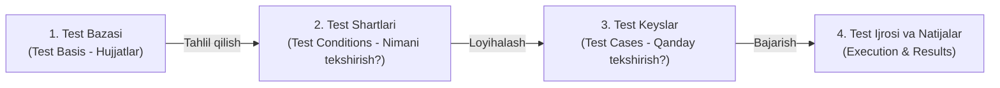

import { Callout } from 'nextra/components'

# Test Bazasi (Test Basis)

**Test Bazasi (Test Basis)** — dasturiy ta'minotni sinash jarayonida test tahlili va loyihalash bosqichlarida talablar, funksiyalar yoki kutilayotgan natijalar olinadigan barcha bilimlar, hujjatlar va manbalar to'plamidir.

ISTQB (*International Software Testing Qualifications Board*) ta'rifiga ko'ra:
> **Test Bazasi** — bu test shartlari va test keyslarni ishlab chiqish uchun asos bo'lib xizmat qiladigan barcha hujjatlar, spetsifikatsiyalar yoki tizim haqidagi ma'lumotlardir.

Oddiy qilib aytganda: **"Biz dastur nima qilishi kerakligini qayerdan bilib olamiz?"** degan savolning javobi aynan Test Bazasidir.

---

## 1. Test Bazasi Nimalardan Tashkil Topishi Mumkin?

Test bazasi loyihaning turi, metodologiyasi (Agile yoki Waterfall) va yetukligiga qarab turlicha manbalardan iborat bo'ladi:

1. **Talablar spetsifikatsiyasi:** SRS (Software Requirements Specification), BRD (Business Requirements Document);
2. **Foydalanuvchi interfeysi (UI/UX) dizaynlari:** Figma, Adobe XD maketlari, dizayn tizimlari;
3. **Texnik va arxitektura hujjatlari:** Ma'lumotlar bazasi diagrammalari (ERD), API spetsifikatsiyalari (Swagger / Postman Collection);
4. **Agile artefaktlari:** User Stories va Acceptance Criteria;
5. **Qonuniy va me'yoriy talablar:** Masalan, bank sohasida Markaziy Bank reglamentlari, xalqaro shifrlash talablari;
6. **Mavjud dastur (Legacy tizimlar):** Agar hujjatlar umuman bo'lmasa, ishlab turgan eski tizimning o'zi yangi tizim uchun test bazasi bo'lib xizmat qiladi.

---

## 2. Test Bazasidan Test Keyslargacha Bo'lgan Zanjir

ISTQB bo'yicha test loyihalash jarayoni doimo quyidagi ketma-ketlikda kechadi:

1. **Test Bazasi tahlil qilinadi:** Talablar o'qiladi, noaniqliklar va kamchiliklar aniqlanadi (Statik sinov).
2. **Test Shartlari (Test Conditions) ajratiladi:** Hujjatdan tekshirilishi kerak bo'lgan barcha jihatlar (masalan: *"Karta raqami uzunligi"*, *"Muddati o'tgan karta xatosi"*) aniqlanadi.
3. **Test Keyslar shakllantiriladi:** Har bir test sharti uchun aniq kiruvchi ma'lumotlar va qadamlar yoziladi.

---

## 3. Test Bazasining Yetarli Emasligi Muammosi

Amaliyotda loyihalarda ko'pincha test bazasi (talablar) to'liq bo'lmaydi, eskirgan bo'ladi yoki umuman mavjud bo'lmaydi. Bunday sharoitda QA muhandisi:
- Dasturchilar va biznes analitiklar bilan faol muloqot qiladi (Savol-javob sessiyalari);
- Raqobatchilarning shunga o'xshash muvaffaqiyatli dasturlarini tahlil qiladi (Benchmarking);
- **Tadqiqotchi sinov (Exploratory Testing)** usullaridan va **Test Orakuli (Test Oracle)** tushunchasidan foydalanadi.
