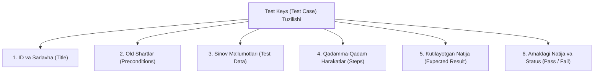

import { Callout } from 'nextra/components'

# Test Keys (Test Case)

**Test Keys (Test Case)** — dasturiy ta'minotning muayyan funksiyasi, talabi yoki xususiyati to'g'ri ishlayotganligini tekshirish uchun zarur bo'lgan kiruvchi ma'lumotlar (*Test Data*), old shartlar (*Preconditions*), qadamma-qadam bajarilish harakatlari (*Test Steps*) va kutilayotgan natijani (*Expected Result*) o'z ichiga olgan batafsil operatsion hujjatdir.

U har doim asosiy savolga javob beradi:
> **"Qanday qilib tekshirish kerak?"** (*"How to test?"*)

---

## 1. Test Keysning Standart Anatomiyasi (Rekvizitlari)

Professional test boshqaruv tizimlarida (Jira Xray, TestRail, Qase) yoziladigan har bir test keys quyidagi majburiy maydonlardan iborat bo'ladi:

1. **Test Case ID:** Unikal identifikator (masalan: `TC_AUTH_001`).
2. **Title (Sarlavha):** Sinovning aniq maqsadi (masalan: *To'g'ri login va parol bilan tizimga kirish*).
3. **Preconditions (Old shartlar):** Sinovni boshlashdan oldin tizim qanday holatda bo'lishi kerakligi (masalan: *Foydalanuvchi bazada mavjud va faol bo'lishi kerak*).
4. **Test Data (Sinov Ma'lumotlari):** Qadamlarda kiritiladigan aniq ma'lumotlar (login: `test@example.com`, parol: `Pass123!`).
5. **Test Steps (Qadamlar):** Sinovchi bajarishi kerak bo'lgan aniq va izchil harakatlar.
6. **Expected Result (Kutilayotgan Natija):** Tizim har bir qadamdan so'ng qanday javob qaytarishi lozimligi.
7. **Actual Result (Amaldagi Natija):** Sinov o'tkazilganda amalda nima yuz berganligi (faqat test o'tkazilgach to'ldiriladi).
8. **Status (Holat):** *Pass* (Muvaffaqiyatli), *Fail* (Xato topildi), *Blocked* (Bloklangan), *Skipped* (O'tkazib yuborilgan).
9. **Severity va Priority:** Jiddiylik va ustuvorlik darajasi.

---

## 2. To'liq Namunaviy Test Keys (Amaliy Jadval)

Quyida autentifikatsiya sahifasi uchun yozilgan real test keys namunasi keltirilgan:

| Maydon | Qiymati |
| :--- | :--- |
| **Test Case ID** | `TC_LOGIN_001` |
| **Modul** | Autentifikatsiya (Auth Module) |
| **Sarlavha** | To'g'ri elektron pochta va parol bilan tizimga muvaffaqiyatli kirish |
| **Old Shartlar** | 1. Foydalanuvchi tizimda ro'yxatdan o'tgan bo'lishi kerak. 2. Brauzerda login sahifasi (`/login`) ochiq bo'lishi kerak. |
| **Sinov Ma'lumotlari** | Email: `qa_user@test.uz`, Parol: `P@ssw0rd2026` |
| **Jiddiyligi (Severity)** | Critical |
| **Ustuvorligi (Priority)** | High |
| **Turi** | Funksional, Ijobiy (Positive Test) |

### Qadamma-Qadam Bajarish Jadvali:

| # | Qadam Harakati (Step) | Kutilayotgan Natija (Expected Result) | Amaldagi Natija | Status |
| :- | :--- | :--- | :--- | :--- |
| **1** | "Email" maydoniga `qa_user@test.uz` manzilini kiriting. | Email maydoni to'ldiriladi, xatolik chiqmaydi. | Mos keldi | Pass |
| **2** | "Parol" maydoniga `P@ssw0rd2026` parolini kiriting. | Kiritilgan belgilar yashirin (yulduzcha yoki nuqta) ko'rinadi. | Mos keldi | Pass |
| **3** | "Kirish" (Login) tugmasini bosing. | Foydalanuvchi shaxsiy kabinetiga (`/dashboard`) o'tadi va yuqori o'ng burchakda foydalanuvchi ismi ko'rinadi. | Mos keldi | Pass |

---

## 3. Sifatli Test Keys Yozishning Oltin Qoidalari (Best Practices)

- **Mustaqillik (Independence):** Har bir test keys boshqa test keyslarga bog'liq bo'lmasligi kerak (masalan, 2-test ishlashi uchun 1-test bajarilgan bo'lishi shart degan cheklov bo'lmasligi lozim).
- **Atomarlik (Atomicity):** Bitta test keys faqat bitta aniq holatni tekshirishi kerak. Bitta testga 10 ta turli xil tekshiruvni tiqishtirmang.
- **Qayta takrorlanuvchanlik (Repeatability):** Istalgan boshqa yangi sinovchi ushbu test keysni o'qib, xuddi siz kabi bir xil natijaga erisha olishi shart.
- **Ijobiy va Salbiy qamrov:** Faqat tizim qanday to'g'ri ishlashini (Happy Path) emas, balki noto'g'ri ma'lumotlar kiritilganda tizim qanday himoyalanishini (Negative Testing) ham qamrab oling.
