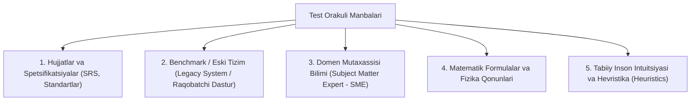

import { Callout } from 'nextra/components'

# Test Orakuli (Test Oracle)

**Test Orakuli (Test Oracle)** — dasturiy ta'minotning amaldagi natijasi (*Actual Result*) to'g'rimi yoki noto'g'rimi ekanligini, ya'ni dastur kutilganidek ishlayotganligini aniqlash va baholash uchun foydalaniladigan mustaqil manba, mezon, qoida yoki mexanizmdir.

ISTQB (*International Software Testing Qualifications Board*) ta'rifiga ko'ra:
> **Test Orakuli** — bu sinovdan o'tkazilayotgan tizimning kutilayotgan natijasi (Expected Result) olinadigan manbadir.

Oddiy savol: **"Dastur to'g'ri ishlaganini biz qayerdan bilamiz?"**  
Agar siz kalkulyatorda `2 + 2` amalini bajarsangiz va u `4` chiqarsa, siz uning to'g'riligini bilasiz, chunki sizning ongingizda arifmetika qoidalari — **Test Orakuli** vazifasini o'taydi.

---

## 1. Test Orakulining Asosiy Manbalari

Dasturiy ta'minotni sinashda orakul vazifasini quyidagi manbalar bajarishi mumkin:

1. **Talablar va Texnik Hujjatlar:** Eng keng tarqalgan orakul. Dastur aynan spetsifikatsiyada (SRS, User Story) yozilganidek ishlashi lozim.
2. **Eski yoki Muqobil Tizim (Legacy Software / Benchmark):** Yangi tizim eski tizim bilan almashtirilayotganda, bir xil kiruvchi ma'lumotlar ikkala tizimga ham beriladi va natijalar bir-biriga solishtiriladi (*Parallel Run Testing*).
3. **Domen Mutaxassisi (Subject Matter Expert — SME):** Murakkab tibbiy, geologik yoki buxgalteriya tizimlarida qoidalar hujjatda bo'lmasligi mumkin. Bu holda tajribali buxgalter yoki shifokor orakul vazifasini o'taydi.
4. **Matematik Qonunlar:** Masalan, grafik dasturda burchaklarni hisoblash trigonometrik qoidalarga solishtirib tekshiriladi.
5. **Hevristikalar va Foydalanuvchi Tajribasi:** Tizim qulayligi (Usability), dizayn uyg'unligi va intuitiv harakatlar.

---

## 2. "Orakul Muammosi" (The Oracle Problem)

Dasturiy ta'minot muhandisligida **"Orakul Muammosi" (The Oracle Problem)** degan mashhur ilmiy konsept mavjud:

> [!WARNING] Orakul Muammosi Nima?
> Bu — dasturga kiritilgan ma'lumotlar natijasida kutilayotgan javobni oldindan aniqlash imkonsiz yoki iqtisodiy jihatdan haddan tashqari qimmat bo'lgan holatdir.

### Orakul Muammosi Qachon Yuzaga Keladi?
1. **Sun'iy Intellekt va Mashinali O'rganish (AI / Machine Learning):**
   - Neyrotarmoq bergan javob (masalan: rentgen tasvirida o'simtani aniqlash) 100% to'g'ri yoki noto'g'riligini oldindan matematik formula bilan qat'iy tekshirib bo'lmaydi.
2. **Katta Ma'lumotlar (Big Data) va Simulyatorlar:**
   - Ob-havo bashorati dasturi yoki aerodinamik simulyatsiya millionlab parametrlarni hisoblaydi. Sinovchi bu natijani qo'lda hisoblab tekshira olmaydi.
3. **Qidiruv Tizimlari Algoritmlari:**
   - Google yoki Yandex qidiruv natijalarining tartibi (relevance) to'g'ri shakllanganligini qat'iy formula bilan tekshirishning imkoni yo'q.

---

## 3. Orakul Muammosini Hal Qilish Yondashuvlari

Orakul mavjud bo'lmagan murakkab tizimlarni sinash uchun QA sohasi quyidagi usullarni ishlab chiqqan:

- **Metamorfik Sinov (Metamorphic Testing):** Natijaning o'zini emas, balki kiruvchi ma'lumotlar o'zgarganda natijaning o'zgarish xususiyatini tekshirish (Masalan: agar `x` o'rniga `2x` berilsa, natija ikki barobar oshishi kerak degan qonuniyat tekshiriladi);
- **A/B Sinovlari:** Haqiqiy foydalanuvchilar oqimini ikki guruhga bo'lib, xatti-harakatlarni taqqoslash;
- **Ko'plik Orakullari (Pseudo-Oracles):** Bir xil algoritmni mustaqil ikki xil dasturchiga yozdirib, ularning natijalarini bir-biriga solishtirish.
