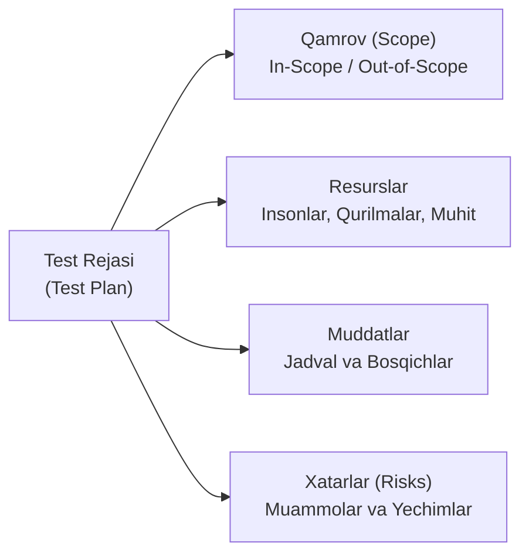
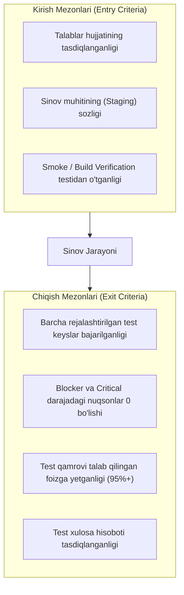

import { Callout } from 'nextra/components'

# Test Rejasi (Test Plan)

**Test Rejasi (Test Plan)** — muayyan dasturiy loyiha, reliz yoki sprint doirasida sinov jarayonining nimalarni o'z ichiga olishi (*Scope*), qanday resurslar, muddatlar, vositalar va mas'uliyatlar asosida tashkil etilishini belgilovchi boshqaruv va amaliy yo'riqnoma hujjatidir.

Dasturiy ta'minotni sinash sohasida klassik Test Rejasi **IEEE 829** (hozirgi kunda **ISO/IEC/IEEE 29119-3**) xalqaro standarti asosida shakllantiriladi.

---

## 1. Test Rejasining Maqsadi va Ahamiyati

Test Rejasi loyihaning barcha a'zolari (QA jamoasi, dasturchilar, loyiha menejerlari — PM, biznes egalari) uchun yagona o'zaro kelishuv shartnomasi hisoblanadi:

- **Noaniqlikni yo'qotish:** Jamoa a'zolari aynan nimani sinash kerakligi va nimani sinash shart emasligini biladi;
- **Resurslarni rejalashtirish:** Qancha sinovchi, qanday qurilmalar (iOS, Android, Windows) va qanday test muhitlari kerakligi oldindan ajratiladi;
- **Muddatlarni nazorat qilish:** Sinov qachon boshlanishi, oraliq nazorat nuqtalari va yakuniy reliz sanasi muvofiqlashtiriladi;
- **Xatarlarni boshqarish:** Dastur kechikib berilsa yoki muhitda muammo chiqsa, qanday chora ko'rilishi oldindan belgilanadi.

---

## 2. IEEE 829 Standarti Bo'yicha 16 Ta Klassik Bo'lim

IEEE 829 standarti to'laqonli Test Rejasi uchun quyidagi 16 ta bandni tavsiya etadi:

1. **Test Plan Identifier:** Hujjatning unikal raqami va versiyasi (masalan: `TP-MOBILE-V1.2`).
2. **Introduction (Kirish):** Loyihaning umumiy tavsifi, maqsadi va qisqacha mazmuni.
3. **Test Items (Sinov Obyektlari):** Sinovdan o'tishi kerak bo'lgan dasturiy modullar, versiyalar yoki servislar ro'yxati.
4. **Features to be Tested (In-Scope):** Sinov qamroviga kiritilgan barcha funksiyalar (masalan: avtorizatsiya, savat, to'lov).
5. **Features not to be Tested (Out-of-Scope):** Sinov qamroviga kiritilmagan qismlar va sababi (masalan: uchinchi tomon SMS provayderi ichki kodi).
6. **Approach (Yondashuv):** Qanday sinov usullari qo'llanilishi (Manual, Automation, API, UI, Performance).
7. **Item Pass/Fail Criteria:** Test holati muvaffaqiyatli yoki muvaffaqiyatsiz deb topilishining aniq qoidalari.
8. **Suspension and Resumption Criteria (Sinovni To'xtatish va Qayta Tiklash):**
   - *To'xtatish:* Masalan, bloklovchi nuqson (Blocker Bug) tufayli butun ilova ochilmasa, sinov to'xtatiladi;
   - *Qayta tiklash:* Yangi tuzatilgan versiya taqdim etilgach, sinov davom ettiriladi.
9. **Test Deliverables (Yetkaziladigan Artefaktlar):** Sinov doirasida tayyorlanadigan hujjatlar (Test Cases, Defect Reports, Test Summary Report).
10. **Testing Tasks (Sinov Vazifalari):** Bajarilishi lozim bo'lgan barcha vazifalar ketma-ketligi.
11. **Environmental Needs (Muhitga Bo'lgan Talablar):** Serverlar, brauzerlar, mobil qurilmalar, operatsion tizimlar va tarmoq sozlamalari.
12. **Responsibilities (Mas'uliyatlar):** Kim qaysi modulni sinashiga javobgar (RACI matritsasi).
13. **Staffing and Training Needs (Xodimlar va Ta'lim):** Sinovchilar malakasi, qo'shimcha o'qitish yoki yangi mutaxassislarni jalb qilish zarurati.
14. **Schedule (Sinov Jadvali):** Aniq sanalar, bosqichlar va muddatlar.
15. **Risks and Contingencies (Xatarlar va Ehtimoliy Rejalar):** Ehtimoliy xatarlar (masalan, API kechikishi) va B-reja.
16. **Approvals (Tasdiqlashlar):** Hujjatni tasdiqlovchi shaxslar (QA Lead, PM, Product Owner) imzolari.

---

## 3. Kirish va Chiqish Mezonlari (Entry & Exit Criteria)

Har qanday Test Rejasining eng amaliy qismi bu sinovga kirish va sinovdan chiqish mezonlaridir:

---

## 4. Test Rejasi Turlari

Murakkab yirik korxonalarda Test Rejalari pog'onali tuziladi:

- **Bosh Test Rejasi (Master Test Plan):** Butun loyiha bo'yicha barcha sinov bosqichlarini yuqori darajada muvofiqlashtiruvchi umumiy reja.
- **Bosqichli Test Rejalari (Phase / Level Test Plans):** Muayyan sinov darajalari bo'yicha alohida batafsil rejalar:
  - *Integration Test Plan;*
  - *System Test Plan;*
  - *Performance Test Plan;*
  - *User Acceptance Test (UAT) Plan.*
