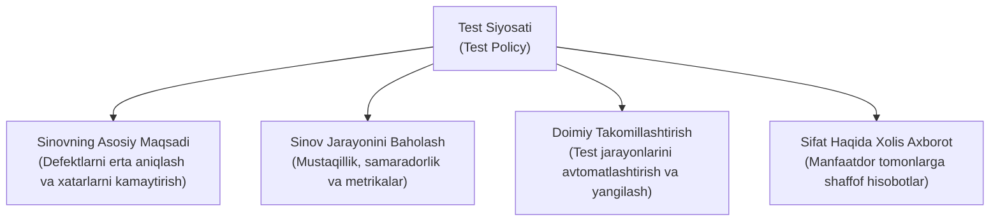

import { Callout } from 'nextra/components'

# Test Siyosati (Test Policy)

**Test Siyosati (Test Policy)** — kompaniyaning umumiy Sifat Siyosatidan kelib chiqqan holda, butun tashkilot miqyosida dasturiy ta'minotni sinash faoliyatining umumiy maqsadlari, tamoyillari, qiymati va mezonlarini belgilab beruvchi eng yuqori darajadagi ixtisoslashgan test hujjatidir.

ISTQB (*International Software Testing Qualifications Board*) standartiga ko'ra, Test Siyosati kompaniya sinov jarayonidan nimani kutayotgani va sinovga qanday yondashishini qisqa va qat'iy bayon qiladi.

---

## 1. Test Siyosatining Asosiy Vazifalari

Test siyosati tashkilotdagi barcha loyihalar va jamoalar uchun yagona yo'naltiruvchi kompas vazifasini o'taydi:

1. **Sinovning maqsadini aniqlash:** Testlash faqat xato qidirish emas, balki biznes xatarlarini kamaytirish va mahsulot sifati haqida aniq axborot berish vositasidir.
2. **Sinov mustaqilligi (Independence of Testing):** Dasturchi o'z kodini o'zi to'liq sinamasligi kerak; mustaqil QA muhandislari va tashqi auditorlar ishtiroki qoidalari belgilanadi.
3. **Muvaffaqiyat mezonlari:** Sinov jarayoni qachon samarali deb hisoblanishi aniq ko'rsatkichlar (metrikalar) orqali shakllantiriladi.
4. **Resurslar va ta'lim:** Sinovchilarning malakasini oshirish va zamonaviy sinov vositalarini joriy etish majburiyati olinadi.

---

## 2. Test Siyosatining Standart Bo'limlari

ISTQB va ISO/IEC/IEEE 29119-3 tavsiyalariga binoan, yaxshi tuzilgan Test Siyosati quyidagi bandlarni o'z ichiga oladi:

- **Kirish va Qo'llanish Sohasi:** Siyosat qaysi mahsulotlar va bo'limlar uchun amal qilishi.
- **Sinov Falsafasi va Maqsadlari:** Dasturiy ta'minot hayot siklida (SDLC) testlashning o'rni (masalan: *Shift-Left* — sinovni talablar bosqichidanoq erta boshlash).
- **Sinov Mustaqilligi Darajalari:** Mustaqil QA bo'limi, avtomatlashtirish guruhi yoki tashqi xavfsizlik auditorlarining o'rni.
- **Sinov Jarayonini Baholash Mezonlari:** Sinov samaradorligi qanday o'lchanadi (Defect Detection Percentage — DDP, Test Coverage).
- **Sinovni Takomillashtirish Rejasi:** TPI (Test Process Improvement) yoki TMMi (Test Maturity Model integration) modellarini tatbiq etish.

---

## 3. Namunaviy Test Siyosati Hujjati

Quyida namunaviy dasturiy ta'minot kompaniyasining Test Siyosati keltirilgan:

> ### Kompaniya Test Siyosati (Namunaviy Shabloni)
>
> 1. **Maqsad:** Ushbu siyosat kompaniyada ishlab chiqilayotgan barcha dasturiy mahsulotlarning yuqori sifat, ishonchlilik va xavfsizlik standartlariga javob berishini ta'minlash uchun sinov jarayonining umumiy qoidalarini belgilaydi.
> 2. **Asosiy Tamoyillar:**
>    - *Erta sinov:* Testlash talablar shakllantirilgan ilk kundanoq (statik tahlil orqali) boshlanadi;
>    - *Xatarlarga asoslangan yondashuv (Risk-Based Testing):* Resurslar va vaqt birinchi navbatda biznes uchun eng muhim va xatarli modullarga qaratiladi;
>    - *Avtomatlashtirish ustuvorligi:* Qaytariluvchi regressiya testlarining kamida 70% qismi CI/CD konveyerida avtomatlashtirilishi shart.
> 3. **Sinov Mustaqilligi:** Barcha dasturiy mahsulotlar ishlab chiqarishga (Production) chiqishidan oldin dasturchilardan mustaqil bo'lgan QA jamoasi tomonidan tasdiqlanishi shart.
> 4. **Metrikalar:** Dastur ishlab chiqarishga chiqqandan so'ng topilgan kritik nuqsonlar soni umumiy nuqsonlarning 5 foizidan oshmasligi kerak (DDP >= 95%).

---

## 4. Test Siyosati va Boshqa Hujjatlarning Taqqoslovi

| Xususiyat | Test Siyosati (Test Policy) | Test Strategiyasi (Test Strategy) | Test Rejasi (Test Plan) |
| :--- | :--- | :--- | :--- |
| **Qamrovi** | Butun kompaniya / Tashkilot | Muayyan loyiha yoki mahsulot liniyasi | Aniq loyiha, reliz yoki sprint |
| **Kim tuzadi?** | Oliy rahbariyat / QA Direktori | QA Lead / QA Menejer | QA Lead / Test Injinirlari |
| **O'zgarish davriyligi**| Juda kam (1-2 yilda bir marta) | Loyiha arxitekturasi o'zgarganda | Har bir sprint yoki relizda |
| **Asosiy savol** | *"Nima uchun va qanday maqsadlarda testlaymiz?"* | *"Qanday texnik usullar bilan testlaymiz?"* | *"Kim, qachon va nimani testlaydi?"* |
