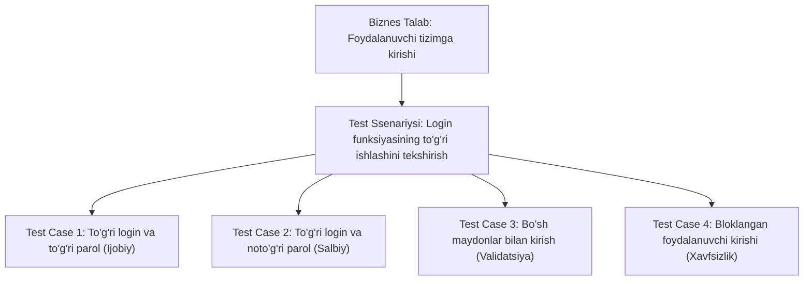

import { Callout } from 'nextra/components'

# Test Ssenariysi (Test Scenario)

**Test Ssenariysi (Test Scenario)** — dasturiy ta'minotning qaysi funksiyasi, moduli yoki xususiyatini tekshirish lozimligini yuqori darajada belgilab beruvchi qisqa, bir satrli test vazifasidir.

U har doim bitta asosiy savolga javob beradi:
> **"Nimani tekshirish kerak?"** (*"What to test?"*)

Test ssenariylari loyihaning boshlang'ich tahlil bosqichida biznes talablar, foydalanuvchi tarixlari (*User Stories*) yoki foydalanish holatlari (*Use Cases*) asosida ishlab chiqiladi va keyinchalik batafsil **Test Keyslar (Test Cases)** uchun asos bo'lib xizmat qiladi.

---

## 1. Test Ssenariysi Qanday Tuziladi?

Test ssenariysi odatda **"Tekshirish..."**, **"Sinash..."** (*"Verify that..."*, *"Check..."*) so'zlari bilan boshlanadi va biznes logikasini aniq ifodalaydi.

Bitta Test Ssenariysi o'z ichiga **bir nechta batafsil Test Keyslarni** (ijobiy, salbiy va chegaraviy holatlarni) birlashtirishi mumkin (1-to-Many bog'liqligi).

---

## 2. Test Ssenariylariga Amaliy Misollar

Quyida turli sohalar bo'yicha namunaviy Test Ssenariylari keltirilgan:

### 1. Elektron Tijorat (E-Commerce) Tizimi:
- **TS_01:** Yangi foydalanuvchining elektron pochta orqali muvaffaqiyatli ro'yxatdan o'tishini tekshirish.
- **TS_02:** Mahsulotni qidiruv satri orqali nom bo'yicha topish imkoniyatini tekshirish.
- **TS_03:** Savatga tovar qo'shish va tovarlar sonini o'zgartirishni tekshirish.
- **TS_04:** Humo/Uzcard kartasi orqali to'lovni muvaffaqiyatli amalga oshirishni tekshirish.
- **TS_05:** Promokod qo'llanilganda narxning to'g'ri kamayishini tekshirish.

### 2. Bank Mobil Ilovasi:
- **TS_06:** Kartadan kartaga pul o'tkazish (P2P) funksiyasini tekshirish.
- **TS_07:** Balans yetarli bo'lmaganda o'tkazma rad etilishini tekshirish.
- **TS_08:** Biometrik autentifikatsiya (Face ID / Touch ID) orqali ilovaga tezkor kirishni tekshirish.

---

## 3. Qachon Test Ssenariysi Yozish Yetarli Bo'ladi?

Batafsil Test Keyslar yozish ko'p vaqt va resurs talab qiladi. Ayrim hollarda faqat Test Ssenariylari bilan cheklanish maqsadga muvofiqdir:

1. **Agile va vaqt cheklovlari:** Sprint muddati juda qisqa bo'lib, har bir qadamni batafsil yozishga vaqt bo'lmaganda;
2. **Tajribali jamoa:** Sinovchilar dasturni va biznes sohani chuqur bilishsa, ularga qadamlarni birma-bir ko'rsatish shart emas;
3. **Erta bosqichlar (Tadqiqotchi sinov — Exploratory Testing):** Sinovchi yuqori darajadagi ssenariy asosida erkin harakatlanadi;
4. **Loyiha prototiplari:** Talablar har kuni o'zgarib turgan boshlang'ich fazalarda.

---

## 4. Test Ssenariysi va Test Keys Taqqoslovi

| Xususiyat | Test Ssenariysi (Test Scenario) | Test Keys (Test Case) |
| :--- | :--- | :--- |
| **Savoli** | *"Nimani tekshirish kerak?"* | *"Qanday qilib tekshirish kerak?"* |
| **Tafsiloti** | Bir qatorda umumiy yo'nalish | Qadamma-qadam, kiruvchi ma'lumotlar va kutilgan natija bilan |
| **Tayyorlash vaqti** | Tez (bir necha daqiqa) | Ko'p vaqt talab qiladi |
| **Bog'liqlik darajasi** | 1 ta ssenariy = Ko'plab test keyslar | Muayyan ssenariyning bitta aniq shoxobchasi |
| **Misol** | *"Parolni tiklash funksiyasini tekshirish"* | *"Havolani bosish, yangi 8 xonali parol kiritish va saqlash tugmasini bosish"* |
