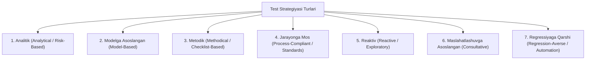

import { Callout } from 'nextra/components'

# Test Strategiyasi (Test Strategy)

**Test Strategiyasi (Test Strategy)** — dasturiy mahsulot yoki butun loyiha doirasida sifat maqsadlariga qanday erishishni belgilovchi, uzoq muddatli va yuqori darajadagi texnik-strategik hujjatdir.

U odatda **QA Lead**, **QA Arxitektor** yoki **QA Menejer** tomonidan loyihaning dastlabki bosqichlarida ishlab chiqiladi. Unda testlash qanday usullar, vositalar, yondashuvlar va mezonlar orqali amalga oshirilishi aniq bayon qilinadi.

---

## 1. Test Strategiyasining Asosiy Turlari (ISTQB Bo'yicha)

ISTQB standarti test strategiyalarini 7 ta asosiy toifaga ajratadi. Loyiha xususiyatiga qarab bir nechta yondashuv birlashtirib qo'llanilishi mumkin:

1. **Analitik yondashuv (Analytical / Risk-Based Testing):** Sinov talablar yoki xatarlarni chuqur tahlil qilish asosida rejalashtiriladi. Eng ko'p xatarga ega modullar birinchi bo'lib va chuqurroq sinovdan o'tkaziladi.
2. **Modelga asoslangan yondashuv (Model-Based Testing):** Dasturning ishlash modeli (holatlar o'tish diagrammasi — State Transition, biznes jarayon modellari) tuzilib, test keyslar shu model asosida avtomatik yoki qo'lda yaratiladi.
3. **Metodik yondashuv (Methodical Testing):** Qat'iy nazorat ro'yxatlari (checklists), xatolar taksonomiyasi (Error Guessing) yoki ISO sifat xususiyatlari asosida izchil tekshiruv.
4. **Jarayonga mos yondashuv (Process / Standard-Compliant):** Qat'iy qonuniy va sanoat standartlariga (masalan: tibbiyotda FDA, avtomobilsozlikda ISO 26262, moliya sektorida PCI DSS) asoslanadi.
5. **Reaktiv yondashuv (Reactive / Dynamic):** Dastlabki rejalardan ko'ra dasturning real xatti-harakatiga qarab qaror qabul qilinadi (Tadqiqotchi sinov — *Exploratory Testing*).
6. **Maslahatlashuvga asoslangan (Consultative / Directed):** Sinov doirasi tashqi ekspertlar, biznes analitiklar yoki foydalanuvchilarning maslahatlari va yo'l-yo'riqlari bo'yicha shakllantiriladi.
7. **Regressiyaga qarshi yondashuv (Regression-Averse):** Asosiy e'tibor yangi o'zgarishlar eski funksiyalarni buzib qo'ymasligiga qaratiladi. Bunga keng qamrovli avtomatlashtirilgan testlar orqali erishiladi.

---

## 2. Test Strategiyasi Hujjatining Tuzilishi

Yaxshi yozilgan Test Strategiyasi quyidagi bo'limlardan tashkil topadi:

### 1. Sinov Qamrovi (Scope):
- **In-Scope:** Sinovga kiritilgan barcha funksiyalar va modullar.
- **Out-of-Scope:** Nimalar sinovdan o'tkazilmaydi va nima sababdan (masalan: uchinchi tomon to'lov shlyuzining ichki algoritmlari).

### 2. Sinov Darajalari (Test Levels):
- **Unit Testing:** Dasturchilar tomonidan bajariladigan komponent sinovlari;
- **Integration Testing:** Modullar va API-lar integratsiyasi;
- **System Testing:** Butun tizimning to'liq funksional va nofunksional sinovi;
- **Acceptance Testing (UAT):** Buyurtmachi tomonidan yakuniy qabul qilish.

### 3. Sinov Turlari (Test Types):
- Funksional sinovlar;
- Unumdorlik va yuklama sinovlari (Performance & Load);
- Xavfsizlik sinovlari (Security Testing);
- Moslashuvchanlik va kross-brauzer sinovlari (Compatibility Testing).

### 4. Sinov Muhitlari va Ma'lumotlari (Environments & Test Data):
- QA Dev muhiti, Staging/UAT muhiti talablari;
- Maxfiy mijoz ma'lumotlarini anonimlashtirish (Data Masking) qoidalari.

### 5. Avtomatlashtirish Yondashuvi (Automation Approach):
- Qaysi qatlamlar (API yoki UI) avtomatlashtirilishi;
- Dasturlash tillari va freymvorklar (masalan: Playwright, Cypress, Selenium, Postman/Newman).

### 6. Sinov Asboblari (Testing Tools):
- Test Management: Jira + Xray / TestRail;
- CI/CD integratsiyasi: GitHub Actions, GitLab CI, Jenkins.

### 7. Kirish va Chiqish Mezonlari (Entry & Exit Criteria):
- Qachon sinov boshlanadi (Entry) va qachon mahsulot sifatli deb qabul qilinadi (Exit).

---

## 3. Test Strategiyasi va Test Rejasi Taqqoslovi

| Mezon | Test Strategiyasi (Test Strategy) | Test Rejasi (Test Plan) |
| :--- | :--- | :--- |
| **Darajasi** | Yuqori darajadagi texnik konsepsiya | Boshqaruv va operatsion reja |
| **Qamrovi** | Mahsulot yoki butun tashkilot | Muayyan loyiha, reliz yoki sprint |
| **Savoli** | *"Qanday texnik yo'l bilan sinaymiz?"* | *"Kim, qachon, nimani va qancha muddatda sinaydi?"* |
| **O'zgaruvchanligi** | Kamdan-kam o'zgaradi (barqaror) | Har bir reliz yoki talab o'zgarganda yangilanadi |
| **Tuzuvchi** | QA Lead / QA Menejer | QA Lead / QA Engineer |
| **Bog'liqligi** | Test Plan uchun asos bo'lib xizmat qiladi | Test Strategiyasidagi tamoyillarni amalda bajaradi |
