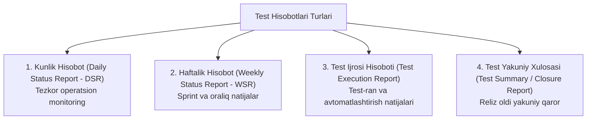

import { Callout } from 'nextra/components'

# Test Hisobotlari Turlari (Types of Test Reports)

**Test Hisoboti (Test Report)** — sinov faoliyati davomida erishilgan natijalar, o'tkazilgan testlar hajmi, aniqlangan xatoliklar statistikasi va dasturiy mahsulotning umumiy sifat holatini manfaatdor tomonlarga (*stakeholders: Product Owner, PM, QA Lead, mijozlar*) yetkazuvchi rasmiy tahliliy hujjatdir.

Sifatli test hisoboti loyiha rahbariyatiga dasturiy ta'minotni ishlab chiqarishga (*Production / Release*) chiqarish yoki relizni kechiktirish bo'yicha asosli qaror qabul qilish imkonini beradi.

---

## 1. Test Hisobotlarining Asosiy Turlari

Sinov bosqichining davomiyligi va auditoriyaga qarab quyidagi test hisobotlari qo'llaniladi:

### 1. Kunlik Test Hisoboti (Daily Status Report — DSR)
- **Maqsadi:** Bugungi kunda qilingan ishlar, topilgan xatolar va jamoa duch kelayotgan to'siqlarni (Blockers) ko'rsatish;
- **Kimga:** QA Lead, Scrum Master, Loyiha Menejeri;
- **Mazmuni:**
  - Bugun bajarilgan test keyslar soni;
  - Bugun ochilgan va yopilgan xatolar;
  - Ertaga rejalashtirilgan ishlar;
  - To'siqlar (masalan: *Staging server ishlamay qoldi*).

### 2. Haftalik Test Hisoboti (Weekly Status Report — WSR)
- **Maqsadi:** Butun hafta yoki sprint davomida sifat dinamikasi qanday o'zgarganini umumlashtirish;
- **Kimga:** Loyiha Menejerlari va Bo'lim Boshliqlari;
- **Mazmuni:**
  - Hafta davomida o'tkazilgan testlar foizi;
  - Xatolarning jiddiyligi (Severity) bo'yicha taqsimoti;
  - Rejadan ortda qolish yoki reja bo'yicha ketayotganlik holati.

### 3. Test Ijrosi Hisoboti (Test Execution Report)
- **Maqsadi:** Aniq bir test to'plami (Test Suite yoki Test Run) natijalarini ko'rsatish;
- Odatda **avtomatlashtirilgan test asboblari** (Allure Report, ExtentReports, Playwright HTML Report) yoki TestRail tizimi tomonidan avtomatik generatsiya qilinadi;
- Qaysi testlar o'tdi (*Passed*), qaysilari yiqildi (*Failed*), yiqilish sabablari, xatolik skrinshotlari va ijro vaqti (Execution Time) grafiklar bilan aks etadi.

### 4. Test Yakuniy Xulosa Hisoboti (Test Summary / Closure Report)
- **Eng muhim va rasmiy hujjat!**
- Butun loyiha yoki yirik reliz yakunlanganda tuziladi.
- Loyiha rahbariyati ushbu hisobotga qarab **"Go / No-Go"** (Mahsulotni reliz qilish yoki qilmaslik) qarorini qabul qiladi.

---

## 2. Test Yakuniy Xulosa Hisoboti Tuzilishi (IEEE 829 Standarti)

To'liq Test Summary Report quyidagi asosiy bo'limlarni o'z ichiga oladi:

1. **Hujjat haqida ma'lumot:** Loyiha nomi, reliz versiyasi, hisobot sanasi va muallif;
2. **Qisqacha xulosa (Executive Summary):** Rahbariyat uchun 1 abzatsda umumiy xulosa;
3. **Sinov qamrovi (Scope):** Nimalar to'liq sinovdan o'tdi va nimalar qamrab olinmadi;
4. **Test ijrosi statistikasi:**
   - Jami rejalashtirilgan testlar: `250`
   - Bajarilgan testlar: `248` (99.2%)
   - Muvaffaqiyatli (Passed): `238` (96%)
   - Yiqilgan (Failed): `10` (4%)
   - Bloklangan (Blocked): `2`
5. **Defektlar statistikasi:**
   - Jami topilgan nuqsonlar: `45`
   - Tuzatilgan va yopilgan: `42`
   - Ochiq qolgan nuqsonlar: `3` (Faqat *Minor* va *Trivial* darajadagi)
   - *Blocker* va *Critical* ochiq nuqsonlar soni: **`0`**
6. **Chiqish mezonlarining (Exit Criteria) bajarilishi:** Test rejada belgilangan barcha shartlar bajarildimi?
7. **Xatarlar va Tavsiyalar:** Masalan: *"Ilova relizga tayyor, biroq keyingi yangilanishda keshni tozalash mexanizmini yaxshilash tavsiya etiladi"*.
8. **Yakuniy qaror (Verdict):** **Tavsiya etiladi (Accepted for Release)**.
