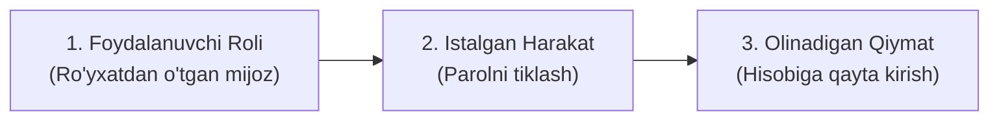

import { Callout } from 'nextra/components'

# Foydalanuvchi Tarixlari (User Stories)

**Foydalanuvchi Tarixi (User Story)** — Agile / Scrum dasturiy ta'minot ishlab chiqish metodologiyasida tizimning muayyan bir xususiyati yoki funksiyasi yakuniy foydalanuvchi (*end-user*) nuqtai nazaridan, sodda va tushunarli tilda yozilgan qisqa talab tavsifidir.

U texnik jargonlardan xoli bo'lib, asosiy e'tiborni **"Kimga kerak?"**, **"Nima kerak?"** va **"Nima uchun kerak?"** degan savollarga qaratadi.

---

## 1. Standart User Story Shablonlari

Klassik User Story quyidagi xalqaro andoza bo'yicha shakllantiriladi:

```text
As a [Foydalanuvchi Roli],
I want to [Amal / Funksiya],
So that [Biznes Qiymati / Maqsad].
```

O'zbek tilidagi talqini:
```text
Sifatida [Kim?],
Men xohlayman [Nimani?],
Natijada [Qanday foyda / qiymat ko'raman?].
```



### Amaliy Misollar:
- *"Sifatida **onlayn xaridor**, men **tovarlarni narx bo'yicha saralashni** xohlayman, natijada **o'z byudjetimga mos mahsulotlarni tezroq topa olaman**."*
- *"Sifatida **tizim administratori**, men **barcha foydalanuvchilar harakatlari loglarini yuklab olishni** xohlayman, natijada **xavfsizlik qoidabuzarliklarini o'z vaqtida aniqlay olaman**."*

---

## 2. Ron Jeffries ning 3C Modeli

Yaxshi User Story shunchaki Jira kartochkasi emas. U **3C modeli** asosida ishlaydi:

1. **Card (Karta):** Talabning qisqa ifodasi (odatda stikerda yoki Jira biletida yoziladi).
2. **Conversation (Muloqot):** Mahsulot egasi (PO), dasturchilar va QA muhandislari o'rtasidagi yuzma-yuz muhokama. Unda talabning barcha nozik jihatlari va savollar yechiladi.
3. **Confirmation (Tasdiqlash):** Story qachon to'liq bajarilgan deb hisoblanishini belgilovchi **Qabul Qilish Mezonlari (Acceptance Criteria)**.

---

## 3. INVEST Sifat Mezonlari

Har bir sifatli User Story **INVEST** qoidalariga javob berishi lozim:

| Harf | Tamoyil | Ma'nosi |
| :--- | :--- | :--- |
| **I** | **Independent** (Mustaqil) | Boshqa User Story-larga bog'liq bo'lmasligi, alohida ishlab chiqilishi va sinovdan o'tkazilishi mumkin bo'lishi kerak. |
| **N** | **Negotiable** (Muzokaraga ochiq) | Qat'iy qotib qolgan shartnoma emas, jamoa muhokamasida o'zgarishi mumkin bo'lgan jonli talab. |
| **V** | **Valuable** (Qiymatli) | Yakuniy foydalanuvchiga yoki biznesga aniq amaliy foyda keltirishi shart. |
| **E** | **Estimable** (Baholash mumkin) | Jamoa uni amalga oshirishga qancha vaqt va mehnat (Story Points) ketishini chamalay olishi lozim. |
| **S** | **Small** (Kichik) | Bitta sprint (odatda 1-2 hafta) ichida dasturlanib, sinovdan o'tib, tugallanishi mumkin bo'lgan hajmda bo'lishi kerak. |
| **T** | **Testable** (Sinovchan) | QA muhandisi ushbu hikoya to'g'ri ishlaganini aniq test keyslar orqali tekshira olishi shart. |

---

## 4. Epik (Epic) va User Story O'rtasidagi Bog'liqlik

- **Epik (Epic):** Bitta sprintga sig'maydigan juda katta hajmdagi strategik maqsad yoki modul (masalan: *"To'liq to'lov tizimini integratsiya qilish"*).
- **User Story:** Epik bir nechta kichik, mustaqil foydalanuvchi hikoyalariga bo'linadi (masalan: *"Humo bilan to'lash"*, *"Uzcard bilan to'lash"*, *"To'lov chekini ko'rish"*).
