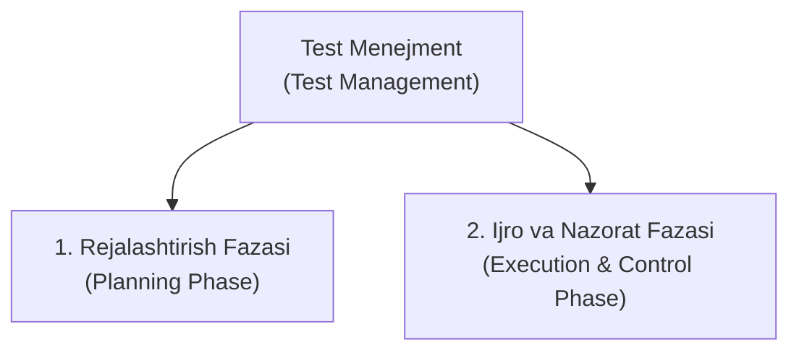
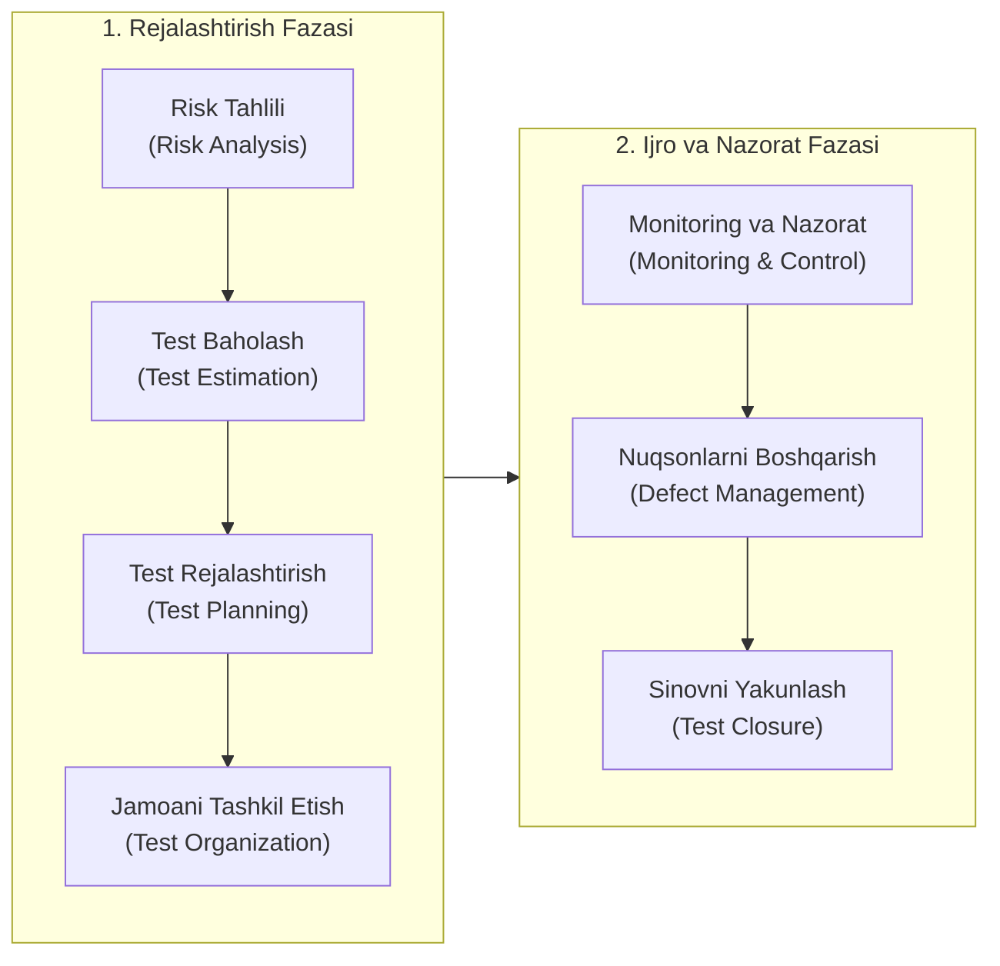
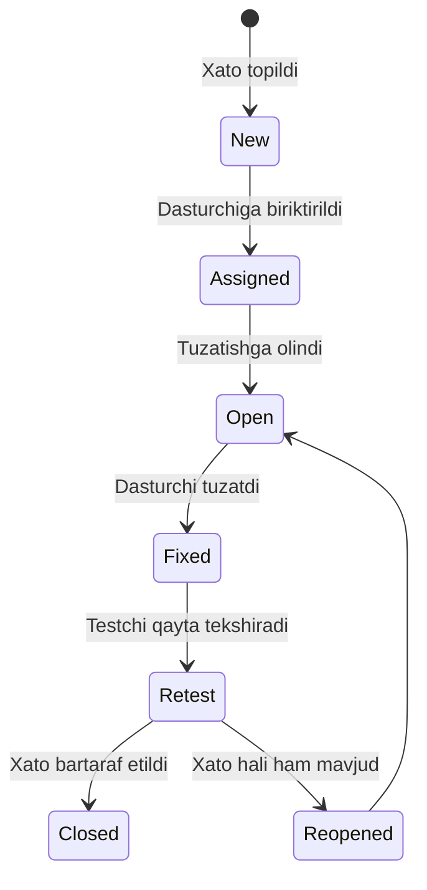

import { Callout } from 'nextra/components'

# Test Menejment (Test Management in Software Testing)

> Oxirgi yangilanish: 25-iyul, 2026

Dasturiy ta'minotni sinash shunchaki test-keyslarni bajarish va xatoliklarni ro'yxatga olishdan iborat emas. Murakkab loyihalarda yuzlab testchilar, minglab test-keyslar, cheklangan muddatlar va qat'iy sifat talablari mavjud bo'ladi. Bunday jarayonni tartibli, samarali va reja asosida tashkil qilish uchun **Test Menejment (Test Management)** zarurdir.

Test menejment butun STLC (Dasturiy Ta'minotni Sinash Hayotiy Sikli) davomida sifatni ta'minlash faoliyatini boshqaruvchi markaziy mexanizm hisoblanadi.

---

## Test Menejment Nima? (What is Test Management?)

**Test Menejment (Test Management)** — dasturiy ta'minotni sinash jarayonini boshidan oxirigacha rejalashtirish, tashkil etish, baholash, monitoring qilish va nazorat qilishga qaratilgan boshqaruv faoliyatidir.

U dasturiy mahsulotning yuqori sifatli bo'lishini, belgilangan byudjet va muddat doirasida ishlab chiqilishini hamda mijoz talablariga to'liq javob berishini kafolatlaydi. Ushbu jarayon odatda **Test Menejer (Test Manager)** yoki **QA Lead** tomonidan boshqariladi.



---

## Test Menejmentining 2 Asosiy Fazasi

Test menejmenti jarayoni ikkita yirik va o'zaro bog'liq fazaga bo'linadi:



---

## 1. Rejalashtirish Fazasi (Planning Phase)

Rejalashtirish fazasi dastur kodi yozilishidan oldin yoki u bilan parallel ravishda amalga oshiriladi va quyidagi 4 ta asosiy qadamni o'z ichiga oladi:

### 1.1. Xatarlarni Tahlil Qilish (Risk Analysis)
Sinov jarayonida yuzaga kelishi mumkin bo'lgan barcha xatarlar (*Risks*) oldindan aniqlanadi va baholanadi:
- **Mahsulot xatarlari (*Product Risks*):** Dasturning murakkab yoki muhim funksiyalari ishlamay qolish xavfi (masalan, to'lov tizimining to'xtab qolishi).
- **Loyiha xatarlari (*Project Risks*):** Vaqt yetishmasligi, tajribali xodimlarning ketib qolishi yoki muhitning kechikishi kabi tashkiliy muammolar.

Xatarlarni baholash orqali **Xatarlarga asoslangan sinov (*Risk-Based Testing*)** strategiyasi tanlanadi: eng xavfli modullarga ko'proq sinov vaqti va eng tajribali muhandislar ajratiladi.

### 1.2. Testni Baholash (Test Estimation)
Sinov jarayonini to'liq bajarish uchun qancha vaqt, odam-soat va moliyaviy resurs kerakligini hisoblab chiqish jarayoni. Ommabop baholash usullari:
- **WBS (Work Breakdown Structure):** Katta sinov vazifasini kichik, o'lchasa bo'ladigan bo'laklarga ajratib baholash;
- **Uch nuqtali baholash (3-Point Estimation):** Eng optimistik (O), eng ehtimoliy (M) va eng pessimistik (P) baholar o'rtacha hisoblanadi:
  ```
  Vaqt = (O + 4M + P) / 6
  ```
- **Delfi (Delphi) texnikasi:** Bir nechta mutaxassislar fikri va tajribasi asosida konsensusga erishish.

### 1.3. Testni Rejalashtirish (Test Planning)
Barcha kelishilgan shartlar asosida loyihaning bosh boshqaruv hujjati — **Test Rejasi (Test Plan)** tuziladi. Unda nimalar sinanishi (*In-Scope*), nimalar sinanmasligi (*Out-of-Scope*), kirish va chiqish mezonlari (*Entry & Exit Criteria*) hamda muddatlar belgilanadi.

### 1.4. Jamoani Tashkil Etish (Test Organization)
Test jamoasidagi har bir a'zoning rollari va vazifalari aniq taqsimlanadi:
- **Test Menejer / QA Lead:** Rejalashtirish, monitoring, byudjet, manfaatdor tomonlar bilan aloqa va risklarni boshqarish;
- **Test Muhandisi (Tester / QA Engineer):** Test keyslar yozish, test ma'lumotlarini tayyorlash, testlarni ijro etish va xatoliklarni qayd etish.

---

## 2. Ijro va Nazorat Fazasi (Execution & Control Phase)

Dastur yig'ilmasi (Build) sinov muhitiga topshirilgach, ijro va nazorat fazasi boshlanadi:

### 2.1. Test Monitoringi va Nazorati (Test Monitoring & Control)
Test menejeri sinov jarayonining rejaga muvofiqligini doimiy ravishda quyidagi metrikalar orqali kuzatib boradi (*Monitoring*):
- **O'tgan/Yiqilgan testlar foizi (*Pass/Fail rate*);**
- **Aniqlangan xatolar soni va ularning jiddiyligi (*Defect Severity*);**
- **Test qamrovi (*Requirement & Code Coverage*);**
- **Xatolarni tuzatish tezligi (*Defect Fix Rate*).**

Agar jarayon rejadan ortda qolsa, menejer darhol nazorat choralarini (*Control*) ko'radi: qo'shimcha testchilarni jalb qiladi, past darajali testlarni qisqartiradi yoki ustuvorliklarni o'zgartiradi.

### 2.2. Nuqsonlarni Boshqarish (Defect Management)
Aniqlangan barcha kamchiliklar maxsus kuzatuv tizimlarida (masalan, Jira) qayd etiladi va ularning hayotiy sikli boshqariladi:


### 2.3. Sinovni Yakunlash va Hisobot (Test Closure & Reporting)
Sinovdan chiqish mezonlari (*Exit Criteria*) bajarilganda, test faoliyati rasman yakunlanadi:
- **Sinov Xulosa Hisoboti (Test Summary Report):** Sifat ko'rsatkichlari aks ettirilgan hujjat rahbariyatga va mijozga taqdim etiladi;
- **Olingan saboqlar (Lessons Learned):** Sinov davomida nimalar yaxshi ishladi va kelajakdagi loyihalarda nimalarni yaxshilash kerakligi tahlil qilinadi;
- Test muhiti va test artefaktlari keyingi relizlar uchun arxivlanadi.

---

## Zamonaviy Test Menejment Vositalari (Tools)

Bugungi kunda test menejment jarayonlarini avtomatlashtirish va kuzatish uchun quyidagi yetakchi platformalar qo'llaniladi:

| Vosita | Asosiy Xususiyatlari |
| :--- | :--- |
| **Jira (Xray / Zephyr)** | Loyiha boshqaruvi va test boshqaruvini yagona joyda birlashtiruvchi eng ommabop yechim. |
| **TestRail** | Test-keyslar, test-rejalari, ijro tahlillari va batafsil metrikalarni yuritish uchun mo'ljallangan ixtisoslashgan tizim. |
| **Qase** | Yangi avlod, qulay va tezkor bulutli test boshqaruv platformasi. |
| **HP ALM (Quality Center)** | Yirik korporativ (Enterprise) loyihalarda to'liq hayot siklini boshqarish uchun klassik platforma. |
| **PractiTest** | Keng qamrovli tahliliy hisobotlar va CI/CD integratsiyasini qo'llab-quvvatlovchi zamonaviy vosita. |
