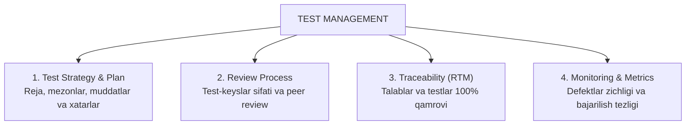

import { Cards, Callout } from 'nextra/components'

# Sinov Boshqaruvi (Test Management)

**Test Management** — dasturiy ta'minotni sinash faoliyatini noldan boshlab yakuniy hisobotgacha bo'lgan barcha bosqichlarini rejalashtirish, tashkillashtirish, resurslarni taqsimlash, xatarlarni boshqarish va sifat metrikalarini monitoring qilish jarayonidir.

Test boshqaruvi orqali QA jamoasi o'z ishini korporativ darajadagi xalqaro standartlar (IEEE 829 va ISO/IEC/IEEE 29119) asosida tizimlashtiradi.

---

## Test Boshqaruvining Asosiy Arxitekturasi

---

## Modul Bo'limlari

<Cards num={2}>
  <Cards.Card
    title="▶️ Test Plan (IEEE 829 Standarti)"
    href="/docs/test-management/test-plan"
  >
    Sinov rejasi tushunchasi, xalqaro IEEE 829 standarti bo'yicha uning majburiy bo'limlari va tuzilishi.
  </Cards.Card>
  <Cards.Card
    title="▶️ Test Strategy (Sinov Strategiyasi)"
    href="/docs/test-management/test-strategy"
  >
    Tashkiliy darajadagi uzoq muddatli sinov yondashuvi va Test Plan o'rtasidagi farqlar.
  </Cards.Card>
  <Cards.Card
    title="▶️ Test-keyslarni Ko'rib Chiqish (Review)"
    href="/docs/test-management/test-case-review"
  >
    Peer review, rasmiy ko'riklar (Inspection, Walkthrough) va test hujjatlari sifatini oshirish usullari.
  </Cards.Card>
  <Cards.Card
    title="▶️ Talablar Kuzatuvchanligi Matrisasi (RTM)"
    href="/docs/test-management/traceability-matrix"
  >
    Requirement Traceability Matrix: Forward, Backward va Bidirectional kuzatuv turlari.
  </Cards.Card>
</Cards>
