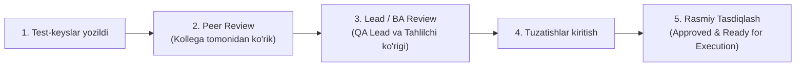

import { Callout } from 'nextra/components'

# Test-keyslarni Ko'rib Chiqish Jarayoni (Test Case Review Process)

**Test Case Review Process** — QA muhandislari tomonidan yozilgan test-keyslarning to'liqligi, aniqligi, talablarga (SRS) mosligi va standartlarga javob berishini jamoaviy tahlil qilish va tasdiqlash jarayonidir.

Ko'rib chiqish (Review) jarayoni sinov boshlanishidan oldin testlarning o'zidagi xatoliklar, noaniqliklar va tushib qolgan chegaraviy holatlarni fosh qilishga xizmat qiladi.

---

## Ko'rib Chiqish Bosqichlari

---

## Ko'rib Chiqish Uslublari (Review Types)

1. **O'z-o'zini tekshirish (Self-Review):** Test-keys yozuvchisi ishini yakunlagach, nazorat ro'yxati (Checklist) asosida o'z matnini qaytadan mustaqil tekshirib chiqadi.
2. **Kollektiv ko'rik (Peer Review):** Bir QA muhandisi yozgan testlarni xuddi shu loyihadagi ikkinchi QA muhandisi ko'rib chiqadi va fikr-mulohazalar (kommentariyalar) qoldiradi.
3. **Rahbar ko'rigi (QA Lead Review):** Jamoa yetakchisi testlarning umumiy qamrovi, BVA/EP usullarining to'g'ri qo'llanilgani va kompaniya standartlariga muvofiqligini tasdiqlaydi.
4. **Mijoz / Tahlilchi ko'rigi (Product Owner / Business Analyst Review):** Testlar biznes talablarini to'g'ri aks ettirayotgani va mahsulot qabul mezonlariga muvofiqligi biznes vakili tomonidan tekshiriladi.

---

## Ko'rib Chiqishda Baholanadigan Asosiy Mezonlar (Review Checklist)

- [ ] **Talablar qamrovi:** Barcha funksional talablar uchun test-keys yozilganmi?
- [ ] **Aniqlik:** Test qadamlari va kutilgan natijalar bir ma'nolimi va begona odam bajara oladimi?
- [ ] **Boshlang'ich shartlar (Preconditions):** Sinovni boshlashdan oldingi tizim holati to'liq ko'rsatilganmi?
- [ ] **Sinov ma'lumotlari (Test Data):** Kiritilishi kerak bo'lgan qiymatlar realistik va aniqmi?
- [ ] **Chegara va salbiy holatlar:** Negativ testlar va ekstremal chegaralar qamrab olinganmi?
- [ ] **Ortiqchalikning yo'qligi:** Bir-birini aynan takrorlovchi keraksiz testlar yo'qligiga ishonch hosil qilinganmi?
