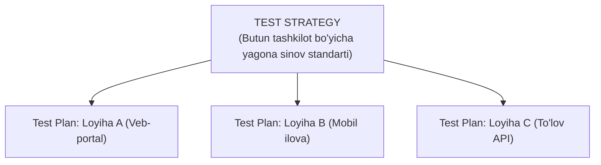

import { Callout } from 'nextra/components'

# Test Strategy va Test Plan O'rtasidagi Farqlar

Ko'plab yangi boshlovchilar va hatto amaliyotchi mutaxassislar ham **Test Strategy (Sinov strategiyasi)** va **Test Plan (Sinov rejasi)** tushunchalarini bir-biri bilan adashtiradilar.

Biroq, professional dasturiy muhandislikda bu ikki hujjat mutlaqo turli darajadagi boshqaruv maqsadlariga xizmat qiladi.

---

## Test Strategy Nima?

**Test Strategy** — bu butun kompaniya yoki bir nechta loyihalar uchun yagona bo'lgan, sinov jarayonining umumiy tamoyillari, standartlari, xavfsizlik talablari va avtomatlashtirish yondashuvini belgilab beruvchi **yuqori darajadagi (organizational-level) uzoq muddatli hujjatdir**.

U odatda **QA Director** yoki **Test Menejer** tomonidan ishlab chiqiladi va uzoq vaqt davomida deyarli o'zgarmaydi.

---

## Qiyosiy Solishtirish Jadvali

| Mezon | Test Strategy (Sinov Strategiyasi) | Test Plan (Sinov Rejasi) |
| :--- | :--- | :--- |
| **Qamrov darajasi** | Tashkiliy darajada (butun kompaniya yoki mahsulotlar tarmog'i) | Loyiha darajasida (aniq bir loyiha yoki reliz) |
| **Hujjat turi** | Yuqori darajadagi konseptual yo'riqnoma | Amaliy, operativ ishchi reja |
| **Mas'ul shaxs** | QA Director / Test Manager | QA Lead / Test Lead |
| **O'zgaruvchanligi** | Kamdan-kam hollarda o'zgartiriladi (statik) | Loyiha jarayonida tez-tez yangilanib turadi (dinamik) |
| **Bosh savol** | Sifatga qanday yondashuv va qoidalar bilan erishamiz? | Qachon, kim tomonidan va qanday resurslar bilan sinaymiz? |
| **Asosiy qismlari** | Sinov turlari, asboblar ro'yxati, standartlar, xavflar | Vazifalar, muddatlar, xodimlar taqsimoti, kirish/chiqish mezonlari |

<Callout type="info">
  **Qisqa xulosa:** Test Strategy — bu "Konstitutsiya" (umumiy qonuniyatlar), Test Plan esa har bir alohida vaziyat uchun qabul qilinadigan "Amaliy Dastur"dir.
</Callout>
