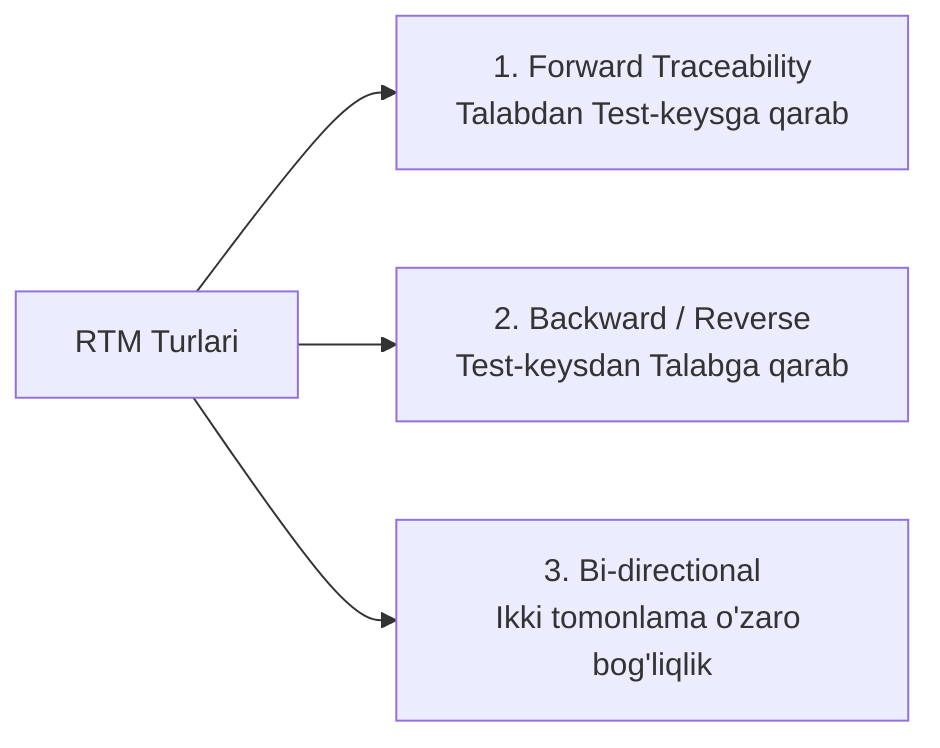

import { Callout } from 'nextra/components'

# Talablar Kuzatuvchanligi Matrisasi (RTM — Requirement Traceability Matrix)

**Requirement Traceability Matrix (RTM)** — foydalanuvchi va texnik talablar (SRS) bilan ularni tekshirish uchun yozilgan test-keyslar o'rtasidagi ikki tomonlama bog'liqlikni aks ettiruvchi maxsus jadvaldir.

RTM ning asosiy vazifasi — dasturning **100% barcha talablari test-keyslar bilan to'liq qamrab olinganligini** hamda sinovdan chetda qolgan birorta ham funksionallik yo'qligini isbotlashdir.

---

## RTM Turlari

1. **Oldinga kuzatuvchanlik (Forward Traceability):** Talablar asosida barcha test-keyslar yaratilganligini tekshiradi (Talab -> Test-keys). Maqsad: Birorta ham talab unutilib ketmaganiga ishonch hosil qilish.
2. **Orqaga kuzatuvchanlik (Backward / Reverse Traceability):** Har bir test-keysning qaysi talabga tegishli ekanligini ko'rsatadi (Test-keys -> Talab). Maqsad: Talabda yo'q bo'lgan keraksiz yoki maqsadsiz testlar (Gold plating) yozilmaganligini aniqlash.
3. **Ikki tomonlama kuzatuvchanlik (Bi-directional Traceability):** Oldinga va orqaga yo'nalishlarni to'liq birlashtiruvchi eng mukammal RTM shakli.

---

## Namunaviy RTM Jadvali

| Talab ID (Req ID) | Talab Mazmuni | Test Case ID | Test Case Tavsifi | Test Holati (Status) | Defekt ID (Bug ID) |
| :---: | :--- | :---: | :--- | :---: | :---: |
| **REQ-01** | Foydalanuvchi tizimga email orqali kirishi kerak | `TC_LOGIN_01` | To'g'ri email va parol bilan kirish | **Pass** | — |
| **REQ-01** | Foydalanuvchi tizimga email orqali kirishi kerak | `TC_LOGIN_02` | Noto'g'ri parol kiritilganda xatolik | **Pass** | — |
| **REQ-02** | Parolni tiklash havolasi yuborilishi lozim | `TC_RESET_01` | Ro'yxatdan o'tgan emailga havola yuborish | **Fail** | `BUG-104` |
| **REQ-03** | Foydalanuvchi profil rasmini o'zgartira olishi kerak | `TC_PROF_01` | 5 MB gacha PNG/JPG yuklash | **Pass** | — |

<Callout type="info">
  **O'zgarishlar boshqaruvi (Change Impact Analysis):** Agar loyiha o'rtasida buyurtmachi biror talabni o'zgartirsa (masalan, `REQ-02`), QA muhandisi RTM jadvaliga qarab, qaysi test-keyslar va qaysi avtomatlashtirilgan skriptlarni qayta ko'rib chiqish kerakligini bir necha soniyada aniqlay oladi.
</Callout>
