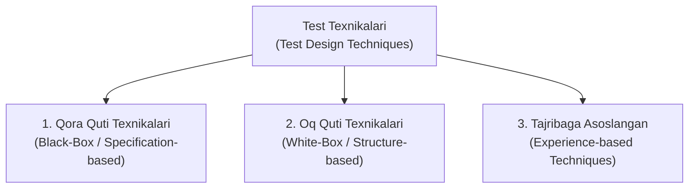
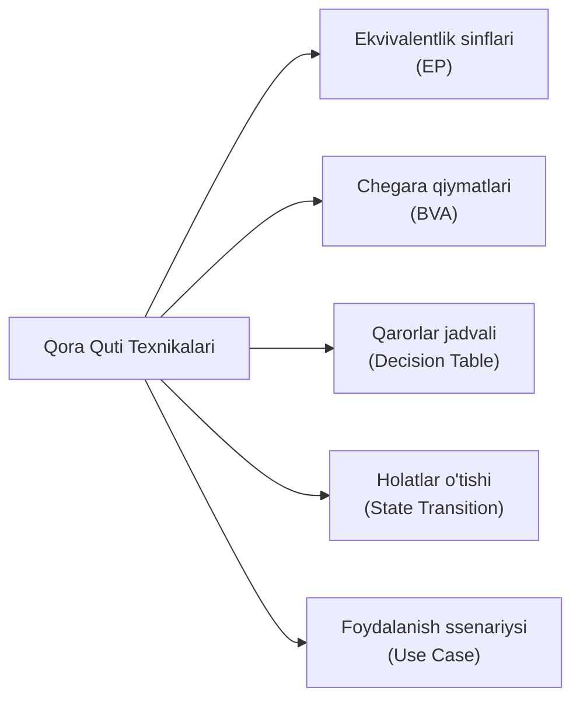
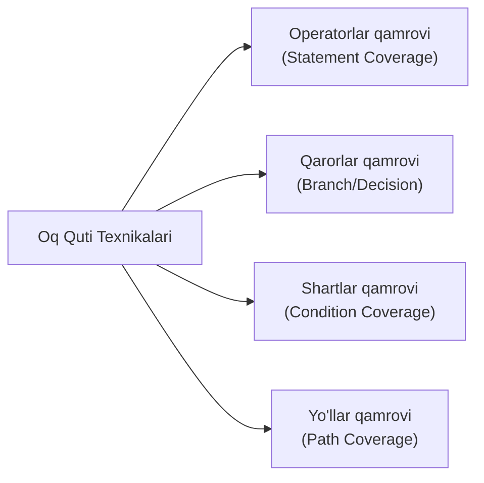

import { Callout } from 'nextra/components'

# Test Texnikalari (Test Design Techniques in Software Testing)

Dasturiy ta'minotni sinashda barcha ehtimoliy ma'lumotlar, foydalanuvchi xatti-harakatlari va kiruvchi qiymatlar kombinatsiyasini 100% to'liq sinab chiqish amalda imkonsizdir (bu sinovning fundamental tamoyili — *"To'liq sinovning imkonsizligi"* qonunidir). Masalan, bitta oddiy son kiritish maydoniga milliardlab turli xil qiymatlarni kiritish mumkin.

Aynan shuning uchun test muhandislari **minimal sondagi test-keyslar bilan maksimal sinov qamroviga (*Test Coverage*) erishish** va eng xavfli nuqsonlarni tezda aniqlash maqsadida maxsus tizimli usullar — **Test Texnikalari (Test Design Techniques)**dan foydalanadilar.

---

## Test Texnikalari Nima? (What are Test Design Techniques?)

**Test Texnikalari (Test Design Techniques)** — dasturiy ta'minotning sifatini tekshirish uchun test shartlari (*Test Conditions*), test holatlari (*Test Cases*) va sinov ma'lumotlarini (*Test Data*) tizimli, asoslangan va ilmiy jihatdan ishlab chiqishda qo'llaniladigan standart uslublar to'plamidir.

Ushbu texnikalar test muhandisiga ko'r-ko'rona yoki tasodifiy qiymatlarni kiritish o'rniga, eng yuqori ehtimol bilan xatolik keltirib chiqaradigan qiymatlarni maqsadli tanlab olishga yordam beradi.



---

## Nega Test Texnikalari Qo'llaniladi?

1. **Vaqt va resurslarni tejash:** Cheksiz test variantlarini optimal va cheklangan sonli yuqori samarali test-keyslarga qisqartiradi.
2. **Maksimal sinov qamrovi:** Dasturning barcha muhim sohalari, shartlari va tarmoqlanishlari tekshirilganligini kafolatlaydi.
3. **Chegaraviy xatoliklarni aniqlash:** Dasturchilar kod yozishda eng ko'p yo'l qo'yadigan chegaraviy va nozik kamchiliklarni fosh etadi.
4. **Strukturaviy yondashuv:** Test jarayonini taxminlarga emas, o'lchanadigan mezonlarga asoslaydi.

---

## 1. Qora Quti Sinov Texnikalari (Black-Box Techniques)

Qora quti texnikalari (shuningdek, **Spetsifikatsiyaga asoslangan texnikalar**) dasturning ichki kod tuzilmasini bilmagan holda, faqat uning tashqi talablari, kiruvchi va chiquvchi ma'lumotlari asosida testlarni loyihalash uchun ishlatiladi.



### 1.1. Ekvivalentlik Sinflariga Ajratish (Equivalence Partitioning — EP)
Ushbu texnikada kiruvchi ma'lumotlar to'plami teng kuchli bo'laklarga — **sinflarga** bo'linadi. Har bir sinf ichidagi barcha qiymatlar tizim uchun bir xil natija beradi deb hisoblanadi. Shuning uchun butun sinfni tekshirish uchun bitta vakil qiymatni tanlash kifoya:
- **To'g'ri (Valid) sinf:** Tizim qabul qiladigan qiymatlar;
- **Noto'g'ri (Invalid) sinf:** Tizim rad etishi va xatolik berishi kerak bo'lgan qiymatlar.

> **Misol:** Foydalanuvchi yoshi `18 dan 60 gacha` bo'lishi kerak.  
> - *Invalid sinf 1:* `< 18` (Masalan: `15`) → Xatolik berishi kerak.  
> - *Valid sinf:* `18 - 60` (Masalan: `25`) → Muvaffaqiyatli o'tishi kerak.  
> - *Invalid sinf 2:* `> 60` (Masalan: `70`) → Xatolik berishi kerak.

### 1.2. Chegara Qiymatlar Tahlili (Boundary Value Analysis — BVA)
Dasturlash amaliyotida eng ko'p xatoliklar ekvivalentlik sinflarining aynan **chegaralarida** (masalan, `<=` o'rniga `<` qo'yilishi sababli) yuz beradi. BVA aynan mana shu chegara nuqtalarini sinashga qaratilgan:
- Minimal chegara va uning atrofidagi qiymatlar: `Min - 1`, `Min`, `Min + 1`;
- Maksimal chegara va uning atrofidagi qiymatlar: `Max - 1`, `Max`, `Max + 1`.

> **Misol:** Yuqoridagi yosh misolida (`18 - 60` oralig'i):  
> Tekshiriladigan chegaraviy qiymatlar: **17**, **18**, **19** hamda **59**, **60**, **61**.

### 1.3. Qarorlar Jadvali Texnikasi (Decision Table Testing)
Bir vaqtning o'zida bir nechta mantiqiy shartlar va ularning kombinatsiyalari mavjud bo'lgan murakkab biznes jarayonlarini sinash uchun qo'llaniladi. Jadvalda shartlar (*Inputs*) va ularga muvofiq kutilgan amallar (*Outputs*) aks ettiriladi.

> **Misol:** Kredit berish sharti — *"Foydalanuvchi rasmiy daromadga ega bo'lishi VA kredit tarixi ijobiy bo'lishi shart"*. Barcha 4 xil (True/False) kombinatsiyalar jadval asosida tekshiriladi.

### 1.4. Holatlar O'tishi Sinovi (State Transition Testing)
Ilova ma'lum bir hodisa (*Event*) yuz berganda bir holatdan ikkinchi holatga qanday o'tishini tekshiradi.
- *Misol:* Bankomat kartasi kiritilganda — tizim *"PIN kod kutilmoqda"* holatida bo'ladi. Agar 3 marta noto'g'ri kod terilsa, tizim *"Karta bloklandi"* holatiga o'tishi kerak.

### 1.5. Foydalanish Ssenariylari Sinovi (Use Case Testing)
Haqiqiy foydalanuvchilar ilovadan qanday foydalanishini ifodalovchi to'liq biznes jarayonlari (*End-to-End*) asosida test-keyslar yaratiladi. U foydalanuvchi ro'yxatdan o'tishidan tortib, mahsulot sotib olib buyurtmani qabul qilgunicha bo'lgan butun zanjirni qamrab oladi.

### 1.6. Sabab-Oqibat Grafigi (Cause-Effect Graphing)
Kiruvchi sabablar (*Causes*) va ularning natijasida yuzaga keladigan oqibatlar (*Effects*) o'rtasidagi bog'liqlikni mantiqiy grafik (AND, OR, NOT) ko'rinishida modellashtirish texnikasi.

### 1.7. Barcha Juftliklar Sinovi (All-Pairs Testing / Pairwise)
Tizimda juda ko'p parametrlar mavjud bo'lganda (masalan: turli brauzerlar, operatsion tizimlar, to'lov turlari), ularning barcha kombinatsiyalarini emas, balki **har bir parametrning o'zaro juftliklarini** optimal tarzda qamrab oluvchi kombinatsiyalar to'plamini tuzish texnikasi.

---

## 2. Oq Quti Sinov Texnikalari (White-Box Techniques)

Oq quti texnikalari (shuningdek, **Tuzilmaga asoslangan texnikalar**) dasturning ichki kodi, arxitekturasi va mantiqiy oqimini bevosita tahlil qilish orqali testlarni loyihalashtirishga asoslanadi. Odatda dasturchilar yoki avtomatlashtirish muhandislari tomonidan qo'llaniladi.



### 2.1. Operatorlar Qamrovi (Statement Coverage)
Dastur kodidagi har bir satr va buyruq kamida bir marta bajarilishini ta'minlovchi test-keyslar yoziladi:

```
Statement Coverage = (Bajarilgan kod satrlari soni / Jami kod satrlari soni) * 100%
```

### 2.2. Qarorlar / Tarmoqlanish Qamrovi (Decision / Branch Coverage)
Dasturdagi barcha shartli operatorlarning (`if-else`, `switch-case`) barcha tarmoqlari — ham **True**, ham **False** yo'nalishlari sinovdan o'tganligini tekshiradi:

```
Branch Coverage = (Tekshirilgan tarmoqlar soni / Jami tarmoqlar soni) * 100%
```

### 2.3. Shartlar Qamrovi (Condition Coverage)
Mantiqiy ifodalar ichidagi har bir alohida bool shart (masalan, `if (A > 0 && B < 10)`) alohida-alohida True va False qiymatlarni qabul qilishi sinovdan o'tkaziladi.

### 2.4. Boshqaruv Oqimi Sinovi (Control Flow Testing)
Dasturning bajarilish yo'llarini grafik (Control Flow Graph) ko'rinishida ifodalab, kodning barcha mantiqiy tugunlari va yo'llari xatosiz ishlashini baholaydi.

### 2.5. Ma'lumotlar Oqimi Sinovi (Data Flow Testing)
O'zgaruvchilarning hayotiy siklini — ularning e'lon qilinishi (*Definition*), qiymat o'zlashtirishi va kodda ishlatilishi (*Usage*) jarayonlarini tahlil qiladi. Qiymat berilmagan o'zgaruvchidan foydalanish kabi jiddiy xatolarni fosh etadi.

---

## 3. Tajribaga Asoslangan Texnikalar (Experience-Based Techniques)

Ushbu usullar qat'iy matematik qoidalar yoki kod tahliliga emas, balki test muhandisining shaxsiy tajribasi, intuitsiyasi va mahsulotni chuqur tushunishiga tayanadi.

### 3.1. Xatolarni Taxmin Qilish (Error Guessing)
Test muhandisi o'z tajribasiga tayangan holda, dasturchilar odatda qayerda ko'proq xatoga yo'l qo'yishini taxmin qiladi va atayin o'sha zaif nuqtalarni tekshiradi:
- Bo'sh qiymat kiritish (*Null / Empty string*);
- Nolga bo'lish (*Division by zero*);
- Maksimal hajmdan ortiq matn yuborish (*Buffer overflow*);
- Maxsus belgilar va SQL in'yeksiyalarni kiritish (`' OR '1'='1`).

### 3.2. Tadqiqiy Sinov (Exploratory Testing)
Oldindan yozilgan qat'iy test-keyslarsiz amalga oshiriladigan erkin sinov turi. Sinovchi ilovani ishlatish jarayonining o'zida bir vaqtning o'zida:
1. Dasturni o'rganadi (*Learn*);
2. Testlarni loyihalashtiradi (*Design*);
3. Ularni darhol bajaradi (*Execute*).

Bu usul qisqa vaqt ichida kutilmagan, noan'anaviy nuqsonlarni topishda juda samaralidir.

### 3.3. Nazorat Ro'yxatiga Asoslangan Sinov (Checklist-Based Testing)
O'tmishdagi loyihalar va tajribalar asosida shakllantirilgan umumiy nazorat ro'yxati (*Checklist*) bo'yicha ilovaning muhim talablarga mosligini tezkor tekshirib chiqish usuli.

---

## Test Texnikasini Qanday Tanlash Kerak?

Har qanday loyihada qaysi test texnikasini tanlash quyidagi omillarga bog'liq:
- **Tizimning murakkabligi va xavflilik darajasi:** Moliyaviy va tibbiy ilovalarda BVA, Qarorlar jadvali va Oq quti usullari majburiydir;
- **Mavjud hujjatlar sifati:** Agar texnik talablar (SRS) to'liq bo'lsa — Qora quti texnikalari; agar talablar yetarli bo'lmasa — Tadqiqiy sinov (*Exploratory*) va Xatolarni taxmin qilish usullari qo'llaniladi;
- **Vaqt va byudjet:** Cheklangan muddatlarda ekvivalentlik sinflari va BVA eng tez va yuqori samaradorlikni ta'minlaydi.
