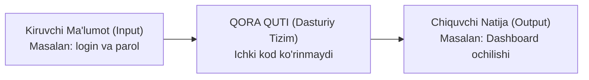

import { Callout } from 'nextra/components'

# Black Box (Qora Quti) Sinovi

**Black Box Testing** (shuningdek, *Xulq-atvor sinovi* yoki *Funksional sinov* deb ataladi) — dasturiy ta'minotning ichki kodi, arxitekturasi va server sozlamalarini bilmagan holda, faqat tizimning tashqi xatti-harakati, foydalanuvchi interfeysi va texnik talablar (SRS) asosida sinash uslubidir.

Sinovchi tizimni qora quti deb tasavvur qiladi: ichkarida nimalar ro'y berayotgani ko'rinmaydi. U qutiga ma'lum bir kiruvchi ma'lumotni beradi va chiqayotgan natijaning kutilgan natijaga mosligini taqqoslaydi.

---

## Qora Quti Sinovining Ishlash Prinsipi

---

## Asosiy Xususiyatlari

- **Talablarga yo'naltirilganlik:** Sinovchi dasturning qanday kodlanganiga emas, balki buyurtmachi talablariga muvofiq ishlayotganiga e'tibor qaratadi.
- **Foydalanuvchi nigohi:** Sinovlar real foydalanuvchi tizim bilan qanday muloqot qilsa, xuddi shu shaklda (tugmalarni bosish, formani to'ldirish, API ga so'rov yuborish) olib boriladi.
- **Dasturlash bilimining shart emasligi:** Sinovchidan dasturlash tillarini chuqur bilish talab qilinmaydi, ammo tizim mantiqini chuqur tushunish va test dizayn usullarini bilish shart.

---

## Afzalliklari va Kamchiliklari

| Afzalliklari | Kamchiliklari |
| :--- | :--- |
| Sinovlar xolis (xolisona) o'tadi, chunki sinovchi dasturchining kod yozish fikriga bog'lanib qolmaydi | Kodning qaysi qismlari sinovdan o'tgani va qaysi biri qolib ketganini aniqlash qiyin |
| Dasturchi kodni yozib tugatishini kutmasdan, talablar tahlilidan test-keyslar yozish mumkin | Barcha ehtimoliy ma'lumotlar kombinatsiyasini sinash juda ko'p vaqt talab qiladi |
| Real foydalanuvchi duch keladigan xatoliklar va tushunarsiz interfeyslar darhol fosh bo'ladi | Tizimning ichki xotira yoki xavfsizlik arxitekturasi yashirin qoladi |

<Callout type="info">
  **Sinov texnikalari:** Qora quti sinovida samaradorlikni oshirish uchun Boundary Value Analysis (BVA), Equivalence Partitioning (EP), Decision Table va State Transition kabi matematik va mantiqiy test dizayn usullari qo'llaniladi.
</Callout>
