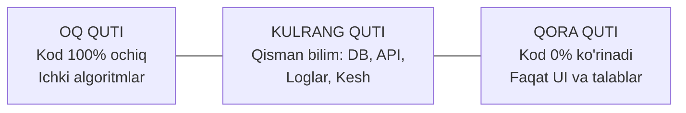

import { Callout } from 'nextra/components'

# Grey Box (Kulrang Quti) Sinovi

**Grey Box Testing** — Oq quti (White Box) va Qora quti (Black Box) uslublarining o'zaro sintezi bo'lib, unda sinovchi tizimning ichki tuzilishi, ma'lumotlar bazasi sxemalari, API arxitekturasi yoki algoritmlari haqida **qisman bilimga** ega bo'ladi, ammo sinovni asosan tashqi interfeyslar orqali amalga oshiradi.

Bu uslubda QA muhandisi tizimni xuddi dasturchi kabi ichki mantiqini tushungan holda, lekin xuddi foydalanuvchi kabi tashqi tomondan sinovdan o'tkazadi.

---

## Kulrang Quti Sinovining O'rni

---

## Real Hayotiy Misol

Tasavvur qiling, internet-do'konda buyurtma berish jarayoni sinovdan o'tkazilmoqda:
1. **Qora quti sinovchisi:** Saytga kiradi, tovar tanlaydi, "Sotib olish" tugmasini bosadi va ekranda "Buyurtmangiz qabul qilindi" xabari chiqqanini ko'rib, test o'tdi deb hisoblaydi.
2. **Kulrang quti sinovchisi:** Xuddi shu buyurtmani beradi, ammo keyin darhol:
   - Ma'lumotlar bazasiga (`PostgreSQL` / `MySQL`) kirib, `orders` jadvalida yozuv to'g'ri shakllanganmi va `inventory` jadvalida qoldiq tovar 1 taga kamayganmi-yo'qligini tekshiradi;
   - Server konsoli va log fayllarini (`Kibana` / `CloudWatch`) tekshirib, yashirin `500 NullPointerException` yoki ogohlantirishlar bo'lmaganiga ishonch hosil qiladi;
   - To'lov shlyuziga yuborilgan JSON so'rovining formatini tahlil qiladi.

---

## Uch Sinov Yondashuvining Qiyosiy Matrisasi

| Xususiyat | Black Box | Grey Box | White Box |
| :--- | :--- | :--- | :--- |
| **Kodga kirish huquqi** | Yo'q (0%) | Qisman (DB, API, Loglar) | To'liq (100%) |
| **Bajaruvchi** | Manual QA, Yakuniy foydalanuvchi | QA Muhandisi, Automation QA | Dasturchi, SDET |
| **Dasturlash talabi** | Kerak emas | SQL, JSON, API tushunchasi | Yuqori dasturlash bilimi |
| **Asosiy yo'nalish** | Foydalanuvchi xatti-harakati | Tizimlararo integratsiya, ma'lumotlar yaxlitligi | Algoritm, sikl, xotira optimizatsiyasi |
| **Sinov darajasi** | System, Acceptance testing | Integration, System testing | Unit, Integration testing |
