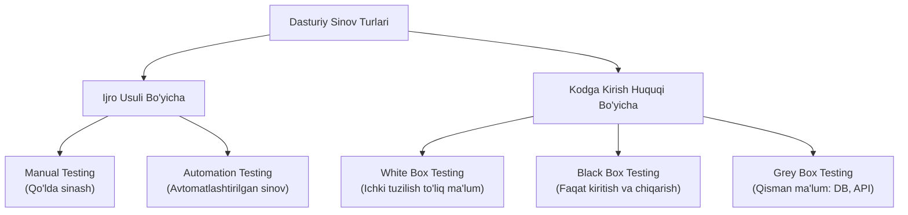

import { Cards, Callout } from 'nextra/components'

# Dasturiy Ta'minotni Sinash Turlari (Types of Testing)

Dasturiy ta'minotni sinash — bu mahsulotning talablarga to'liq mosligini tekshirish va yashirin nuqsonlarni aniqlashga yo'naltirilgan keng qamrovli sohadir.

Sinov jarayoni bajarilish usuliga ko'ra **Qo'lda sinash (Manual)** va **Avtomatlashtirilgan sinov (Automation)** ga, dastur ichki tuzilishini bilish darajasiga ko'ra esa **Oq quti (White Box)**, **Qora quti (Black Box)** va **Kulrang quti (Grey Box)** sinovlariga bo'linadi.

---

## Sinov Turlarining Asosiy Tasnifi

---

## Modul Bo'limlari

<Cards num={2}>
  <Cards.Card
    title="▶️ Manual vs Automation Sinov"
    href="/docs/test-types/manual-vs-automation"
  >
    Qo'lda sinash va avtomatlashtirish o'rtasidagi farqlar, ularning ijobiy va salbiy tomonlari.
  </Cards.Card>
  <Cards.Card
    title="▶️ White Box (Oq quti) Sinovi"
    href="/docs/test-types/white-box-testing"
  >
    Dastur kodining ichki tuzilishi, mantiqiy tarmoqlari va arxitekturasini sinash asoslari.
  </Cards.Card>
  <Cards.Card
    title="▶️ Black Box (Qora quti) Sinovi"
    href="/docs/test-types/black-box-testing"
  >
    Kodni ko'rmasdan, faqat tashqi talablar va foydalanuvchi interfeysi orqali sinash.
  </Cards.Card>
  <Cards.Card
    title="▶️ Grey Box (Kulrang quti) Sinovi"
    href="/docs/test-types/grey-box-testing"
  >
    Oq va qora quti uslublarining kombinatsiyasi: arxitektura va ma'lumotlar bazasini bilgan holda sinash.
  </Cards.Card>
</Cards>
