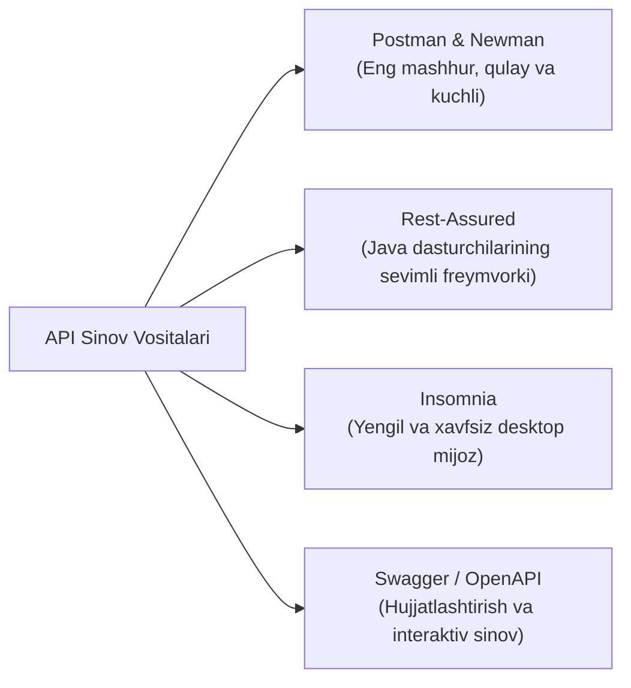

import { Callout } from 'nextra/components'

# API Sinov Vositalari (API Testing Tools)

Zamonaviy mikroservislar va veb-ilovalarning asosi API (Application Programming Interface) hisoblanadi. Foydalanuvchi interfeysi (UI) chizilishidan ancha oldin orqa fon xizmatlarini sinash uchun maxsus API vositalari qo'llaniladi.

---

## Yetakchi API Vositalari

---

## 1. Postman va Newman

- **Postman:** Dunyodagi eng ommabop API sinov platformasi. HTTP so'rovlarini (GET, POST, PUT, DELETE, PATCH) yuborish, sarlavhalar (Headers) va parametrlarni sozlash, avtorizatsiya (Bearer Token, OAuth 2.0) ni boshqarish imkonini beradi.
  - **Tests tili:** JavaScript asosidagi `pm.test()` orqali javob kodi (`200 OK`), javob vaqti va JSON ma'lumotlar sxemasini avtomatik tekshirish.
  - **Environment Variables:** Turli muhitlar (Dev, Staging, Prod) uchun o'zgaruvchilarni tezkor almashtirish.
- **Newman:** Postman to'plamlarini (Collections) buyruqlar satrida (CLI) va CI/CD konveyerlarida (GitHub Actions, Jenkins) avtomatik yugurtirish vositasi.

---

## 2. Rest-Assured (Java)

- Agar loyiha kodi Java tilida yozilgan bo'lsa va to'liq avtomatlashtirilgan API regressiya testlari kerak bo'lsa, **Rest-Assured** eng yaxshi tanlovdir.
- BDD uslubida (`given()`, `when()`, `then()`) o'ta toza va o'qilishi oson sinov kodini yozish imkonini beradi.
