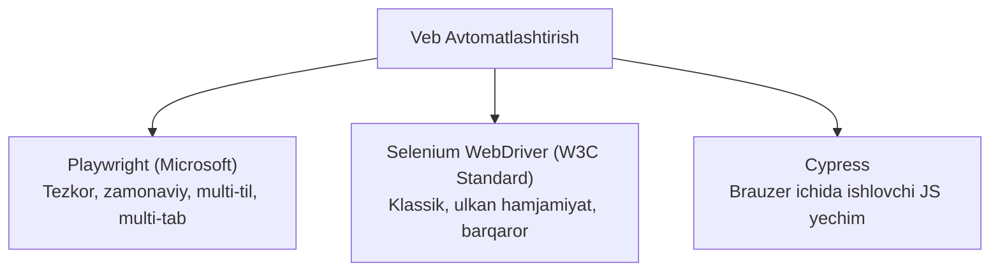

import { Callout } from 'nextra/components'

# Avtomatlashtirish Vositalari (Test Automation Tools)

Veb va mobil ilovalarni avtomatlashtirish bugungi kunda tezkor relizlar va doimiy sifat nazoratining (CI/CD) asosiy shartidir.

Quyida zamonaviy jahon IT bozorida yetakchi bo'lgan eng asosiy test avtomatlashtirish vositalari va ularning imkoniyatlari keltirilgan.

---

## Yetakchi Veb-Avtomatlashtirish Vositalari

---

## 1. Microsoft Playwright (Yangi Avlod Yetakchisi)

- **Afzalliklari:** Hozirgi kunda dunyoda eng tez ommalashayotgan vosita. Bir vaqtning o'zida Chromium, Firefox va WebKit (Safari) dvigatellarini qo'llab-quvvatlaydi.
- **Xususiyatlari:**
  - Avtomatik kutish (Auto-waiting) mexanizmi: sahifa yuklanishini kutib `sleep()` qo'yish shart emas.
  - Multi-page, multi-tab va ko'p foydalanuvchili ssenariylarni oson qo'llab-quvvatlaydi.
  - O'rnatilgan ajoyib vositalar: Kod generatori (`codegen`), Test tahlilchisi (`Trace Viewer`).
  - Dasturlash tillari: TypeScript, JavaScript, Python, Java, C#.

---

## 2. Selenium WebDriver (Sanoatning Boqiy Standarti)

- **Afzalliklari:** 20 yildan ortiq tarixga ega, W3C xalqaro rasmiy standarti hisoblangan tizim.
- **Xususiyatlari:** Har qanday brauzer, har qanday operatsion tizim va deyarli barcha dasturlash tillarini (Java, Python, C#, Ruby, JS) qo'llab-quvvatlaydi. Dunyo bo'ylab eng katta hamjamiyat va tayyor yechimlarga ega.

---

## 3. Cypress

- **Afzalliklari:** To'g'ridan-to'g'ri brauzerning ijro zanjirida ishlaydi. Front-end dasturchilar uchun o'rnatish va ishga tushirish juda oson.
- **Cheklovi:** Faqat JavaScript/TypeScript da yoziladi, bir vaqtda bir nechta tab yoki bir nechta brauzerni boshqarish imkoniyati cheklangan.

---

## Qiyosiy Matrisa

| Xususiyat | Playwright | Selenium WebDriver | Cypress |
| :--- | :--- | :--- | :--- |
| **Ishlab chiquvchi** | Microsoft | Open Source (W3C) | Cypress.io |
| **Ijro tezligi** | **O'ta tez** | O'rtacha | Tez |
| **Multi-tab / Window** | **To'liq qo'llab-quvvatlaydi** | Qo'llab-quvvatlaydi | Cheklangan |
| **Auto-wait mexanizmi** | Standart mavjud | Qo'lda sozlanadi | Standart mavjud |
| **Mobil emulyatsiya** | Mukammal | Cheklangan | Asosiy |
