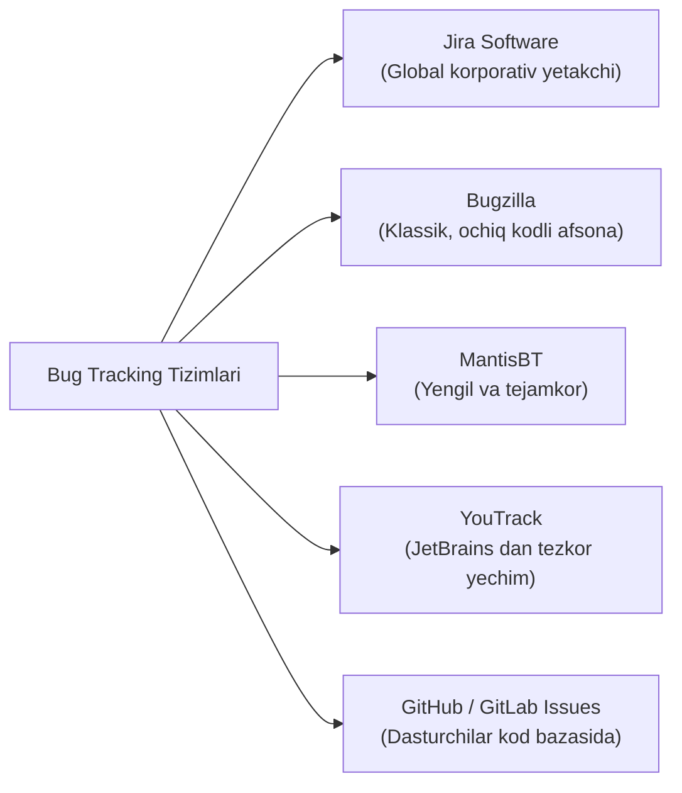

import { Callout } from 'nextra/components'

# Bug Tracking Tizimlari: Nuqsonlarni Kuzatish Vositalari

Dasturda aniqlangan har bir xatolik albatta yozma qayd etilishi, unga aniq mas'ul shaxs biriktirilishi va uning holati (New -> Fixed -> Closed) doimiy nazoratda bo'lishi kerak.

**Bug Tracking Tools (Defect Tracking Systems)** — xatoliklarni ro'yxatga olish, saralash, ularga skrinshot va video ilova qilish hamda jamoa a'zolari o'rtasida shaffof muloqotni tashkil etishga xizmat qiluvchi tizimlardir.

---

## Mashhur Bug Tracking Tizimlari

---

## 1. Atlassian Jira

- **Afzalliklari:** Dunyodagi eng ko'p qo'llaniladigan loyiha va xatoliklar boshqaruvi tizimi.
- **Xususiyatlari:** Scrum va Kanban taxtalari, moslashuvchan Workflow (o'zingiz xohlagan Bug Life Cycle ni chizishingiz mumkin), qidiruv tili (JQL — Jira Query Language) va yuzlab integratsiyalar.

---

## 2. Bugzilla (Mozilla Jamg'armasi)

- **Afzalliklari:** 1998 yildan beri mavjud bo'lgan, butunlay bepul va ochiq kodli tizim.
- **Xususiyatlari:** Linux, Mozilla Firefox kabi ulkan ochiq kodli gigantlar hali ham Bugzilla dan foydalanadi. U vizual jihatdan oddiy bo'lsa-da, millionlab xatoliklarni xatosiz va tezkor qidirish imkonini beradi.

---

## 3. MantisBT (Mantis Bug Tracker)

- PHP va MySQL asosidagi yengil, serverga tez o'rnatiladigan bepul tizim. Kichik loyihalar va server resurslari cheklangan jamoalar uchun ideal.

---

## Sifatli Bug Reportning Majburiy Tarkibi

Qaysi tizimdan foydalanishingizdan qat'i nazar, professional QA muhandisi kiritadigan hisobot quyidagi qismlardan iborat bo'lishi shart:
1. **Title (Qisqa sarlavha):** Qayerda, qachon va nima yuz berdi?
2. **Environment (Muhit):** Masalan, *Windows 11, Chrome v128, Staging muhiti*.
3. **Steps to Reproduce (Xatoni qaytarish qadamlari):** 1-qadam, 2-qadam, 3-qadam.
4. **Expected Result (Kutilgan natija):** Talab bo'yicha nima bo'lishi kerak edi.
5. **Actual Result (Amaldagi natija):** Amalda qanday xatolik yuz berdi.
6. **Attachment (Ilovalar):** Xatoni isbotlovchi skrinshot, xatolik yozilgan video (Loom) yoki server konsol loglari.
7. **Severity va Priority darajasi.**
