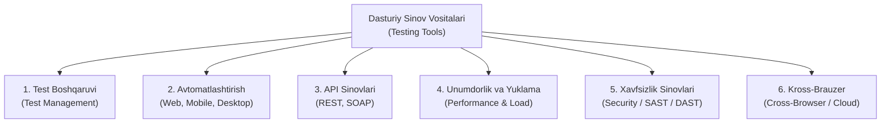

import { Callout } from 'nextra/components'

# Dasturiy Sinov Vositalari (Software Testing Tools)

> Oxirgi yangilanish: 25-iyul, 2026

Zamonaviy dasturiy ta'minotni ishlab chiqishda tizimlar tobora murakkablashib, chiqarilish tezligi (Time-to-Market) oshib bormoqda. Bunday sharoitda barcha sinovlarni faqat qo'lda (manual) bajarish juda ko'p vaqt talab qiladi va insoniy xatoliklar ehtimolini oshiradi. 

Sinov jarayonini tezlashtirish, regressiya sinovlarini avtomatlashtirish, tizimning yuqori yuklamalarga chidamliligini va xavfsizligini tekshirish uchun **Dasturiy Sinov Vositalari (Software Testing Tools)** qo'llaniladi.

---

## Dasturiy Sinov Vositalari Nima? (What are Testing Tools?)

**Dasturiy Sinov Vositalari (Software Testing Tools)** — dasturiy ta'minotning funksionalligi, unumdorligi, xavfsizligi va qulayligini tekshirish jarayonlarini yengillashtirish, qo'llab-quvvatlash va avtomatlashtirish uchun foydalaniladigan maxsus dasturiy ilovalar va freymvorklardir.

Ushbu vositalar test muhandislariga test-keyslarni rejalashtirishdan tortib, ularni avtomatik ishga tushirish, natijalarni yig'ish va xatoliklarni ro'yxatga olishgacha bo'lgan barcha bosqichlarda yordam beradi.

---

## Sinov Vositalarining Asosiy Toifalari

Sinov faoliyatining yo'nalishiga qarab vositalar quyidagi asosiy guruhlarga bo'linadi:

### 1. Test Boshqaruvi va Hujjatlashtirish Vositalari (Test Management Tools)
Test jarayonini rejalashtirish, test-keyslar bazasini yuritish, ijro natijalarini to'plash va metrikalarni tahlil qilish uchun xizmat qiladi:
- **Jira (Xray / Zephyr):** Sanoatda eng keng tarqalgan, vazifalar va test-keyslarni boshqaruvchi ekotizim;
- **TestRail:** Test holatlari, test-ranlar va bajarilish statistikasini yurituvchi ixtisoslashgan vosita;
- **Qase:** Zamonaviy, chaqqon va qulay bulutli test boshqaruv platformasi;
- **Confluence:** Loyiha dokumentatsiyasi, test rejalari va bilimlar bazasini saqlash joyi.

### 2. Veb Avtomatlashtirish Vositalari (Web Automation Tools)
Veb-brauzerlarda foydalanuvchi harakatlarini avtomatik takrorlovchi vositalar:
- **Selenium (WebDriver):** Avtomatlashtirishning eng mashhur ochiq manbali standarti (Java, Python, C#, JS tillarini qo'llab-quvvatlaydi);
- **Playwright:** Microsoft tomonidan yaratilgan, zamonaviy, juda tezkor va ishonchli avtomatlashtirish freymvorki;
- **Cypress:** JavaScript/TypeScript muhitida frontend dasturchilar va QA muhandislari orasida mashhur bo'lgan all-in-one vosita.

### 3. Mobil Avtomatlashtirish Vositalari (Mobile Testing Tools)
Android va iOS mobil ilovalarini emulyator yoki real qurilmalarda avtomatik sinash uchun:
- **Appium:** Kross-platformali (ham Android, ham iOS uchun bitta kod) ochiq manbali standart vosita;
- **Espresso:** Google tomonidan Android ilovalar uchun yaratilgan tezkor native freymvork;
- **XCUITest:** Apple tomonidan iOS ilovalar uchun tavsiya etilgan rasmiy sinov freymvorki.

### 4. API Sinov Vositalari (API Testing Tools)
Server va mijoz o'rtasidagi ma'lumotlar almashinuvini (REST, GraphQL, SOAP) tekshiruvchi vositalar:
- **Postman:** API so'rovlarini yuborish, test skriptlarini yozish va avtomatlashtirilgan to'plamlarni (Collection Runner) ishga tushirish uchun 1-raqamli vosita;
- **REST Assured:** Java tilida RESTful API larni kod darajasida avtomatlashtirish uchun kuchli kutubxona;
- **Swagger / OpenAPI:** API hujjatlarini ko'rish va ularni interaktiv sinash vositasi.

### 5. Unumdorlik va Yuklama Sinovi Vositalari (Performance & Load Testing)
Tizimning bir vaqtning o'zida minglab foydalanuvchilar oqimiga bardosh bera olishini tekshiruvchi vositalar:
- **Apache JMeter:** Yuklama va stress sinovlarini o'tkazish uchun eng mashhur ochiq manbali vosita;
- **k6:** JavaScript tilida yoziluvchi, developer-friendly va CI/CD ga oson integratsiya qilinadigan zamonaviy yuklama vositasi;
- **Gatling:** Scala/Java asosidagi yuqori unumdorlikka ega sinov vositasi;
- **Locust:** Python tilida yuklama ssenariylarini yozishga mo'ljallangan yengil va moslashuvchan tizim.

### 6. Xavfsizlik Sinovi Vositalari (Security Testing Tools)
Dasturdagi zaifliklar (vulnerabilities), xakerlik xatarlari va ochiq teshiklarni aniqlash uchun:
- **OWASP ZAP:** Veb-ilovalardagi xavfsizlik zaifliklarini avtomatik va qo'lda skanerlovchi bepul ochiq manbali vosita;
- **Burp Suite:** Xavfsizlik bo'yicha mutaxassislar va penetratsion testchilar (Penetration Testers)ning asosiy professional vositasi;
- **SonarQube:** Dastur kodini statik tahlil qilib (SAST), koddagi xavfsizlik kamchiliklari va sifat xatolarini ko'rsatib beruvchi tizim.

### 7. Kross-Brauzer va Bulutli Muhitlar (Cloud Testing Platforms)
Real qurilmalarni sotib olmasdan, bulutda yuzlab brauzer va telefonlarda sinov o'tkazish imkonini beruvchi platformalar:
- **BrowserStack:** Veb va mobil ilovalarni real qurilmalarda masofadan sinash;
- **LambdaTest:** Kross-brauzer sinovlari va avtomatlashtirilgan test tarmoqlari (Selenium Grid);
- **Sauce Labs:** Yirik korporativ darajadagi bulutli sinov infratuzilmasi.

---

## Sinov Vositasini Qanday Tanlash Kerak? (Selection Criteria)

Loyihaga yangi sinov vositasini tanlashda quyidagi mezonlarga tayanish tavsiya etiladi:

1. **Loyiha turi va platformasi:** Veb-saytmi, mobil ilovami, API yoki desktop dasturmi?
2. **Texnologik stek va dasturlash tili:** Jamoa qaysi dasturlash tilida (Java, Python, JS/TS, C#) ishlaydi?
3. **Litsenziya narxi:** Ochiq manbali (*Open Source* — bepul) yoki Tijoriy (*Commercial* — pullik litsenziya) ekanligi;
4. **O'rganish osonligi (*Learning Curve*):** Jamoa vositani qanchalik tez o'zlashtira oladi?
5. **CI/CD integratsiyasi:** Jenkins, GitHub Actions, GitLab CI quvurlari bilan avtomatik ishlay oladimi?
6. **Hamjamiyat va qo'llab-quvvatlash (*Community Support*):** Muammoga duch kelganda internetda yechimlar va hujjatlar yetarlimi?

---

## Vositalardan Foydalanishning Afzalliklari va Cheklovlari

### Afzalliklari:
- **Tezkorlik:** Minglab testlarni bir necha daqiqada bajarish;
- **Inson omilini kamaytirish:** Zerikarli va takroriy ishlarda testchi charchoqdan xatoga yo'l qo'ymaydi;
- **Doimiy nazorat (24/7):** Yangi kod yozilishi bilan testlar avtomatik ishga tushadi;
- **Yuqori aniqlik:** Katta hajmdagi ma'lumotlarni solishtirishda inson ko'zidan qochadigan tafovutlarni aniqlaydi.

### Cheklovlari:
- **Dastlabki yuqori xarajatlar:** Vositalarni sozlash, infratuzilma yaratish va testchilarni o'qitish vaqt va mablag' talab qiladi;
- **Doimiy qo'llab-quvvatlash zarurati:** Interfeys o'zgarganda avtotestlar ham yangilanib turishi kerak;
- **100% almashtirib bo'lmasligi:** Insoniy sezgi, qulaylik (*Usability*) va dizaynni baholashni vositalarga to'liq topshirib bo'lmaydi.
