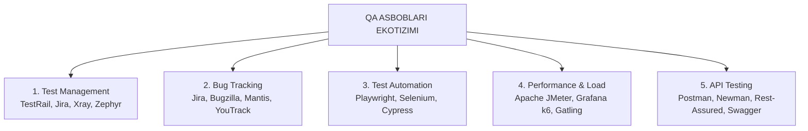

import { Cards, Callout } from 'nextra/components'

# Dasturiy Ta'minotni Sinash Vositalari (Software Testing Tools)

Zamonaviy QA muhandisining mahorati nafaqat nazariy test dizayn usullarini bilishda, balki sinov jarayonini tezlashtiruvchi, xatoliklarni kuzatuvchi va testlarni avtomatlashtiruvchi dasturiy vositalar (Tools) ekotizimini to'g'ri tanlash va qo'llay olishida namoyon bo'ladi.

TpointTech dasturining ushbu bo'limida global IT sanoatida eng ko'p qo'llaniladigan sinov asboblari va ularning qiyosiy tahlili keltirilgan.

---

## QA Asboblari Ekotizimi

---

## Modul Bo'limlari

<Cards num={2}>
  <Cards.Card
    title="▶️ Test Boshqaruvi Vositalari"
    href="/docs/testing-tools/test-management-tools"
  >
    Test-keyslar bazasini yuritish, test-ranlarni shakllantirish va sifat hisobotlarini generatsiya qilish (TestRail, Jira Xray).
  </Cards.Card>
  <Cards.Card
    title="▶️ Bug Tracking Tizimlari"
    href="/docs/testing-tools/defect-tracking-tools"
  >
    Nuqsonlarni ro'yxatga olish, dasturchilarga biriktirish va ularning hayot siklini kuzatish (Jira, Bugzilla, Mantis).
  </Cards.Card>
  <Cards.Card
    title="▶️ Avtomatlashtirish Vositalari"
    href="/docs/testing-tools/automation-tools"
  >
    Veb va mobil ilovalarni avtomatlashtirish: Playwright, Selenium WebDriver va Cypress imkoniyatlari tahlili.
  </Cards.Card>
  <Cards.Card
    title="▶️ Yuklama Sinov Vositalari"
    href="/docs/testing-tools/performance-tools"
  >
    Serverlarga o'n minglab virtual foydalanuvchilar oqimini yuborish: Apache JMeter va Grafana k6 vositalari.
  </Cards.Card>
  <Cards.Card
    title="▶️ API Sinov Vositalari"
    href="/docs/testing-tools/api-tools"
  >
    REST va GraphQL API larni sinash, avtomatik test skriptlari va CI/CD ga ulash (Postman, Newman).
  </Cards.Card>
</Cards>
