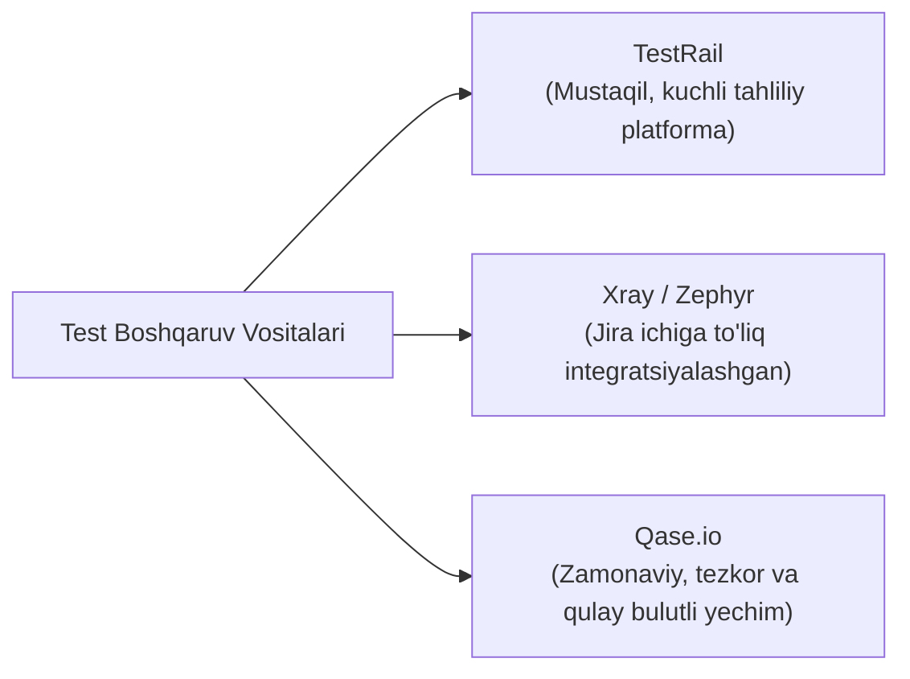

import { Callout } from 'nextra/components'

# Test Boshqaruvi Vositalari (Test Management Tools)

Loyiha kattalashgan sari undagi test-keyslar soni yuzlab va minglabga yetadi. Bunday katta hajmdagi testlarni oddiy Excel yoki Google Sheets da yuritish tezda chalkashlik va nazoratning yo'qolishiga olib keladi.

**Test Management Tools (Test boshqaruv tizimlari)** — barcha test-keyslarni modullar bo'yicha markazlashtirilgan saqlash, test-yugurishlarni (Test Runs) shakllantirish, sinov natijalarini (Pass/Fail) belgilash va avtomatik sifat hisobotlarini olish uchun maxsus yaratilgan dasturlardir.

---

## Yetakchi Test Boshqaruv Tizimlari

---

## 1. TestRail (Sanoat Standarti)

- **Afzalliklari:** Dunyodagi eng mashhur ixtisoslashgan test boshqaruv platformasi. Test-keyslarni versiyalash, test suitelar yaratish va o'tgan sinovlar dinamikasini ko'rsatuvchi ajoyib tahliliy grafiklar (Metrics & Dashboards).
- **Integratsiya:** Jira, GitHub, GitLab va avtomatlashtirilgan test freymvorklari bilan oson API orqali bog'lanadi.

---

## 2. Jira Pluginlari: Xray va Zephyr

Agar jamoa barcha vazifalarni Atlassian Jira tizimida bajarsa, test-keyslarni alohida saytda emas, balki to'g'ridan-to'g'ri Jira ichida boshqarish qulay bo'ladi:
- **Xray for Jira:** Har bir test-keys Jira ning alohida topshirig'i (Issue Type: Test) sifatida yuritiladi. Talablar (User Story), Testlar va Nuqsonlar (Bugs) o'rtasidagi RTM kuzatuvchanligi 100% Jira ichida avtomatik ta'minlanadi.
- **Zephyr Squad:** Kichik va o'rta jamoalar uchun Jira ichidagi ommabop va sodda boshqaruv moduli.

---

## 3. Qase.io (Yangi Avlod Tizimi)

- Zamonaviy interfeys, bepul boshlang'ich tarif va avtomatlashtirish natijalarini to'g'ridan-to'g'ri qabul qiluvchi ochiq kodli muhit.

| Mezon | TestRail | Xray (Jira) | Excel / Sheets |
| :--- | :--- | :--- | :--- |
| **Qulaylik va Tezlik** | Juda yuqori | O'rtacha (Jira og'irligi) | Past |
| **RTM Kuzatuvchanligi** | API orqali | **Mukammal (100% Jira ichida)** | Qo'lda (xatoga moyil) |
| **Metrikalar va Hisobotlar** | Professional | Yaxshi | O'zingiz formulalaysiz |
| **Avtomatlashtirish integratsiyasi** | Ha (REST API) | Ha (REST API & CI/CD) | Yo'q |
