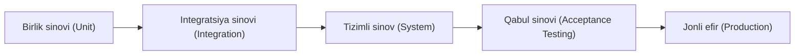
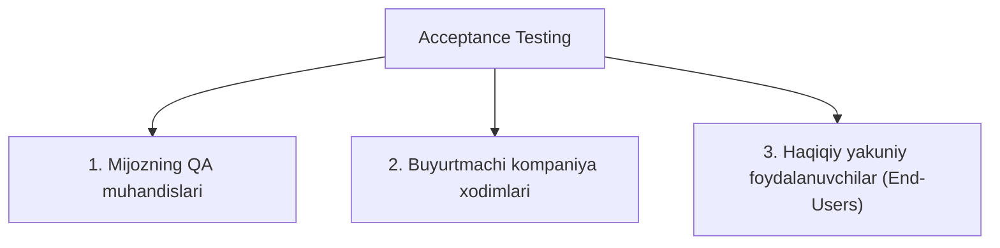
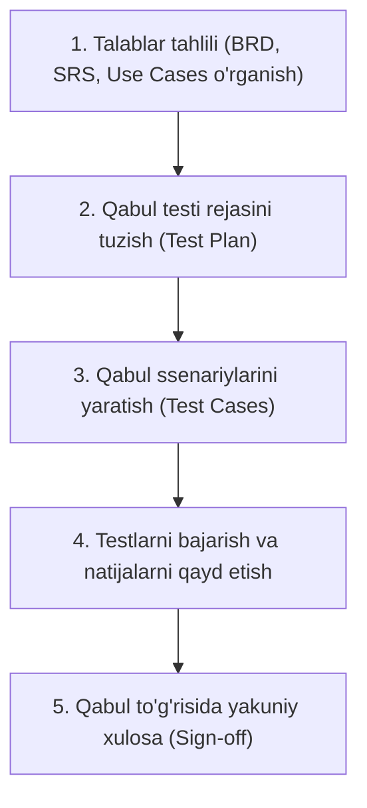

import { Callout } from 'nextra/components'

# Qabul sinovi (Acceptance Testing)

**Qabul sinovi (Acceptance Testing)** — bu dasturiy ta'minotni ishlab chiqish jarayonidagi sinovlarning to'rtinchi va yakuniy darajasi bo'lib, unda tizim biznes talablariga va yakuniy foydalanuvchilar ehtiyojlariga to'liq javob berishi hamda foydalanishga topshirilishga (release/delivery) tayyorligi tekshiriladi.

---

## Acceptance Testing nima va u nega zarur?

Dastur allaqachon birlik (unit), integratsion va tizimli (system) testlardan o'tgan bo'lsa-da, qabul sinovi o'tkazilishi shart. Buning asosiy sabablari quyidagilardir:

1. **Talablarning o'zgarishi va muloqotdagi bo'shliqlar:** Loyiha davomida mijoz talablari o'zgargan, ammo bu o'zgarishlar ishlab chiquvchilarga to'liq yetib bormagan bo'lishi mumkin.
2. **Dasturchilarning subyektiv talqini:** Dasturchi texnik talablar hujjatini o'z tushunchasi bo'yicha kodga aylantiradi, bu esa mijozning haqiqiy biznes qarashidan farq qilishi mumkin.
3. **Faqat real foydalanishda chiqadigan xatolar:** Dastur faqat mijozning real biznes ssenariylari va haqiqiy ishlab chiqarish ma'lumotlari bilan sinab ko'rilgandagina ba'zi yashirin kamchiliklar fosh bo'ladi.

<Callout type="info">
Hech qaysi buyurtmachi yoki biznes vakili dasturni tekshirmasdan qabul qilmaydi. Yakuniy ruxsat berish (Sign-off) uchun ular o'zlarining qabul sinovini o'tkazadilar.
</Callout>

---

## Qabul sinovini kimlar o'tkazadi?

Qabul sinovi turli loyihalarda va turli sharoitlarda turlicha subyektlar tomonidan amalga oshiriladi:

### 1-holat: Mijozning maxsus test muhandislari (Customer QA)
* Dastur ishlab chiquvchi kompaniya (masalan, autsorsing IT kompaniyasi) dasturni topshirgandan so'ng, buyurtmachi tashkilotning o'z test muhandislari uni mijoz infratuzilmasida tekshiradilar.
* Bu muhandislar biznes sohasini chuqur biluvchi (domain experts) mutaxassislar bo'lib, real ma'lumotlar bilan ishlaydilar.

### 2-holat: Kompaniya xodimlari (Ichki foydalanuvchilar)
* Agar alohida testchilar bo'lmasa, ilova buyurtmachi tashkilotning 20-30 nafar amaliy xodimlariga tarqatiladi.
* Xodimlar kundalik ish faoliyatida dasturdan foydalanib, xatoliklarni aniqlaydilar.
* Ushbu jarayonda quyidagi so'rovlar yuzaga keladi:
  * **REF (Request for Enhancement):** Funksionallikni yaxshilash yoki qulaylashtirish bo'yicha takliflar.
  * **CR (Change Request):** Dastlab noto'g'ri berilgan yoki o'zgargan talablar bo'yicha o'zgartirish kiritish so'rovi.

### 3-holat: Yakuniy tashqi foydalanuvchilar (Real End-Users)
* Dastur keng ommaga taqdim etiladi (masalan, Beta-versiya sifatida).
* Olingan foydalanuvchi fikr-mulohazalari (feedback) asosida keyingi relizlar yoki kritik xatolar uchun tezkor tuzatishlar (**Hotfix**) chiqariladi.

---

## Qabul sinovining asosiy turlari

| Tur | Qisqartma | Tavsif |
| :--- | :--- | :--- |
| **Foydalanuvchi qabul sinovi** | **UAT** (User Acceptance Testing) | Dastur foydalanuvchilar uchun qulayligi va ularning ish ehtiyojlariga mosligini tekshirish. |
| **Biznes qabul sinovi** | **BAT** (Business Acceptance Testing) | Tizim belgilangan biznes maqsadlari va moliyaviy talablarni qondirishini tekshirish. |
| **Shartnoma bo'yicha qabul sinovi** | **CAT** (Contract Acceptance Testing) | Loyiha boshida tuzilgan shartnomada ko'rsatilgan SLA va texnik shartlarga moslikni tekshirish. |
| **Regulyator / Qonuniy qabul sinovi** | **RAT** (Regulation Acceptance Testing) | Qonunchilik, xavfsizlik va davlat standartlari talablariga moslikni tekshirish (masalan, GDPR, HIPAA). |
| **Alfa va Beta sinovlari** | **Alpha & Beta** | Ichki jamoa (Alpha) va keng auditoriya (Beta) tomonidan o'tkaziladigan qabul bosqichlari. |

---

## Qabul sinovini o'tkazish bosqichlari

Qabul sinovi quyidagi ketma-ketlikda tashkil etiladi:

1. **Talablar tahlili:** BRD (Business Requirements Document), SRS va biznes Use Case hujjatlari tahlil qilinadi.
2. **Qabul testi rejasi:** Qabul mezonlari (Acceptance Criteria), sinov muddati va mas'ullar belgilanadi.
3. **Test ssenariylarini loyihalash:** Asosiy e'tibor texnik detallarga emas, balki real hayotiy biznes ssenariylariga qaratiladi.
4. **Testlarni bajarish:** Testchilar va mijoz vakillari UAT muhitida testlarni birgalikda amalga oshiradilar.
5. **Maqsadlarning tasdiqlanishi:** Dastur barcha qabul mezonlariga javob bersa, rasmiy qabul hujjati imzolanadi va loyiha ishga tushiriladi (Production).

---

## Qabul sinovida foydalaniladigan avtomatlashtirish vositalari

* **Cucumber / SpecFlow:** BDD (Behavior Driven Development) yondashuvi orqali qabul ssenariylarini oddiy inson tilida (Gherkin: Given-When-Then) yozish va avtomatlashtirish imkonini beradi.
* **FitNesse:** Biznes talablari va test ma'lumotlarini jadval shaklida kiritish hamda testlarni avtomatlashtirilgan tarzda bajarish vositasi.
* **Watir:** Veb-brauzer orqali qabul testlarini bajarish uchun mo'ljallangan avtomatlashtirish vositasi.

---

## Afzalliklari va Kamchiliklari

### Afzalliklari
* Buyurtmachining mahsulotga bo'lgan ishonchini oshiradi.
* Dasturiy ta'minotning real biznes ehtiyojlariga mos kelishini kafolatlaydi.
* Loyiha ishlab chiqarishga (Production) chiqqandan so'ng yuzaga kelishi mumkin bo'lgan qimmatbaho xatolar xavfini bartaraf etadi.

### Kamchiliklari
* Agar buyurtmachi test jarayonida faol ishtirok etmasa, sinov kutilgan natijani bermaydi.
* Test ssenariylari mijoz tomonidan tushunarsiz deb topilsa, o'zaro kelishmovchiliklar yuzaga kelishi mumkin.
