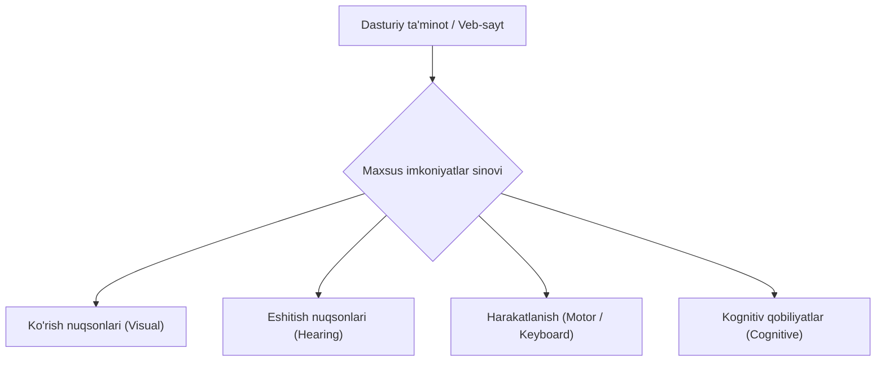

import { Callout } from 'nextra/components'

# Maxsus imkoniyatlar sinovi (Accessibility Testing)

**Maxsus imkoniyatlar sinovi (Accessibility Testing / a11y)** — bu dasturiy ta'minotning imkoniyati cheklangan (ko'rish, eshitish, harakatlanish yoki aqliy qobiliyati zaiflashgan) shaxslar hamda keksa yoshdagi insonlar uchun to'siqsiz va qulay bo'lishini tekshirish jarayonidir.

U dasturiy mahsulotning xalqaro **WCAG (Web Content Accessibility Guidelines)**, **Section 508** hamda **ADA (Americans with Disabilities Act)** qonunlari va standartlariga to'liq mos kelishini ta'minlaydi.

---

## Foydalanuvchilar toifalari va ularga yordamchi texnologiyalar

Maxsus imkoniyatlar sinovi asosan quyidagi guruh foydalanuvchilarining ehtiyojlarini qondirishga qaratilgan:

| Imkoniyat turi | Muammo tavsifi | Qo'llaniladigan yordamchi texnologiya (Assistive Tech) |
| :--- | :--- | :--- |
| **Ko'rish nuqsonlari (Visual)** | Ko'zi ojizlik, past ko'rish, rang ajrata olmaslik (Color Blindness) | Ekran o'quvchilari (Screen Readers: NVDA, JAWS, VoiceOver), ekran kattalashtirgichlar (Zoom) |
| **Eshitish nuqsonlari (Hearing)** | Zaif eshitish yoki to'liq karlik | Videolar uchun subtitrlar (Captions), matnli transkriptlar, vizual ogohlantirishlar |
| **Harakatlanish nuqsonlari (Motor)** | Qo'llar harakatining cheklanganligi, titrash (Tremor) | Faqat klaviatura (Tab, Enter) bilan boshqarish, bosh bilan boshqariladigan sichqonchalar |
| **Kognitiv nuqsonlar (Cognitive)** | Diqqat yetishmasligi, disleksiya, xotira zaifligi | Sodda interfeys, aniq tushunarli xatolar matni, chalg'ituvchi animatsiyalardan qochish |

---

## Asosiy sinov qoidalari va standartlari

Dasturiy ta'minotni tekshirishda quyidagi qat'iy mezonlarga e'tibor qaratiladi:

### 1. Rasmlar uchun muqobil matn (Alt Text)
Har bir muhim rasm va grafikada uning ma'nosini tushuntiruvchi `alt` atributi bo'lishi shart. Ekran o'qish dasturi (Screen Reader) ko'zi ojiz odamga rasm o'rniga aynan shu matnni ovozli o'qib beradi.

### 2. Rang kontrasti (Color Contrast)
Matn va uning orqa fon rangi o'rtasidagi kontrast yetarli darajada yuqori bo'lishi kerak. WCAG 2.1 AA darajasi bo'yicha oddiy matnlar uchun minimal kontrast nisbati **4.5:1** bo'lishi talab etiladi.

### 3. To'liq klaviatura orqali boshqaruv (Keyboard Accessibility)
Foydalanuvchi sichqonchadan umuman foydalanmasdan, faqat `Tab`, `Shift + Tab`, `Enter` va `Space` tugmalari yordamida saytning barcha havolalari, tugmalari va shakllarini to'liq ishlata olishi kerak. Joriy faol element atrofida yaqqol ko'rinadigan fokus indikatori (**Focus Outline**) bo'lishi shart.

### 4. Ranglarga to'liq tayanib qolmaslik
Muhim ma'lumot faqat rang bilan berilmasligi kerak. Masalan, xatolik faqat qizil hoshiya bilan emas, balki ogohlantiruvchi belgi va matn bilan ham ko'rsatilishi shart (chunki daltonik insonlar qizil va yashil rangni bir xil kulrang ko'rishlari mumkin).

---

## Maxsus imkoniyatlarni qo'lda (Manual) tekshirish usullari

1. **Sichqonchani chetga surib qo'yish:** Sayt bo'ylab faqat `Tab` tugmasi bilan harakatlanib, buyurtma berish yoki ro'yxatdan o'tish mumkinligini tekshirish;
2. **Ekran o'quvchi (Screen Reader) bilan test qilish:** Bepul **NVDA** yoki brauzerning o'rnatilgan vositasi yordamida ko'zni yumgan holda sahifadagi ma'lumotlarni tushunishga urinib ko'rish;
3. **Ekran masshtabini 200% ga oshirish:** Shrift va elementlar kattalashganda matnlar ustma-ust tushib ketmasligiga yoki ekrandan chiqib ketmasligiga ishonch hosil qilish;
4. **Yuqori kontrast rejimini (High Contrast Mode) yoqish:** Operatsion tizimning yuqori kontrastli rejimida dizayn va matnlar to'g'ri aks etishini ko'rish.

---

## Ommabop avtomatlashtirilgan vositalar

* **WAVE (Web Accessibility Evaluation Tool):** Sahifadagi kontrast, tuzilma va etishmayotgan teglar bo'yicha vizual hisobot beruvchi brauzer kengaytmasi;
* **Axe DevTools:** Ishlab chiquvchilar va testchilar orasida eng mashhur va xatolik ko'rsatkichi past bo'lgan vosita;
* **Google Lighthouse:** Chrome brauzeriga o'rnatilgan audit vositasi bo'lib, sahifaning Accessibility ballini (0 dan 100 gacha) chiqarib beradi;
* **Color Oracle:** Daltonizmning turli shakllarini (deuteranopiya, protanopiya) modellashtirib ko'rsatuvchi rang filtri.
