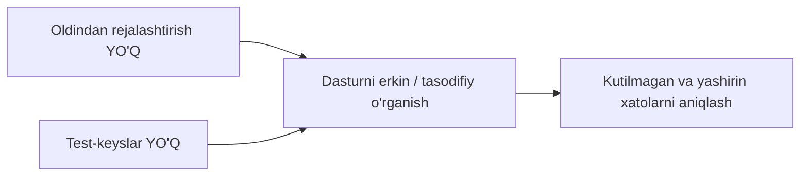
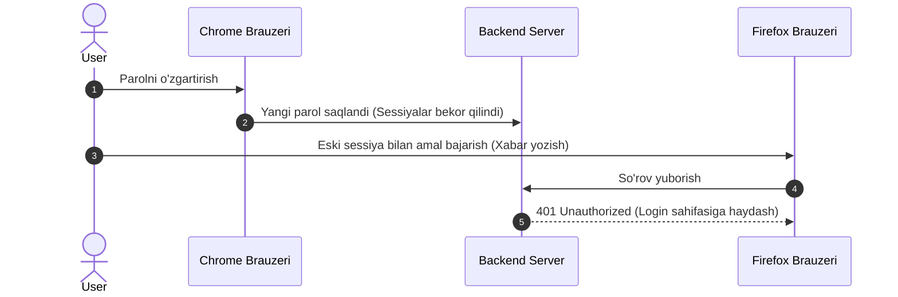
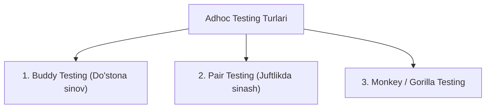

import { Callout } from 'nextra/components'

# Adhoc sinov (Adhoc Testing)

**Adhoc sinov (Adhoc Testing)** — bu hech qanday oldindan tuzilgan reja, rasmiy test-keyslar yoki hujjatlarsiz, tizimni tasodifiy (random) va erkin tarzda sinab ko'rish usulidir.

U dasturiy ta'minotni "sindirib ko'rish" (break the software) va an'anaviy sinovlar orqali topib bo'lmaydigan yashirin nuqsonlarni aniqlash maqsadida test muhandisining intuitsiyasi va tajribasiga tayangan holda o'tkaziladi.

---

## Nega Adhoc sinov o'tkaziladi?

Professional test muhandislari talablar hujjati bo'yicha ketma-ket (A $\rightarrow$ B $\rightarrow$ C $\rightarrow$ D) harakat qilishga odatlangan. Ammo **haqiqiy foydalanuvchilar hech qachon dasturdan qat'iy qoidalar bo'yicha foydalanmaydi**:
* Ular sahifalar bo'ylab tartibsiz sakraydi;
* Orqaga va oldinga tugmalarini ketma-ket bosadi;
* Bir vaqtning o'zida bir nechta oynani ochib, turli xil qarama-qarshi amallarni bajaradi;
* Maydonlarga kutilmagan va mantiqsiz belgilarni kiritadi.

Adhoc sinovining asosiy vazifasi — aynan mana shunday tasodifiy va tartibsiz harakatlarni modellashtirish orqali tizim barqarorligini tekshirishdir.

---

## Hayotiy misollar (Scenarios)

### 1-ssenariy: Jarayonlar ketma-ketligini buzish
Standart xarid jarayoni: **Mahsulot tanlash $\rightarrow$ Savat $\rightarrow$ Yetkazib berish manzili $\rightarrow$ To'lov**.
Adhoc sinovda testlovchi manzil kiritmasdan to'g'ridan-to'g'ri to'lov sahifasining URL manziliga o'tib ko'radi yoki to'lov vaqtida brauzerning "Orqaga" tugmasini qayta-qayta bosadi.

### 2-ssenariy: Bir nechta sessiyalar to'qnashuvi
Foydalanuvchi bitta hisob bilan bir vaqtning o'zida ikkita brauzerda (Chrome va Firefox) tizimga kiradi. Chrome brauzerida parolini o'zgartiradi, keyin esa Firefox orqali xabar yuborishga urinadi. To'g'ri ishlangan tizim sessiyani darhol to'xtatib, foydalanuvchini yana kirish (Login) sahifasiga yo'naltirishi shart.

---

## Adhoc sinovining asosiy turlari

### 1. Buddy Testing (Do'stona sinov)
* Kamida ikki kishi: **bitta dasturchi (developer)** va **bitta test muhandisi (QA)** birgalikda ishlaydi.
* Odatda birlik sinovlari (Unit testing) tugashi bilan o'tkaziladi. Dasturchi kod qanday tuzilganini tushuntiradi, testlovchi esa darhol o'z g'oyalari bilan funksiyani turli tomondan sinab ko'radi.

### 2. Pair Testing (Juftlikda sinash)
* **Ikkita test muhandisi** bitta kompyuterda yonma-yon o'tirib sinov o'tkazadi.
* Biri dasturni ishlatadi va turli ssenariylarni sinab ko'radi, ikkinchisi esa jarayonni tahlil qilib, yangi g'oyalarni taklif qiladi va topilgan kamchiliklarni qayd etib boradi.

### 3. Monkey / Gorilla Testing
* Ma'lum bir modulni hech qanday mantiqsiz, tasodifiy va juda agressiv tarzda (tezkor tugmalar bosish, tasodifiy belgilar kiritish) sinovdan o'tkazish.

---

## Adhoc va Exploratory Testing farqi

Ko'pincha bu ikki tushuncha bir-biriga adashtiriladi:

| Xususiyat | Adhoc Testing | Exploratory Testing (Tadqiqiy) |
| :--- | :--- | :--- |
| **Tuzilishi** | To'liq tartibsiz, hech qanday qoidalarsiz | Ma'lum charter, maqsad va strategiyaga ega |
| **Hujjatlashtirish** | Hech narsa yozilmaydi (faqat topilgan bug'lar) | Test qaydlari (mind maps, notes) yuritiladi |
| **Vaqt chegarasi** | Istalgan erkin vaqtda bajariladi | Odatda qat'iy vaqt bloklariga (Time-boxing) bo'linadi |
| **Bajarish maqsadi** | Dasturni sindirish (Break the application) | Tizimni o'rganish va funksionalini tushunish |

---

## Afzalliklari va Kamchiliklari

### Afzalliklari
* **Hujjatlashtirish talab etilmaydi:** Vaqt to'liq dasturni amalda sinashga sarflanadi.
* **Kutilmagan xatolar:** Standart testlar ko'zdan qochirgan juda murakkab va noan'anaviy xatolar aniqlanadi.
* **Tezkorlik:** Loyihani topshirish arafasida vaqt kam qolganda tezkor tekshiruv uchun qulay.

### Kamchiliklari
* **Takrorlash qiyinligi (Hard to reproduce):** Xatolik tasodifiy harakatlar natijasida chiqqani sababli, testlovchi unga aynan qaysi ketma-ketlikda kelganini eslay olmasligi mumkin.
* **Qamrovni baholash imkonsiz:** Tizimning qaysi qismlari tekshirildi-yu, qaysilari qolib ketganini aniqlash qiyin.
* **Tajribaga bog'liqlik:** Tizimni yaxshi bilmagan yangi mutaxassis Adhoc sinovda samarasiz vaqt o'tkazishi mumkin.
