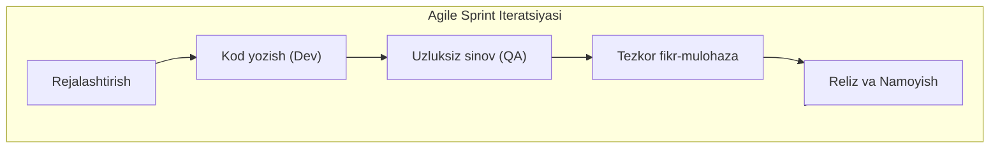
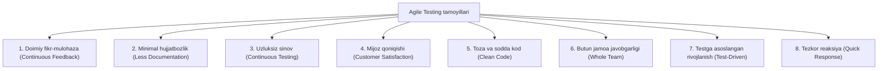
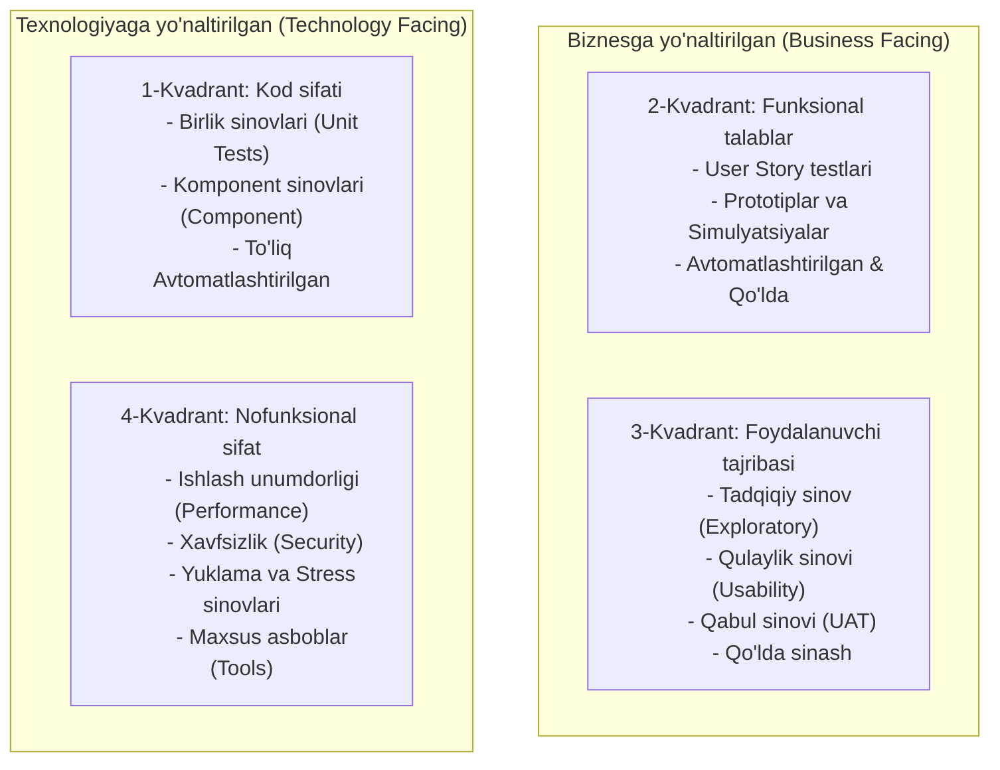

import { Callout } from 'nextra/components'

# Agile sinov (Agile Testing)

**Agile sinov (Agile Testing)** — bu tezkor dasturiy ta'minot ishlab chiqish (**Agile Software Development**) metodologiyasi tamoyillariga asoslangan, iterativ va uzluksiz amalga oshiriladigan sinov amaliyotidir.

Klassik Waterfall modelidan farqli o'laroq, Agile sinovda testlash jarayoni ishlab chiqish yakunlangandan so'ng emas, balki loyihaning birinchi kunidanoq dasturchilar, testerlar, biznes tahlilchilar va mijozlarning yaqin hamkorligida (**Continuous Testing**) parallel olib boriladi.

---

## Agile sinovining 8 ta asosiy tamoyili

1. **Doimiy fikr-mulohaza:** Har bir yangi kod yoki o'zgarish bo'yicha darhol xulosa beriladi.
2. **Kamroq hujjatbozlik:** Qalin test-planlar o'rniga qisqa chek-listlar, foydalanuvchi hikoyalari (User Stories) va qabul mezonlariga (Acceptance Criteria) tayaniladi.
3. **Uzluksiz sinov (Continuous Testing):** Sinov jarayoni sprintning har bir bosqichida to'xtovsiz davom etadi.
4. **Butun jamoaning ishtiroki (Whole-Team Approach):** Sifat faqat QA muhandisining emas, balki dasturchi, dizayner, PO (Product Owner) va testerlarning umumiy mas'uliyatidir.
5. **Testga asoslanganlik (Test-Driven):** Kod yozishdan oldin yoki parallel ravishda testlar ishlab chiqiladi.

---

## Agile Testing Kvadrantlari (Brian Marick modeli)

Agile metodologiyasida sinovlar o'z yo'nalishi va maqsadiga ko'ra to'rtta kvadrantga bo'linadi:

| Kvadrant | Yo'nalishi | Bajarilish usuli | Sinov turlari |
| :--- | :--- | :--- | :--- |
| **Q1 (Ichki sifat)** | Texnologiyaga yo'naltirilgan | Avtomatlashtirilgan | Unit testlar, Komponent testlar, TDD |
| **Q2 (Funksionallik)** | Biznesga yo'naltirilgan | Avtomatlashtirilgan va Qo'lda | Funksional testlar, User Story qabuli, BDD |
| **Q3 (Mijoz nigohi)** | Biznesga yo'naltirilgan | Qo'lda sinash | Exploratory testing, Usability, UAT, Alfa/Beta |
| **Q4 (Tizim kuchi)** | Texnologiyaga yo'naltirilgan | Asboblar (Tools) orqali | Yuklama, Stress, Xavfsizlik, Masshtablilik |

---

## Agile sinovidagi ilg'or metodologiyalar

* **TDD (Test-Driven Development):** Kod yozishdan oldin muvaffaqiyatsiz test yoziladi, so'ngra testdan o'tadigan minimal kod yaratiladi va kod refaktoring qilinadi (`Red -> Green -> Refactor`).
* **BDD (Behavior-Driven Development):** Texnik bo'lmagan shaxslar (mijoz, biznes tahlilchi) tushunadigan tabiiy tilda (`Given - When - Then`) ssenariylar yoziladi (Cucumber, SpecFlow).
* **ATDD (Acceptance Test-Driven Development):** Butun jamoa birgalikda funksiyani topshirishdan oldin uning qabul mezonlarini belgilaydi.
* **Exploratory Testing (Tadqiqiy sinov):** Qat'iy ssenariylarsiz ilovani erkin o'rganish orqali yashirin xatolar va mantiqiy nomuvofiqliklarni topish.

---

## Agile sinovining hayotiy sikli (5 bosqich)

1. **Ta'sirni baholash (Impact Assessment):** Oldingi sprint natijalari va mijozlar talablari asosida yangi iteratsiya maqsadlari belgilanadi.
2. **Agile sinovni rejalashtirish (Agile Test Planning):** Dasturchilar va testerlar har bir vazifa (Task) bo'yicha sinov hajmini kelishib oladi.
3. **Kundalik uchrashuvlar (Daily Scrum):** Har kungi 15 daqiqalik yig'ilishda test jarayoni, to'siqlar va topilgan muhim xatolar muhokama qilinadi.
4. **Relizga tayyorgarlik (Release Readiness):** Bajarilgan topshiriqlar "Done" (Bajarildi) mezonlariga mosligi va ishlab chiqarishga tayyorligi tekshiriladi.
5. **Agile sharh va retrospektiva (Test Agility Review):** Sprint yakunida sinov jarayoni qanday o'tgani, nimani yaxshilash mumkinligi tahlil qilinadi.

<Callout type="info">
  Agile sinovda muvaffaqiyat garovi — **Avtomatlashtirilgan regressiya testlari (CI/CD)** dir. Kod har safar yangilanganda avtomatik testlar ishga tushib, tizim butunligini saqlab turadi.
</Callout>
