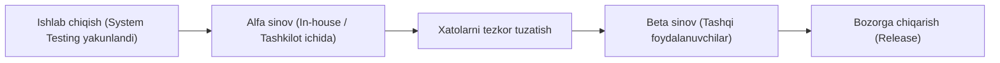
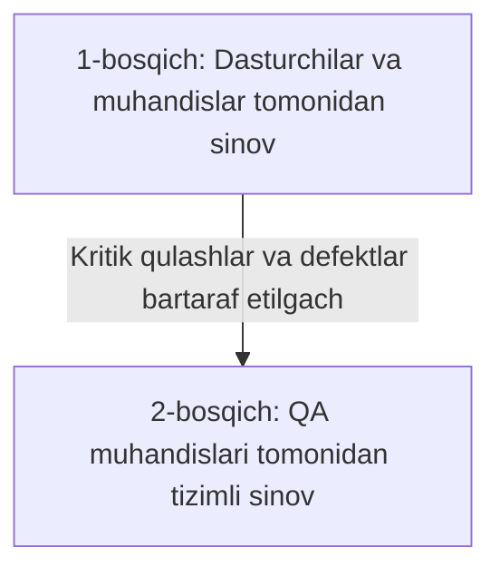
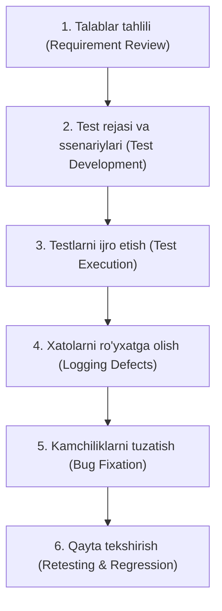

import { Callout } from 'nextra/components'

# Alfa sinov (Alpha Testing)

**Alfa sinov (Alpha Testing)** — bu dasturiy ta'minotni ishlab chiquvchi tashkilotning o'zida (in-house), nazorat qilinadigan laboratoriya muhitida, ichki mutaxassislar (dasturchilar va QA muhandislari) tomonidan o'tkaziladigan qabul sinovi (Acceptance Testing) turidir.

U dastur birlik (unit), integratsion va tizimli (system) sinovlardan to'liq o'tganidan so'ng, lekin mahsulot keng ommaga (Beta sinoviga yoki bozorga) chiqarilishidan oldin amalga oshiriladi.

---

## Alpha Testing nima?

Alfa sinovning asosiy maqsadi — mahsulotning barcha funksiyalari talablarga muvofiq ishlashini tekshirish, kutilmagan qulashlar (crash) va jiddiy nosozliklarni mijoz yoki keng jamoatchilik ko'rmasdan oldin bartaraf etishdir.

Sinov ishlab chiquvchilarning bevosita kuzatuvi ostida maxsus test laboratoriyalarida olib boriladi. Dasturchilar testlovchilarning harakatlarini real vaqtda kuzatib, yuzaga kelgan xatoliklarni shu zahotiyoq o'rganishlari va tuzatishlari mumkin.

<Callout type="info">
Alfa sinovida keng omma yoki tashqi mijozlar ishtirok etmaydi. U faqat tashkilotning ichki xodimlari va mustaqil QA jamoasi ishtirokida, yopiq eshiklar ortida o'tkaziladi.
</Callout>

---

## Alfa sinovining ikki asosiy fazasi (Phases)

Alfa sinovi odatda ikki ketma-ket bosqichda tashkil qilinadi:

1. **1-bosqich (Dasturchilar va tizim muhandislari):**
   * Ushbu bosqichda ishlab chiquvchilar dasturning dastlabki yig'ilishini (build) tekshiradilar.
   * Asosiy e'tibor tizimning qulashlari (crashes), yetishmayotgan muhim funksiyalar va hujjatlashtirishdagi nuqsonlarni tezda aniqlashga qaratiladi.
   * Nosozliklarni tezkorlik bilan topish uchun maxsus apparat va dasturiy vositalar (debuggers) qo'llaniladi.

2. **2-bosqich (Professional QA jamoasi):**
   * Malakali test muhandislari tizimni ham oq quti (White-box), ham qora quti (Black-box) texnikalaridan foydalangan holda keng qamrovli sinovdan o'tkazadilar.
   * Barcha kutilgan va kutilmagan foydalanuvchi ssenariylari tekshirib chiqiladi.

---

## Alfa sinovini o'tkazish jarayoni (Workflow)

Alfa sinov jarayoni quyidagi standart bosqichlarni o'z ichiga oladi:

1. **Talablar tahlili (Requirement Review):** Dastur arxitekturasi va funksional talablar to'liq o'rganiladi.
2. **Test rejasi va ssenariylari:** Sinov strategiyasi, laboratoriya muhiti parametrlari va test-keyslar ishlab chiqiladi.
3. **Ijro etish:** Rejalashtirilgan test ssenariylari laboratoriya sharoitida bajariladi.
4. **Xatoliklarni ro'yxatga olish:** Aniqlangan barcha kamchiliklar defektlarni kuzatish tizimiga (masalan, Jira) kiritiladi.
5. **Xatolarni tuzatish:** Dasturchilar aniqlangan defektlarni zudlik bilan bartaraf etadilar.
6. **Qayta sinash:** Tuzatilgan kod qayta tekshirilib, yangi xatolar paydo bo'lmaganiga ishonch hosil qilinadi.

---

## Alfa sinovining o'ziga xos xususiyatlari

* **Nazorat qilinadigan muhit:** Sinov sun'iy ravishda yaratilgan, barcha parametrlari oldindan ma'lum bo'lgan laboratoriya muhitida olib boriladi.
* **Tezkor tuzatish:** Dasturchilar va testlovchilar bitta binoda yoki yaqin aloqada bo'lganligi bois, xatolarni ko'rsatish va tuzatish minimal vaqt oladi.
* **Gibrid texnika:** Ham dastur kodining ichki tuzilishi (oq quti), ham tashqi interfeysi (qora quti) bir vaqtda tekshirilishi mumkin.
* **Beta sinoviga yo'llanma:** Mahsulot faqat alfa sinovidan muvaffaqiyatli o'tgandan keyingina Beta bosqichiga tavsiya etiladi.

---

## Afzalliklari va Kamchiliklari

### Afzalliklari
* Mahsulotning ishonchliligi va barqarorligi haqida erta tushuncha beradi.
* Kritik xatoliklarning tashqi muhitga chiqib ketishining oldini oladi va kompaniya obro'sini himoya qiladi.
* Dasturchilar xatoliklarni bevosita o'z ko'zlari bilan ko'rib, tezda tuzatish imkoniga ega bo'ladilar.
* Yakuniy relizgacha bo'lgan vaqtni va loyihaning umumiy xarajatlarini qisqartiradi.

### Kamchiliklari
* Laboratoriya sharoiti hech qachon real dunyoning barcha turli-tuman shart-sharoitlarini (tarmoq uzilishlari, turfa xil qurilmalar va brauzerlar) 100% aks ettira olmaydi.
* Testlovchilar tashkilot a'zosi bo'lganligi sababli ularning qarashlarida ma'lum darajada ko'nikish yoki subyektivlik (bias) bo'lishi mumkin.
