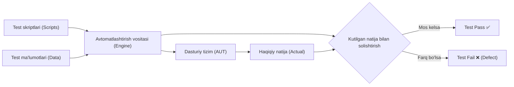
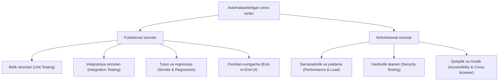
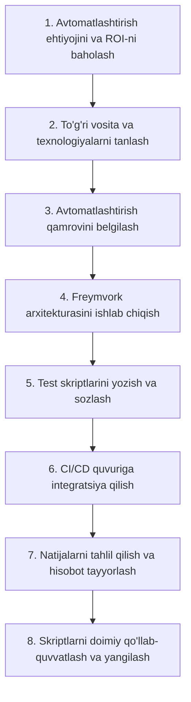

import { Callout } from 'nextra/components'

# Avtomatlashtirilgan sinov (Automation Testing)

**Avtomatlashtirilgan sinov (Automation Testing)** — maxsus dasturiy vositalar, skriptlar va freymvorklar yordamida test holatlarini inson aralashuvisiz avtomatik tarzda bajarish, kutilgan va haqiqiy natijalarni taqqoslash hamda tizim sifatini baholash jarayonidir.

Dasturiy ta'minot ishlab chiqish hayotiy siklida (SDLC) har bir yangi funksiya yoki tuzatish kiritilganda butun tizimni qo'lda qayta-qayta sinab chiqish juda ko'p vaqt va resurs talab etadi. Avtomatlashtirilgan sinov inson omili sababli yuzaga keladigan xatoliklarni kamaytiradi, testlarning bajarilish tezligini keskin oshiradi va uzluksiz integratsiya hamda uzluksiz yetkazib berish (CI/CD) jarayonlarining asosi hisoblanadi.

---

## Qo'lda sinov (Manual) va Avtomatlashtirilgan sinov (Automation) taqqoslanishi

| Xususiyati | Qo'lda sinov (Manual Testing) | Avtomatlashtirilgan sinov (Automation Testing) |
| :--- | :--- | :--- |
| **Ijrochi** | Inson (QA muhandisi) tomonidan bosqichma-bosqich bajariladi. | Maxsus vositalar, skriptlar va dasturlar orqali bajariladi. |
| **Tezlik va muddat** | Sekin va ko'p vaqt talab qiladi. | O'ta tezkor (bir nechta testlar parallel ishlay oladi). |
| **Inson omili va aniqlik** | Qaytariluvchi holatlarda charchoq va e'tiborsizlik xavfi mavjud. | 100% aniq va qat'iy mantiqqa asoslangan. |
| **Qayta ishlatiluvchanlik** | Har gal test stsenariylari boshqatdan qo'lda bajarilishi kerak. | Yozilgan skriptlar har bir yangi relizda cheksiz marta qayta ishlatiladi. |
| **Boshlang'ich xarajat** | Dastlabki xarajat pastroq (faqat xodimlar vaqti). | Dastlabki xarajat yuqori (vositalar, freymvork yaratish va muhandislar). |
| **ROI (Investitsiya qaytishi)** | Uzoq muddatda ROI past yoki o'zgarmas. | Uzoq muddatda ROI (Return on Investment) juda yuqori. |
| **Ideal sohalar** | Tadqiqiy (Exploratory), qulaylik (Usability) va adhoc sinovlar. | Regressiya (Regression), yuklama (Load), tutun (Smoke) va API sinovlari. |

---

## Avtomatlashtirishning asosiy yo'nalishlari va turlari

Avtomatlashtirilgan testlar funksional va nofunksional yo'nalishlarga bo'linadi:

### 1. Funksional avtomatlashtirish
- **Birlik sinovi (Unit Testing):** Dasturchilar tomonidan yozilgan alohida funksiya va modullarni sinovchi eng quyi va tezkor testlar (masalan, JUnit, NUnit, PyTest, Jest).
- **Integratsiya va API sinovi (Integration & API Testing):** Turli modullar, mikroxizmatlar va ma'lumotlar bazasi o'rtasidagi ma'lumot almashinuvini tekshirish (REST, GraphQL, gRPC).
- **Regressiya sinovi (Regression Testing):** Kod o'zgarganda avvalgi funksiyalar buzilmaganligini doimiy tekshirib turish.
- **Oxiridan-oxirigacha sinov (E2E UI Testing):** Haqiqiy foydalanuvchi harakatlarini brauzer yoki mobil ilovada emulyatsiya qilish (tugmalarni bosish, formalar to'ldirish).

### 2. Nofunksional avtomatlashtirish
- **Yuklama va stress sinovlari (Load & Stress Testing):** Minglab virtual foydalanuvchilar oqimini simulyatsiya qilib tizimning bardoshliligini tekshirish (JMeter, k6, Gatling).
- **Xavfsizlik tahlili (Automated Security Scanning):** Zaifliklarni avtomatlashtirilgan skanerlar orqali aniqlash (OWASP ZAP, SonarQube).

---

## Avtomatlashtirish freymvorklari turlari

Avtomatlashtirish jarayonida skriptlarni tizimli yuritish uchun quyidagi me'moriy freymvorklar (Frameworks) qo'llaniladi:

1. **Chiziqli freymvork (Linear Scripting / Record & Playback):** Testlarni yozib olish va qayta ijro etish. O'rganish oson, biroq tizim o'zgarganda qo'llab-quvvatlash juda murakkab.
2. **Modulli freymvork (Modular-driven):** Tizim alohida mustaqil modullarga bo'linadi va har bir modul uchun mustaqil skriptlar yoziladi.
3. **Ma'lumotlarga asoslangan freymvork (Data-driven):** Test logikasi va test ma'lumotlari (Excel, CSV, JSON, Database) bir-biridan ajratiladi. Bitta test stsenariysi turli xil ma'lumotlar to'plami bilan qayta-qayta ishlatiladi.
4. **Kalit so'zlarga asoslangan freymvork (Keyword-driven):** Har bir amaliy harakat (masalan, `click`, `input`, `verify`) maxsus kalit so'zlarga biriktiriladi. Bu texnik bo'lmagan mutaxassislarga ham test yozish imkonini beradi.
5. **Gibrid freymvork (Hybrid Framework):** Data-driven va Keyword-driven yondashuvlarning afzalliklarini birlashtirgan, sanoatda eng ko'p foydalaniladigan yondashuv.
6. **Xulq-atvorga asoslangan freymvork (BDD - Behavior-Driven Development):** Test stsenariylari inson tiliga yaqin formatda (Gherkin: *Given-When-Then*) tuziladi (Cucumber, SpecFlow, Behave).

---

## Avtomatlashtirish jarayoni bosqichlari

Muvaffaqiyatli test avtomatlashtirish quyidagi bosqichlardan iborat bo'ladi:

1. **Ehtiyoj va ROI tahlili:** Qaysi testlarni avtomatlashtirish foyda keltirishini aniqlash. Kam takrorlanadigan yoki tez-tez o'zgaruvchan qismlarni avtomatlashtirish tavsiya etilmaydi.
2. **Asbob-uskunalarni tanlash:** Dastur tili, platformasi (Veb, Mobil, Desktop, API) va jamoaning bilim darajasiga mos vositani tanlash.
3. **Qamrovni belgilash:** Avtomatlashtiriladigan test holatlarini tanlash (asosan Regression va Smoke testlar).
4. **Freymvork yaratish:** Ma'lumotlarni boshqarish, log yozish, hisobot shakllantirish va xatoliklarni ushlash mexanizmlarini o'rnatish.
5. **Skriptlashtirish va tekshirish:** Test kodlarini yozish va ularning barqarorligini (flakiness yo'qligini) tekshirish.
6. **CI/CD integratsiyasi:** Har bir yangi kod qo'shilganda yoki relizdan oldin testlarni avtomatik ishga tushirish (GitHub Actions, GitLab CI, Jenkins).
7. **Qo'llab-quvvatlash (Maintenance):** Ilova interfeysi yoki biznes mantig'i o'zgarganda test skriptlarini tezkor yangilab borish.

---

## Mashhur test avtomatlashtirish vositalari

| Vosita | Turi / Qo'llanish sohasi | Qo'llab-quvvatlaydigan tillar / Platformalar | Asosiy afzalligi |
| :--- | :--- | :--- | :--- |
| **Selenium** | Veb ilovalarni sinash | Java, Python, C#, JavaScript, Ruby | Keng hamjamiyat, barcha brauzerlar va OS qo'llovi. |
| **Playwright** | Zamonaviy E2E veb sinov | TypeScript, JavaScript, Python, C#, Java | O'ta tezkor, avtomatik kutish (auto-wait), ko'p oyna va tarmoq monitoringi. |
| **Cypress** | Frontend veb sinov | JavaScript, TypeScript | O'rnatish oson, real vaqtda qayta yuklanish, brauzer ichida to'g'ridan-to'g'ri ishlash. |
| **Appium** | Mobil ilovalarni sinash (iOS, Android) | Ko'p tilli (Selenium protokoli asosida) | Mahalliy (Native), gibrid va mobil veb ilovalarni bir xil API bilan sinaydi. |
| **Postman / Newman** | API sinovlari | JavaScript | Qulay interfeys, kolleksiyalar va CI/CD bilan tezkor integratsiya. |
| **JMeter** | Yuklama va unumdorlik sinovi | Java asosida | O'n minglab virtual foydalanuvchilar oqimini yaratish, boy monitoring. |
| **Cucumber** | BDD (Xulq-atvorga asoslangan sinov) | Java, JavaScript, Ruby, Python | Gherkin sintaksisi orqali biznes va texnik jamoani birlashtiradi. |

---

## Avtomatlashtirishning afzalliklari va cheklovlari

### Afzalliklari:
- **Tezkor fikr-mulohaza (Fast Feedback):** Dasturchilar har bir o'zgarishdan so'ng bir necha daqiqa ichida xatolik haqida xabar oladi.
- **Vaqt va resurs tejami:** Katta hajmdagi regressiya testlarini tuni bilan yoki bir necha daqiqada inson aralashuvisiz bajarish mumkin.
- **Keng qamrov:** Turli brauzerlar, qurilmalar va ekran o'lchamlari bo'yicha bir vaqtda parallel tekshirish imkoniyati.
- **CI/CD bilan uzviy bog'liqlik:** Mahsulotni sifatli va tez ishlab chiqarishga chiqarish (Time to Market) imkoniyatini taqdim etadi.

### Cheklovlari va e'tibor qaratish kerak bo'lgan jihatlar:
- **Boshlang'ich xarajat:** Freymvork qurish va tajribali muhandislarni jalb qilish katta sarmoya talab qiladi.
- **Turg'unlik muammolari (Flaky Tests):** Noto'g'ri yozilgan yoki tarmoq kechikishlariga bog'liq testlar asossiz xato berib, jamoada ishonchsizlik uyg'otishi mumkin.
- **Qo'lda sinovni to'liq almashtira olmaydi:** Inson ko'zi, estetik his-tuyg'ular, tadqiqiy testlar va foydalanuvchi qulayligi (UX) kabi jihatlarni avtomatlashtirib bo'lmaydi.

<Callout type="info">
Avtomatlashtirishning oltin qoidasi: **"Tez-tez takrorlanadigan, vaqt ko'p oladigan va xatarga moyil bo'lgan testlarni avtomatlashtiring. Bir marta ishlatiladigan yoki har kuni o'zgaradigan interfeyslarni esa qo'lda sinash samaraliroqdir."**
</Callout>
