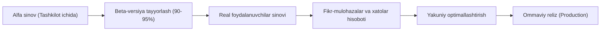
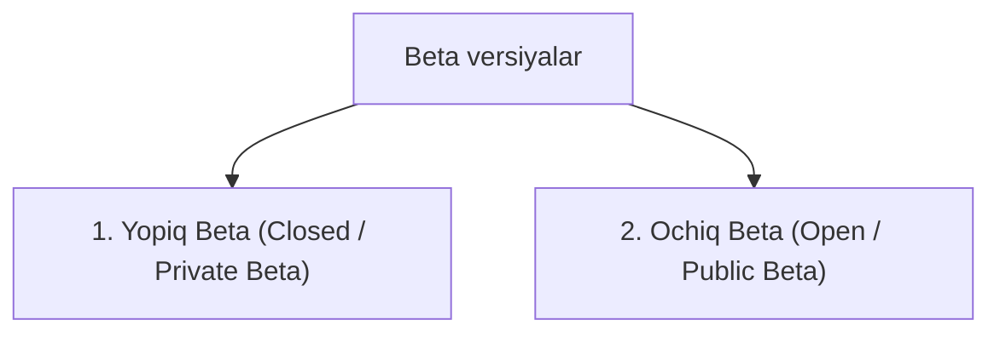
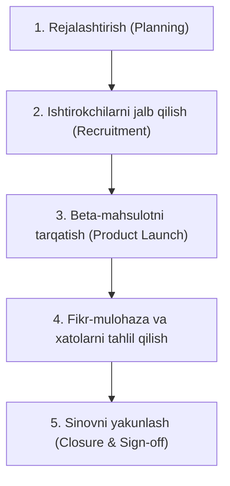

import { Callout } from 'nextra/components'

# Beta sinov (Beta Testing)

**Beta sinov (Beta Testing)** — bu dasturiy ta'minotning rasmiy relizidan oldin, tashqi muhitda real foydalanuvchilar (mijozlar, auditoriya) tomonidan o'tkaziladigan qabul sinovi (UAT) va "dala sinovi" (Field Test) turidir.

U dasturiy mahsulot **Alfa sinovdan** muvaffaqiyatli o'tgandan so'ng, ishlab chiquvchilarning bevosita ishtirokisiz, turli xil real qurilmalar, operatsion tizimlar va tarmoq sharoitlarida uning qulayligi, barqarorligi hamda funksionalligini baholash uchun amalga oshiriladi.

---

## Beta Testing nima va uning xususiyatlari

Beta sinovi mahsulot hayotiy siklining oxirgi bosqichlaridan biri bo'lib, unga 90-95% tayyor bo'lgan dastur taqdim etiladi.

**Beta sinovining asosiy xususiyatlari:**
* **Real muhit:** Sinov sun'iy laboratoriyada emas, foydalanuvchilarning shaxsiy kompyuterlari, smartfonlari va real internet sharoitida o'tkaziladi.
* **Haqiqiy foydalanuvchilar:** Sinovni dasturchi yoki testerlar emas, balki mahsulotning bo'lajak haqiqiy mijozlari va ixlosmandlari bajaradilar.
* **Qora quti usuli (Black-box):** Foydalanuvchilar dasturning ichki kodi bilan tanish emas, ular faqat tashqi interfeys bilan ishlaydilar.
* **To'g'ridan-to'g'ri fikr-mulohaza (Direct Feedback):** Dastur qulayligi (UX), tezligi va foydalanuvchiga yoqqan/yoqmagan tomonlari haqida real taassurotlar olinadi.

<Callout type="info">
Beta sinovi dasturiy mahsulotning bozordagi muvaffaqiyatsizlik xavfini kamaytiradi, chunki xatolar va tushunarsiz interfeys muammolari ommaviy sotuvga chiqishdan oldin aniqlanadi.
</Callout>

---

## Beta-versiyaning ikki asosiy ko'rinishi

Beta sinovi o'tkazilish auditoriyasiga qarab ikki xil bo'ladi:

### 1. Yopiq Beta (Closed / Private Beta)
* Faqat oldindan taklif qilingan yoki ro'yxatdan o'tgan cheklangan foydalanuvchilar guruhiga (masalan, 100-500 nafar) beriladi.
* Mahsulotning asosiy qiymati tayyor, ammo ayrim funksiyalar yoki qo'llanmalar to'liq yakunlanmagan bo'lishi mumkin.
* Maqsad: aniq belgilangan auditoriyadan chuqur texnik fikr-mulohazalarni olish.

### 2. Ochiq Beta (Open / Public Beta)
* Keng ommaga taqdim etiladi; istalgan foydalanuvchi dasturni yuklab olib sinab ko'rishi mumkin.
* Mahsulot relizga juda yaqin holatda bo'ladi.
* Maqsad: yuqori yuklamalarni (stress/load) tekshirish va keng ko'lamli qurilmalardagi yashirin xatolarni aniqlash.

---

## Beta sinovining hayotiy sikli (Lifecycle)

Beta sinovini tizimli o'tkazish quyidagi 5 bosqichdan iborat:

1. **Rejalashtirish (Planning):** Sinov maqsadi, muddati, kerakli foydalanuvchilar soni va qamrov doirasi belgilanadi.
2. **Ishtirokchilarni jalb qilish (Recruitment):** Maqsadli auditoriyaga mos keladigan beta-testerlar tanlab olinadi.
3. **Mahsulotni tarqatish (Product Launch):** Beta yig'ilmasi (build) foydalanuvchilarga o'rnatish qo'llanmalari bilan birga yetkaziladi.
4. **Fikr-mulohazalarni to'plash (Feedback & Evaluation):** Maxsus shakllar, ichki telemetriya yoki bug-tracker tizimlari orqali xatolar yig'iladi va dasturchilarga yuboriladi.
5. **Yakunlash (Closure):** Barcha jiddiy muammolar hal qilinib, belgilangan mezonlarga erishilgach, beta-sinov yopiladi va ishtirokchilarga minnatdorchilik bildiriladi.

---

## Alfa sinov va Beta sinov taqqoslashi

| Xususiyat | Alfa sinov (Alpha Testing) | Beta sinov (Beta Testing) |
| :--- | :--- | :--- |
| **O'tkaziladigan joy** | Ishlab chiquvchi tashkilot hududida (In-house / Lab) | Haqiqiy mijozlar va foydalanuvchilar muhitida |
| **Ishtirokchilar** | Dasturchilar va ichki QA muhandislari | Haqiqiy foydalanuvchilar va mijozlar |
| **O'tkazilish vaqti** | Tizimli sinovdan so'ng, Beta sinovidan oldin | Alfa sinovidan so'ng, rasmiy relizdan oldin |
| **Test turi** | Oq quti va Qora quti sinovlari uyg'unligi | Asosan Qora quti (Black-box) sinovi |
| **Nazorat darajasi** | Qat'iy nazorat qilinadigan laboratoriya | Nazorat qilinmaydigan erkin muhit |
| **Xatolarni tuzatish** | Darhol, joyida tuzatiladi | Feedback tahlil qilinib, keyingi relizlarda tuzatiladi |

---

## Kirish va Chiqish mezonlari (Entry & Exit Criteria)

### Kirish mezonlari (Entry Criteria)
* Alfa sinovi to'liq yakunlangan va rasmiy tasdiqlangan (Sign-off) bo'lishi;
* Dasturning beta yig'ilmasi (build) barqaror holatda bo'lishi;
* Foydalanuvchilar uchun o'rnatish va foydalanish yo'riqnomalari tayyor bo'lishi;
* Xatolar va takliflarni qabul qilish mexanizmi (masalan, test portali yoki forma) sozlangan bo'lishi.

### Chiqish mezonlari (Exit Criteria)
* Barcha kritik va yuqori darajadagi (Critical & Major) xatolar bartaraf etilgan bo'lishi;
* Foydalanuvchilarning asosiy e'tirozlari ko'rib chiqilgan bo'lishi;
* Beta sinovining yakuniy xulosaviy hisoboti (Beta Test Summary Report) tayyorlangan bo'lishi.
