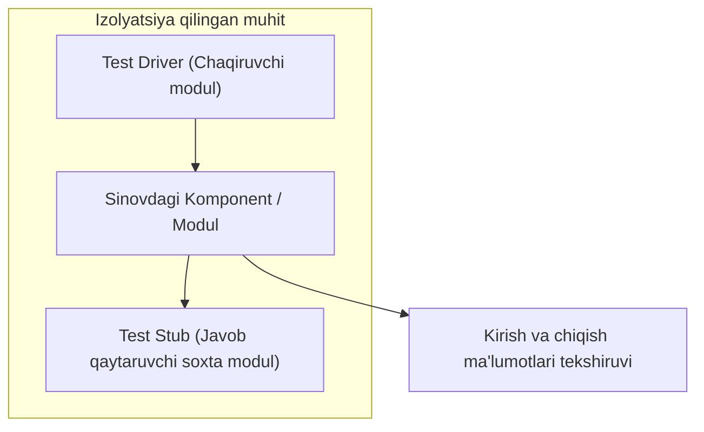
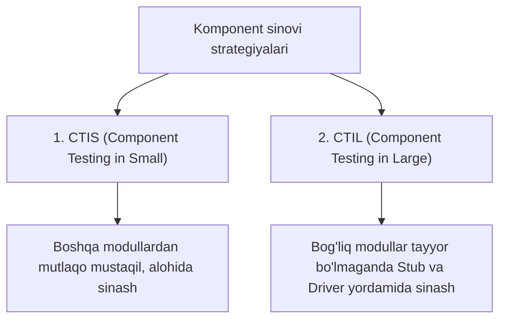
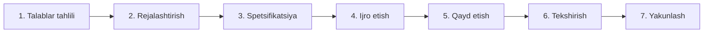

import { Callout } from 'nextra/components'

# Komponent sinovi (Component Testing)

**Komponent sinovi (Component Testing)** — bu dasturiy ta'minotning har bir mustaqil moduli yoki komponentini butun tizimning boshqa qismlaridan ajratilgan (**izolyatsiya qilingan**) holda uning kiritish-chiqarish (I/O) xatti-harakatlari va funksionalligini tekshirish jarayonidir.

Ushbu sinov turi ko'pincha **Modul sinovi (Module Testing)** yoki **Dastur sinovi (Program Testing)** deb ham yuritiladi. Komponent sinovi tizimli integratsiya (Integration Testing) bosqichidan oldin o'tkazilib, har bir blokning to'g'ri ishlashini kafolatlaydi.

---

## Komponent sinovining asosiy maqsadlari

* **Xatarlarni erta kamaytirish:** Nuqsonlarni dastlabki bosqichdayoq aniqlab, tuzatish narxini keskin pasaytirish.
* **Xatoliklarning keyingi bosqichlarga o'tishini to'sish:** Bitta modul ichidagi xatolar integratsiya va tizimli testlarga o'tib ketmasligini ta'minlash.
* **Funksional va nofunksional xususiyatlarni tekshirish:** Komponent hisob-kitoblarining to'g'riligi bilan bir qatorda uning xotira sarfini ham alohida baholash.
* **Modul ishonchliligini tasdiqlash:** Boshqa tizimlar bilan integratsiyadan oldin modul o'z shartnomasiga (Contract/API) to'liq mosligiga ishonch hosil qilish.

---

## Komponent sinovi strategiyalari (CTIS va CTIL)

Komponent sinovi murakkablik va bog'liqlik darajasiga ko'ra ikkita strategiyaga bo'linadi:

### 1. Kichik miqyosdagi komponent sinovi (Component Testing in Small - CTIS)
* Komponent boshqa modullardan to'liq mustaqil bo'lgan holda sinovdan o'tkaziladi.
* **Misol:** Veb-saytdagi alohida kalkulyator yoki valyuta ayirboshlash vidjetini boshqa sahifalarga bog'lamasdan alohida tekshirish.

### 2. Katta miqyosdagi komponent sinovi (Component Testing in Large - CTIL)
* Sinovdan o'tkazilayotgan modul boshqa hali ishlab chiqilmagan modullarga bog'liq bo'lsa qo'llaniladi.
* Haqiqiy modullar o'rniga soxta ob'ektlar — **Stubs** va **Drivers** ishlatiladi.

---

## Stubs va Drivers tushunchasi

Bog'liqliklarni uzish va mustaqil sinov o'tkazish uchun ikkita simulyatsiya vositasi qo'llaniladi:

| Tushuncha | Yo'nalishi | Vazifasi | Real misol |
| :--- | :--- | :--- | :--- |
| **Driver (Chaqiruvchi)** | Yuqoridan pastga (Bottom-Up) | Sinovdagi modulni ishga tushiruvchi, lekin hali tayyor bo'lmagan yuqori modulni simulyatsiya qiladi | Hali Login oynasi tayyor emas, lekin "Foydalanuvchi profili" modulini ochish uchun sun'iy so'rov yuboruvchi skript |
| **Stub (Javob beruvchi)** | Pastdan yuqoriga (Top-Down) | Sinovdagi modul murojaat qiladigan, lekin hali tayyor bo'lmagan tashqi servis o'rniga soxta javob qaytaradi | To'lov moduli sinalayotganda, bank API hali ulanmaganligi sababli "To'lov muvaffaqiyatli o'tdi" degan qalbaki JSON javob qaytaruvchi dastur |

---

## Komponent sinovini o'tkazish bosqichlari (7 qadam)

1. **Talablar tahlili (Requirement Analysis):** Modul bajarishi kerak bo'lgan vazifalar aniqlanadi.
2. **Testni rejalashtirish (Test Planning):** Sinov usullari, kiritish ma'lumotlari va simulyatorlar (Stub/Driver) belgilanadi.
3. **Test spetsifikatsiyasi (Test Specification):** Aniq test holatlari (Test Cases) loyihalanadi.
4. **Testni bajarish (Test Implementation):** Testlar ishga tushiriladi va natijalar olinadi.
5. **Natijalarni qayd etish (Test Recording):** Topilgan defektlar tizimga kiritiladi.
6. **Xatoliklarni tekshirish (Test Verification):** Dasturchi tuzatgan nuqsonlar qayta tekshiriladi.
7. **Yakunlash (Completion):** Modul integratsiyaga tayyor deb xulosa qilinadi.

<Callout type="info">
  **Birlik sinovi (Unit Testing) va Komponent sinovi (Component Testing) farqi:**  
  * Unit testing odatda manba kodi darajasida alohida funksiya yoki metodlarni sinaydi (White-box).  
  * Komponent sinovi esa to'liq shakllangan modul yoki UI komponentining kiritish-chiqarish xatti-harakatlarini qora quti (Black-box) tarzida tekshiradi.
</Callout>
