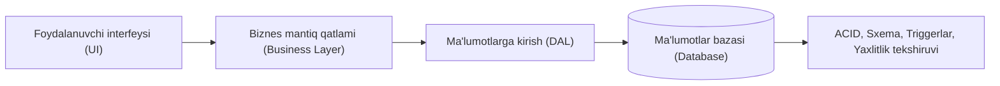
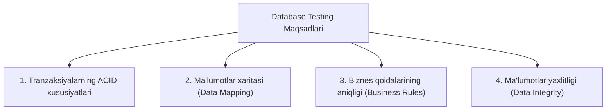
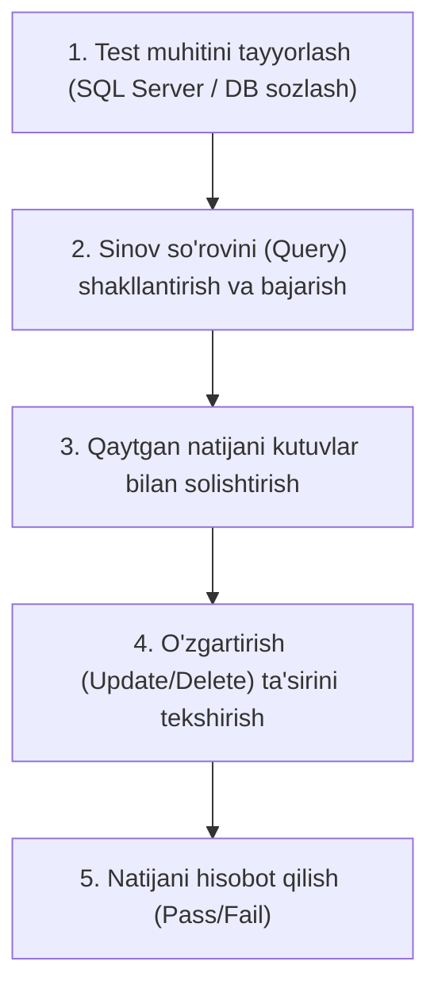

import { Callout } from 'nextra/components'

# Ma'lumotlar bazasi sinovi (Database Testing)

**Ma'lumotlar bazasi sinovi (Database Testing)** — bu dasturiy ta'minotning orqa qismida (backend) joylashgan ma'lumotlar bazasining to'g'riligi, ma'lumotlar yaxlitligi (integrity), xavfsizligi va unumdorligini tekshirish jarayonidir.

Foydalanuvchi interfeysi (UI) orqali kiritilgan ma'lumotlar bazaga to'g'ri saqlanishi, jadvallar orasidagi munosabatlar buzilmasligi va murakkab so'rovlar (SQL queries) tezkor ishlashini ta'minlash uchun ushbu sinov muhim ahamiyatga ega.

---

## Nega ma'lumotlar bazasi sinovi zarur?

Zamonaviy tizimlarda ma'lumotlar hajmi keskin ortib bormoqda. Faqat interfeysni (UI) tekshirish yetarli emas, chunki:
* Interfeysda ma'lumot to'g'ri ko'ringani bilan, bazada noto'g'ri yoki yaroqsiz formatda saqlanayotgan bo'lishi mumkin;
* Ma'lumotlar yo'qolishi yoki buzilishi (data corruption) yuz berishi mumkin;
* Baza tuzilmasi (schema) o'zgarganda eski funksiyalar va hisobotlar ishlamay qolishi mumkin;
* Katta hajmdagi ma'lumotlar bilan ishlaganda murakkab SQL so'rovlar butun tizimni sekinlashtirishi mumkin.

---

## Ma'lumotlar bazasi sinovining asosiy maqsadlari

Database testing asosan to'rtta fundamental jihatni kafolatlashga qaratilgan:

### 1. Tranzaksiyalarning ACID xususiyatlari
Barcha moliyaviy va muhim tizimlarda tranzaksiyalar quyidagi to'rtta qoidaga qat'iy javob berishi kerak:

* **Atomicity (Bo'linmaslik / "All-or-Nothing"):** Tranzaksiya ichidagi barcha operatsiyalar yo to'liq bajarilishi kerak, yoki bittasi xato bersa, butun tranzaksiya bekor qilinishi (**Rollback**) lozim. Masalan, pul bir hisobdan yechilib, ikkinchisiga tushmasa, operatsiya butkul qaytariladi.
* **Consistency (Muvofiqlik / Moslik):** Tranzaksiyadan oldin ham, keyin ham ma'lumotlar bazasi belgilangan qoidalarga va cheklovlarga to'liq mos kelishi kerak.
* **Isolation (Alohidalik / Yakkalanish):** Bir vaqtning o'zida bir nechta tranzaksiya parallel bajarilsa ham, ular bir-birining oraliq ma'lumotlariga ta'sir qilmasligi kerak.
* **Durability (Bardoshlilik):** Muvaffaqiyatli yakunlangan (Commit qilingan) ma'lumotlar hatto server o'chib qolsa yoki nosozlik yuz bersa ham o'chib ketmasligi shart.

### 2. Ma'lumotlarni moslashtirish (Data Mapping)
* Foydalanuvchi ekranda kiritgan har bir maydon (masalan: Ism, Familiya, Email) ma'lumotlar bazasidagi mos jadval ustuniga to'g'ri bog'langanligini tekshirish.
* Ekranda bajarilgan amallarning orqa fonda **CRUD** (Create, Retrieve, Update, Delete) operatsiyalari bilan to'liq mos kelishini aniqlash.

### 3. Biznes qoidalarining aniqligi (Business Rules)
* Ma'lumotlar bazasiga kiritilgan cheklovlar (masalan: foydalanuvchi yoshi 18 dan kichik bo'lishi mumkin emas, email takrorlanmasligi kerak).
* **Triggers** (ma'lum harakat bo'lganda avtomatik ishga tushuvchi kodlar) va **Stored Procedures** (saqlangan muolajalar) kutilganidek to'g'ri ishlashi.

### 4. Ma'lumotlar yaxlitligi (Data Integrity)
* Tizimning bir joyida yangilangan ma'lumot boshqa barcha bog'langan jadvallarda ham bir vaqtda to'g'ri aks etishi.
* Birlamchi kalit (**Primary Key**) va tashqi kalit (**Foreign Key**) bog'liqliklarining buzilmasligi.

---

## Ma'lumotlar bazasi sinovining asosiy komponentlari

| Komponent | Tavsif | Sinov usuli |
| :--- | :--- | :--- |
| **Sxema (Database Schema)** | Jadvallar, ustunlar nomlari, ma'lumot turlari va indekslar | `DESC <table_name>` so'rovi yoki SchemaCrawler vositasi |
| **Tranzaksiyalar (Transactions)** | BEGIN, COMMIT va ROLLBACK operatsiyalari | Stress test va parallel so'rovlar yordamida ACID tekshiruvi |
| **Saqlangan muolajalar (Stored Procedures)** | Bazada saqlanadigan dasturiy funksiyalar va protseduralar | Turli kirish parametrlari bilan birlik testlarni (Unit test) bajarish |
| **Triggerlar (Triggers)** | Ma'lumotlar o'zgarganda avtomatik ishga tushadigan qoidalar | DML (Insert, Update, Delete) amallarini bajarib, trigger natijasini tekshirish |
| **Maydon cheklovlari (Constraints)** | NOT NULL, UNIQUE, CHECK, DEFAULT, PRIMARY/FOREIGN KEY | Chegaraviy va noto'g'ri ma'lumotlar kiritib (Negative testing) tekshirish |

---

## Ma'lumotlar bazasini qo'lda (Manual) tekshirish bosqichlari

1. **Muhitga ulanish:** DBMS (DataGrip, DBeaver, pgAdmin, SQL Server Management Studio) orqali test bazasiga ulaniladi.
2. **So'rovlarni bajarish:** Kerakli ma'lumotlarni chiqarish uchun `SELECT`, `JOIN` so'rovlari yoziladi.
3. **Natijalarni taqqoslash:** Olingan ma'lumotlar dastur ekrani va talablar hujjati bilan solishtiriladi.
4. **Yaxlitlikni tekshirish:** Ma'lumot qo'shilganda yoki o'chirilganda bog'langan boshqa jadvallardagi o'zgarishlar kuzatiladi.

---

## Ma'lumotlar bazasini avtomatlashtirilgan sinovdan o'tkazish

Agile va tezkor rivojlanish jarayonida bazadagi har bir o'zgarishni qo'lda tekshirish ko'p vaqt oladi. Shu sababli avtomatlashtirish vositalari qo'llaniladi:

* **DbUnit:** Java va JUnit asosidagi ma'lumotlar bazasini sinash vositasi. Har bir testdan oldin va keyin bazani boshlang'ich etalon holatga keltiradi (CLEAN-INSERT).
* **tSQLt:** Microsoft SQL Server uchun eng mashhur birlik sinov (Unit testing) freymvorki.
* **SchemaCrawler:** Ma'lumotlar bazasi sxemasi va tuzilishini tahlil qilish hamda o'zgarishlarni solishtirish vositasi.
* **Flyway / Liquibase:** Ma'lumotlar bazasi migratsiyalarini sinovdan o'tkazish va nazorat qilish platformalari.
