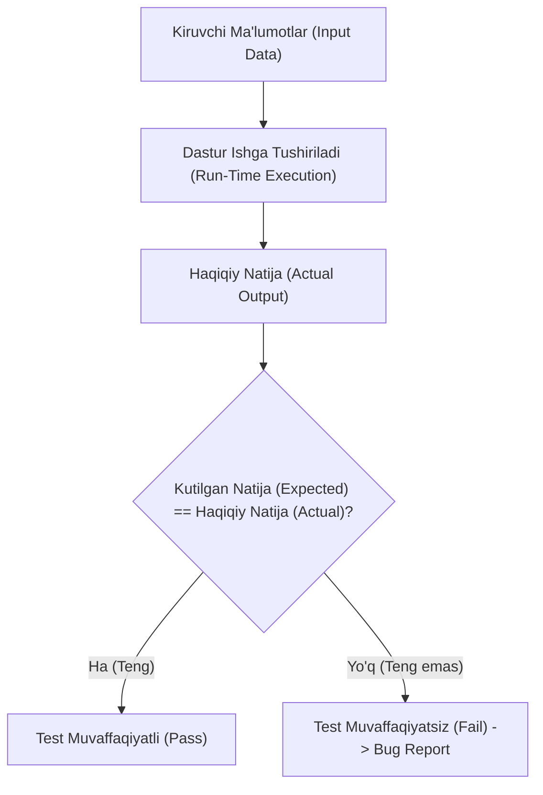
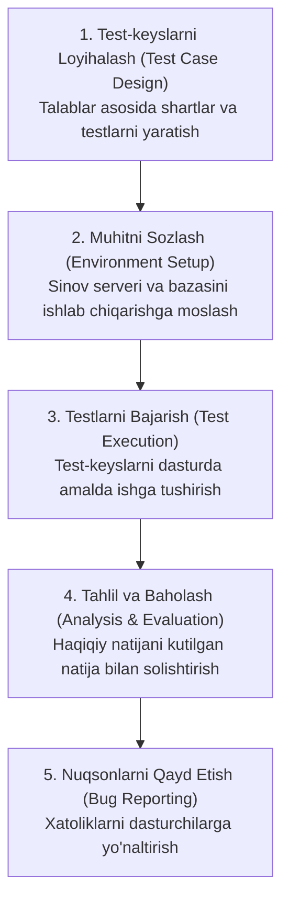
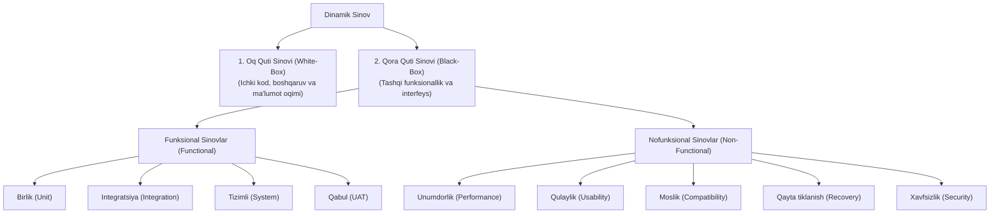

import { Callout } from 'nextra/components'

# Dinamik Sinov (Dynamic Testing)

**Dinamik sinov (Dynamic Testing)** — dasturiy ta'minot kodini real yoki test muhitida kompyuter xotirasida ishga tushirib (*Execution* qilib), dasturga kiruvchi qiymatlarni (*Input*) berish va olingan natijalarni (*Actual Output*) kutilgan natijalar (*Expected Output*) bilan solishtirish orqali o'tkaziladigan sinov turidir.

Ushbu jarayon dasturiy ta'minot sifatini ta'minlashda **Tasdiqlash (Validation)** bosqichining asosi bo'lib, ilovaning dinamik xatti-harakati, tezligi, xavfsizligi va talablarga muvofiqligini amalda baholashga xizmat qiladi.

---

## Dinamik Sinov Nima? (What is Dynamic Testing?)

Agar Statik sinovda kodni ishga tushirmasdan hujjatlar va sintaksis tekshirilsa, Dinamik sinovda dastur to'liq kompiylyatsiya qilinadi, ishga tushiriladi va uning xatti-harakati tekshiriladi. 

Dinamik sinov quyidagi ikki asosiy qanotni to'liq qamrab oladi:
1. **Funksional sinovlar (Functional Testing):** Tizim nima qilishi kerakligini tekshiradi (birlik, integratsiya, tizimli va qabul sinovlari).
2. **Nofunksional sinovlar (Non-functional Testing):** Tizim buni qanday bajarayotganini tekshiradi (tezlik, yuklamaga chidamlilik, xavfsizlik, moslik va qulaylik).

<Callout type="info">
**Statik va Dinamik sinov uyg'unligi:**  
Statik sinov dasturdagi nuqsonlarning asosiy **sabablarini (Flaws / Causes)** topsa, Dinamik sinov ushbu nuqsonlarning amaldagi **oqibatlarini (Failures / Bugs)** aniqlaydi. Dastur sifatini to'liq kafolatlash uchun ikkala sinov turi birgalikda qo'llanilishi shart.
</Callout>

---

## Nega Dinamik Sinov O'tkaziladi?

1. **Haqiqiy ishlash holatini tekshirish:** Dastur o'rnatilgandan so'ng uning turli qurilma, server va tarmoq sharoitida to'g'ri ishlashini tasdiqlash uchun.
2. **Mijoz talablari va kutuvlariga muvofiqlik:** Foydalanuvchi interfeysi va biznes mantig'i real hayotiy ssenariylarga to'liq javob berishini tekshirish uchun.
3. **Ishlash unumdorligini (Performance) o'lchash:** Ko'p sonli foydalanuvchilar bir vaqtning o'zida kirganda tizim qulab tushmasligini tekshirish uchun.
4. **Tizim barqarorligi va xavfsizligini ta'minlash:** Tashqi kiberhujumlar va nosozliklardan keyin qayta tiklanish qobiliyatini baholash uchun.

---

## Dinamik Sinovning Asosiy Xususiyatlari

- Dasturiy ta'minotning **Tasdiqlash (Validation)** bosqichida o'tkaziladi.
- Kodni majburiy ravishda ishga tushirish (*Code Execution*) talab etiladi.
- Sinovlar qo'lda (*Manual*) yoki avtomatlashtirilgan vositalar (*Automation*) yordamida bajariladi.
- Ham ijobiy (*Positive*), ham salbiy (*Negative*) sinov ssenariylari qo'llaniladi.
- Aniq belgilangan 5 bosqichli jarayonga amal qiladi.

---

## Dinamik Sinov Jarayoni (5 Asosiy Qadam)

Dinamik sinov jarayoni dasturiy ta'minotni sinash hayotiy siklida (STLC) quyidagi 5 bosqichdan iborat:

### 1. Test-keyslarni Loyihalash (Test Case Design)
Loyiha talablari va spetsifikatsiyalari asosida test qamrovi belgilanadi, test shartlari va batafsil test-keyslar yoziladi.

### 2. Sinov Muhitini Sozlash (Environment Setup)
Test o'tkaziladigan server, ma'lumotlar bazasi, apparat ta'minoti va tarmoq parametrlari ishlab chiqarish (*Production*) muhitiga maksimal darajada parallel qilib sozlanadi.

### 3. Testlarni Bajarish (Test Execution)
Tayyorlangan test-keyslar bo'yicha dasturga turli kiruvchi ma'lumotlar kiritiladi va amallar bajariladi.

### 4. Tahlil va Baholash (Analysis and Evaluation)
Olingan natijalar spetsifikatsiyadagi kutilgan natijalar bilan solishtiriladi. Agar tafovut aniqlansa, test muvaffaqiyatsiz (*Fail*) deb baholanadi.

### 5. Nuqsonlarni Qayd Etish (Bug Reporting)
Aniqlangan barcha nosozliklar skrinshotlar, loglar va qayta takrorlash qadamlari bilan birga xatoliklarni boshqarish tizimida (Jira, GitHub Issues) qayd etiladi.

---

## Amaliy Misol: Ro'yxatdan O'tish va Xavfsiz Parol Tekshiruvi

Ijtimoiy tarmoq yoki veb-platformada yangi hisob ochish jarayonini ko'rib chiqaylik. Xavfsizlik talabiga ko'ra, parol:
- Kamida 8 ta belgidan iborat bo'lishi;
- Kamida bitta bosh harfni o'z ichiga olishi;
- Kamida bitta maxsus belgiga (`@`, `#`, `$`) ega bo'lishi shart.

**Dinamik sinov jarayonida QA muhandisi quyidagilarni amalga oshiradi:**
1. **To'g'ri qiymat kiritish (Ijobiy sinov):** `Admin#2026` kiritiladi va hisob muvaffaqiyatli yaratilishi tasdiqlanadi.
2. **Kuchsiz qiymat kiritish (Salbiy sinov):** Faqat 4 ta belgili `test` paroli kiritiladi. Tizim xatolik haqida aniq ogohlantirishi (`Parol kamida 8 ta belgidan iborat bo'lishi kerak`) va ro'yxatdan o'tishni to'xtatishi tekshiriladi.
3. Tizimning ushbu amallarga qaytargan real reaksiyasi kutilgan natija bilan solishtiriladi.

---

## Dinamik Sinovning Turlari

Dinamik sinov ikki yirik texnik yondashuvga bo'linadi: **Oq quti sinovi (White-box)** va **Qora quti sinovi (Black-box)**.

---

### 1. Oq Quti Sinovi (White-Box Testing)
Dasturchilar tomonidan amalga oshiriladi. Unda dasturning ichki arxitekturasi, ma'lumotlar oqimi (*Data Flow*) va buyruqlar bajarilish tartibi (*Control Flow*) kodning har bir qatori bo'yicha tahlil qilinadi.

---

### 2. Qora Quti Sinovi (Black-Box Testing)
Test muhandislari tomonidan dasturning ichki tuzilishini bilmagan holda, faqat talablar spetsifikatsiyasi va tashqi interfeys orqali amalga oshiriladi.

#### A. Funksional Sinovlar (Functional Testing):
- **Birlik sinovi (Unit Testing):** Dasturning har bir mustaqil komponenti yoki funksiyasi alohida tekshiriladi.
- **Integratsiya sinovi (Integration Testing):** Mustaqil modullar birlashtirilib, ular orasidagi ma'lumot almashinuvi sinovdan o'tkaziladi.
- **Tizimli sinov (System / End-to-End Testing):** Butun dasturiy ta'minot yaxlit tizim sifatida foydalanuvchi nuqtai nazaridan boshidan oxirigacha tekshiriladi.
- **Foydalanuvchi qabul sinovi (UAT):** Buyurtmachi yoki yakuniy foydalanuvchilar tomonidan dastur qabul qilib olinishi oldidan o'tkaziladigan yakuniy sinov.

#### B. Nofunksional Sinovlar (Non-Functional Testing):
- **Unumdorlik sinovi (Performance Testing):** Turli darajadagi foydalanuvchilar yuklamasida tizimning tezligi, javob berish vaqti va barqarorligini tekshirish.
- **Qulaylik sinovi (Usability Testing):** Dastur interfeysi foydalanuvchi uchun tushunarli, intuitiv va oson ekanligini baholash.
- **Moslik sinovi (Compatibility Testing):** Dasturning turli operatsion tizimlar (Windows, macOS, Linux, Android, iOS), brauzerlar va ekran o'lchamlarida to'g'ri ishlashini tekshirish.
- **Qayta tiklanish sinovi (Recovery Testing):** Kutilmagan server qulashi, tarmoq uzilishi yoki elektr o'chishidan keyin dasturning ma'lumotlarni yo'qotmasdan qayta tiklana olish qobiliyatini tekshirish.
- **Xavfsizlik sinovi (Security Testing):** Tizimni ruxsatsiz kirish, ma'lumotlar sizib chiqishi va tashqi kiberhujumlardan himoyalanganligini tekshirish.

---

## Xulosa

Dinamik sinov (Dynamic Testing) — dasturiy ta'minotning haqiqiy dunyoda xatosiz va ishonchli ishlashining bosh kafolatidir. Kodni jonli ishga tushirish, turli kutilgan va kutilmagan kiruvchi ma'lumotlar bilan sinash orqali jamoa mahsulotning nafaqat to'g'ri ishlashiga, balki foydalanuvchilar uchun xavfsiz va qulay bo'lishiga ishonch hosil qiladi.
