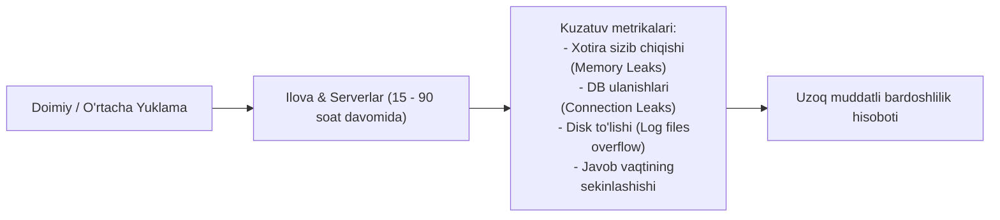
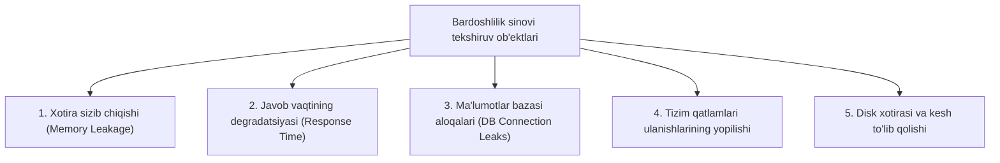

import { Callout } from 'nextra/components'

# Bardoshlilik sinovi (Endurance Testing)

**Bardoshlilik sinovi (Endurance Testing)** — bu dasturiy ta'minot yoki tizimning kutilgan yuklama ostida **uzoq vaqt (bir necha soatdan bir necha kungacha)** uzluksiz ishlash qobiliyatini, xotira sarfini va resurslar barqarorligini tahlil qiluvchi nofunksional sinov turidir.

Ushbu sinov sanoatda ko'pincha **Soak Testing** yoki **Longevity Testing** deb ham ataladi. U samaradorlik (Performance) sinovlarining yakuniy bosqichida o'tkaziladi.

---

## Yuklama sinovi (Load Testing) va Bardoshlilik sinovi (Endurance Testing) farqi

| Xususiyat | Yuklama sinovi (Load Testing) | Bardoshlilik sinovi (Endurance Testing) |
| :--- | :--- | :--- |
| **Sinov davomiyligi** | Odatda 1–3 soat | Bir necha soatdan bir necha haftagacha (15–90+ soat) |
| **Asosiy maqsadi** | Tizim kutilgan foydalanuvchilar oqimini ko'tara olishini tekshirish | Uzoq vaqt davomida resurslar sizib chiqmasligini tasdiqlash |
| **E'tibor markazi** | Javob berish tezligi (Response time) va o'tkazuvchanlik | Xotira iste'moli, disk to'lib qolishi va tizimning sekinlashuvi |

---

## Bardoshlilik sinovida nimalar tekshiriladi?

1. **Xotira sizib chiqishi (Memory Leakage):**  
   Dastur kodi keraksiz ob'ektlarni operativ xotiradan (RAM) bo'shatmasligi oqibatida xotira soat sayin to'lib borishi va oqibatda tizim qulashi tekshiriladi.
2. **Javob berish vaqtining degradatsiyasi:**  
   Ilova dastlabki 1-soatda 200 ms tezlikda javob berib, 24 soat o'tgach javob vaqti 5000 ms ga cho'zilib ketishi kabi muammolar aniqlanadi.
3. **Ma'lumotlar bazasi ulanishlarini tekshirish (Connection Pool Leaks):**  
   Har bir so'rovdan so'ng baza bilan ulanish muvaffaqiyatli yopilayotganini kafolatlash. Agar ulanishlar ochiq qolib ketsa, yangi foydalanuvchilar "Too many connections" xatosi bilan tizimga kira olmay qoladi.
4. **Jurnallar (Log Files) va kesh hajmi:**  
   Uzoq vaqt ishlash natijasida disk xotirasi tizim jurnallari (logs) bilan to'lib qolib, serverni to'xtatib qo'ymasligini nazorat qilish.

---

## Bardoshlilik sinovini o'tkazish jarayoni (7 bosqich)

1. **Test muhitini sozlash (Establish Test Environment):** Sinov muhiti real ishlab chiqarish tizimidan to'liq izolyatsiya qilingan bo'lishi kerak.
2. **Test reja va ssenariylarni ishlab chiqish (Test Plan & Scenarios):** Tizim qanday yuklama darajasida (masalan, 3 000 parallel foydalanuvchi) va qancha muddat sinovda turishi belgilanadi.
3. **Sinov siklini baholash (Test Cycle Approximation):** Sinov qancha soat davom etishi va qancha avtomatlashtirilgan agentlar jalb qilinishi aniqlanadi.
4. **Xatarlarni tahlil qilish (Risk Analysis):** Uzoq muddatli sinov davomida yuzaga kelishi mumkin bo'lgan uzilishlar va tashqi omillar ko'rib chiqiladi.
5. **Jadvalni tasdiqlash (Test Schedule):** Sinov boshlanish va tugash muddatlari, jamoaning monitoring navbatchiligi tasdiqlanadi.
6. **Sinovni bajarish (Test Execution):** JMeter, k6 yoki LoadRunner yordamida uzluksiz so'rovlar yuboriladi va server telemetriyasi monitoring qilinadi.
7. **Sinov siklini yakunlash (Test Cycle Closure):** Chiqqan grafiklar asosida xotira va CPU sarfi barqarorligi bo'yicha hisobot tayyorlanadi.

---

## Bardoshlilik sinovining afzalliklari va cheklovlari

### Afzalliklari:
* Tizimning uzoq muddat (dam olish kunlari, bayramlarda) texnik xizmat ko'rsatishsiz (reboot talab qilmasdan) mustahkam ishlashiga ishonch beradi.
* Texnik xizmat ko'rsatish xarajatlarini (maintenance costs) kamaytiradi.
* Kutilmagan qulashlarning oldini olib, mijozlar ishonchini qozonadi.

### Cheklovlari:
* Sinov juda ko'p vaqt (bir necha kun) talab qiladi.
* Uzoq muddatli server quvvatlari sababli sinov xarajatlari yuqori bo'ladi.
* Jarayon faqat avtomatlashtirilgan vositalar orqali bajarilishi shart.

<Callout type="info">
  **Maslahat:** Bardoshlilik sinovini yakunlaganingizdan so'ng, xotira sarfi (RAM usage) grafik chizig'iga e'tibor bering. Agar chiziq vaqt o'tishi bilan uzluksiz yuqoriga qarab ketsa, kodda albatta **Memory Leak** mavjud!
</Callout>
