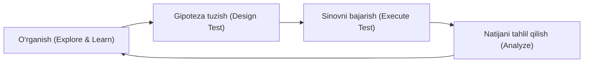
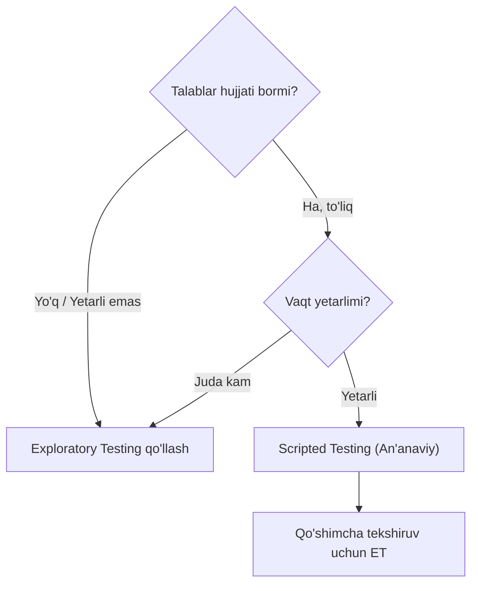
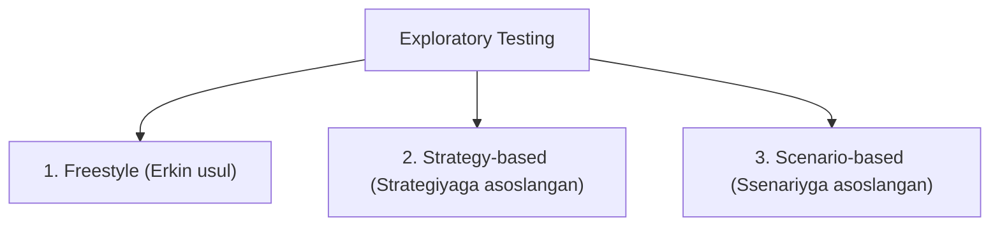

import { Callout } from 'nextra/components'

# Tadqiqiy sinov (Exploratory Testing)

**Tadqiqiy sinov (Exploratory Testing)** — bu dasturiy ta'minotni oldindan yozilgan qat'iy test ssenariylari (test cases)siz, bir vaqtning o'zida dasturni o'rganish (learning), testlarni loyihalash (test design) va ularni bajarish (test execution) jarayonidir.

Odatda loyihada talablar spetsifikatsiyasi (requirements) mavjud bo'lmaganda yoki yetarli darajada yozilmaganda, dasturchi va testerlar dastlabki bosqichda aynan tadqiqiy sinov yondashuvidan foydalanadilar.

---

## Exploratory Testing nima?

An'anaviy testlashda avval talablar o'rganiladi, test ssenariylari yoziladi, tasdiqlanadi va shundan so'nggina sinov o'tkaziladi. **Tadqiqiy sinovda esa testlovchi:**
1. Ilovani barcha mumkin bo'lgan yo'llar bilan mustaqil tekshiradi;
2. Dasturning real ishlash oqimini (application flow) tushunadi;
3. Kuzatuvlar asosida test qaydlari (charter/notes) yuritadi;
4. Yangi g'oyalar paydo bo'lishi bilan ularni darhol amalda sinab ko'radi.

<Callout type="info">
Cem Kaner ta'rifiga ko'ra: *"Exploratory Testing — bu test dizayni va test ijrosi bir vaqtda amalga oshiriladigan, o'rganishga asoslangan sinov uslubidir."*
</Callout>

---

## Qachon Exploratory Testing qo'llaniladi?

Tadqiqiy sinov quyidagi holatlarda eng samarali hisoblanadi:

1. **Talablar (Requirements) yetarli bo'lmaganda yoki mavjud bo'lmaganda:** Mahsulot haqida yozma hujjat yo'q, lekin ilovani sinash zarur.
2. **Tezkor fikr-mulohaza (Early feedback) kerak bo'lganda:** Yangi iteratsiya yoki reliz tezda o'rganilishi lozim bo'lganda.
3. **Kritik ilovalarga yangi testerlar qo'shilganda:** Yangi a'zolar dastur logikasini chuqur tushunishi uchun.
4. **Kutilmagan va yashirin xatoliklarni topishda:** Standart test holatlari qamrab olmagan chekka holatlarni (edge cases) aniqlashda.
5. **Vaqt juda oz bo'lganda:** To'liq test-keyslar yozishga vaqt yetishmagan favqulodda vaziyatlarda.

---

## Nega loyihalarda talablar (Requirements) yetishmasligi mumkin?

Ko'p hollarda test muhandislari talablar to'liq emasligidan shikoyat qiladilar. Bunga quyidagi omillar sabab bo'ladi:

* **Eski va meros loyihalar (Legacy systems):** Mahsulot 10-15 yildan beri ishlab kelayotgan bo'lsa, uning boshlang'ich talablari eskirgan, yo'qolgan yoki yangilanmagan bo'ladi. Yangi tester ilovani faqat uni ishlatib ko'rish orqali o'rgana oladi.
* **Agile/Startap muhiti:** Talablar juda tez o'zgaradi va yozma hujjatlashtirishga vaqt ajratilmaydi.
* **Og'zaki talablar:** Funksionallik to'g'ridan-to'g'ri mahsulot egasi (PO) yoki mijoz tomonidan og'zaki tushuntirilgan.

---

## Exploratory Testing turlari

Tadqiqiy sinov o'zining strukturasiga ko'ra uchta asosiy turga bo'linadi:

### 1. Freestyle (Erkin usul)
* Hech qanday qat'iy qoidalarga yoki oldindan belgilangan tartibga amal qilinmaydi.
* Adhoc sinoviga o'xshash tarzda ilova bo'ylab erkin harakatlaniladi.
* Dastur bilan tezda do'stlashish, boshqa test muhandisining ishini ko'zdan kechirish yoki tezkor tekshiruv uchun qulay.

### 2. Strategy-based (Strategiyaga asoslangan)
* Ma'lum bir test strategiyasi va texnikalariga tayangan holda o'tkaziladi.
* **Chegara qiymatlari tahlili (BVA)**, **Ekvivalentlik bo'linishi (EP)**, **Xatolar taxmini (Error Guessing)** va **Risk-based testing** usullaridan foydalaniladi.
* Odatda tizimni va uning zaif tomonlarini yaxshi biladigan tajribali testlovchilar tomonidan olib boriladi.

### 3. Scenario-based (Ssenariyga asoslangan)
* Real foydalanuvchilarning xatti-harakatlari va hayotiy senariylar (end-to-end, user stories) asosida amalga oshiriladi.
* Test muhandisi tizim bo'ylab turli rollarda (masalan, yangi xaridor, doimiy mijoz, administrator) harakat qilib, kutilmagan vaziyatlarni modellashtiradi.

---

## Exploratory Testingni qanday o'tkazish kerak?

Tadqiqiy sinov tartibsiz harakat emas, u tizimli yondashuvni talab qiladi:

| Bosqich | Tavsif |
| :--- | :--- |
| **1. O'rganish (Explore)** | Ilovani ishlatib ko'rish, dasturchilar, senior testerlar va domen ekspertlari bilan suhbatlashish. |
| **2. Tahlil va Hujjatlashtirish** | Dastur oqimini qayd etish (mind-maps, charter notes tuzish). |
| **3. Raqobatchilarni tahlil qilish** | Bozordagi o'xshash raqobatchi mahsulotlar bilan solishtirish orqali standart kutilmalarni aniqlash. |
| **4. Sinov va Baholash** | G'oyalar bo'yicha chekka holatlarni sinash va topilgan defektlarni ro'yxatga olish. |

---

## Scripted Testing va Exploratory Testing farqi

| Xususiyat | Scripted Testing (Ssenariyli) | Exploratory Testing (Tadqiqiy) |
| :--- | :--- | :--- |
| **Hujjatlashtirish** | Qat'iy test-keyslar oldindan yoziladi | Oldindan test-keyslar talab qilinmaydi |
| **Moslashuvchanlik** | Kam — faqat ssenariy bo'yicha ketiladi | Yuqori — test jarayonida yo'nalish o'zgarishi mumkin |
| **Fikrlash tarzi** | Qoidalarga qat'iy rioya qilish | Ijodkorlik, qiziquvchanlik va tanqidiy fikrlash |
| **Xatolarni topish** | Standart va kutilgan xatolarni tasdiqlaydi | Murakkab, kutilmagan va yashirin xatolarni fosh qiladi |
| **Vaqt sarfi** | Rejalashtirishga ko'p vaqt ketadi | Darhol boshlash mumkin |

---

## Afzalliklari va Kamchiliklari

### Afzalliklari
* Dastlabki tayyorgarlikka kam vaqt sarflanadi va darhol sinovga kirishish mumkin.
* Standart testlar ko'zdan qochiradigan kritik xatoliklarni aniqlashda juda samarali.
* Test muhandisining intuitsiyasi, tajribasi va ijodiy salohiyatini to'liq ishga soladi.
* Tez o'zgaruvchan (Agile) loyihalar uchun nihoyatda mos keladi.

### Kamchiliklari
* Sinov natijalarini va qamrovni (coverage) o'lchash nisbatan qiyin.
* Test qadamlarini qayta takrorlash (reproduce qilish) har doim ham oson bo'lmasligi mumkin.
* Natija to'liq test muhandisining bilim va mahoratiga bog'liq.
