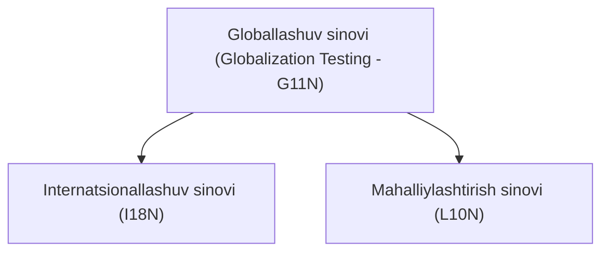
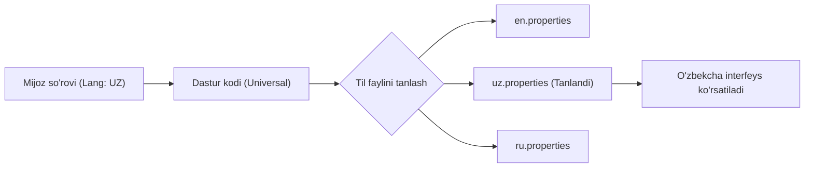

import { Callout } from 'nextra/components'

# Globallashuv sinovi (Globalization Testing)

**Globallashuv sinovi (Globalization Testing)** — bu dasturiy ta'minotning dunyoning turli mamlakatlari, tillari, mintaqaviy formatlari va madaniy xususiyatlariga to'liq mos kelishini hamda asosiy dastur kodini o'zgartirmasdan har qanday tilda to'g'ri ishlashini tekshirish jarayonidir.

U dastur global auditoriyaga taqdim etilganda matnlar, sanalar, valyutalar, o'lchov birliklari va interfeys elementlari foydalanuvchining hududiy sozlamalariga (locale) muvofiq to'g'ri aks etishini kafolatlaydi.

---

## Globallashuv sinovi nima uchun kerak?

Dunyo bo'ylab har bir mintaqaning o'ziga xos standartlari mavjud:
* **Til va alifbo:** Kirill, lotin, iyerogliflar yoki o'ngdan chapga yoziladigan (RTL — Right-to-Left, masalan: arab, ibroniy) yozuvlar.
* **Sana va vaqt formatlari:** AQShda `MM/DD/YYYY`, O'zbekiston va Yevropada `DD.MM.YYYY`, Yaponiyada `YYYY/MM/DD`.
* **Valyuta va sonlar formati:** `$1,000.50` (AQSh), `1 000,50 so'm` (O'zbekiston), `1.000,50 €` (Germaniya).
* **Telefon va pochta indekslari:** Turli davlatlarda raqamlar uzunligi, xalqaro kodlar va harfli indekslar mavjudligi.

Agar dastur ushbu jihatlarni inobatga olmagan holda yaratilsa, boshqa mamlakat foydalanuvchilari uchun xizmatdan foydalanish noqulay yoki imkonsiz bo'lib qoladi.

---

## Globallashuv sinovining ikki asosiy ustuni

Globallashuv sinovi ikkita o'zaro bog'liq yo'nalishdan tashkil topgan:

### 1. Internatsionallashuv sinovi (I18N — Internationalization)
* Nomdagi **18** soni "I" va "n" harflari orasidagi 18 ta harfni bildiradi.
* **Maqsad:** Dastur kodining arxitektura darajasida har qanday tilga moslashuvchan qilib loyihalashtirilganligini tekshirish.
* **Asosiy qoida:** Dastur kodida matnlar hech qachon qattiq (hardcode) yozilmasligi kerak. Buning o'rniga tashqi resurs fayllaridan (masalan, `en.json`, `uz.properties`, `ru.po`) foydalaniladi.
* **Tekshirish sohalari:**
  * UTF-8 va Unicode belgilarining to'g'ri renderlanishi;
  * Matn uzunligi o'zgarganda UI elementlarining buzilmasligi (masalan, nemis tilidagi so'zlar inglizchasiga qaraganda 30-40% uzunroq bo'ladi);
  * O'ngdan chapga (RTL) yo'naltirilgan tillarda menyu va elementlarning to'g'ri ko'zgu akslanishi (mirroring).

### 2. Mahalliylashtirish sinovi (L10N — Localization)
* Nomdagi **10** soni "L" va "n" harflari orasidagi 10 ta harfni bildiradi.
* **Maqsad:** Dastur muayyan bir maqsadli bozor yoki madaniyatga (locale) moslashtirilgandan so'ng, uning to'g'riligini amalda tekshirish.
* **Tekshirish sohalari:**
  * **Tarjimaning sifatliligi:** Avtomatik tarjimon xatolarini emas, balki sohaviy va kontekstual jihatdan to'g'ri ma'nodagi tarjima qo'llanilganligini tekshirish;
  * **Mintaqaviy formatlar:** Sana, soat (12/24), valyuta ramzlari, o'lchov birliklari (metr/fut, kilogramm/funt);
  * **Ranglar va madaniy belgilar:** Ayrim ranglar yoki piktogrammalar ba'zi madaniyatlarda salbiy yoki nojo'ya ma'no anglatishi mumkin.

---

## I18N va L10N sinovlari taqqoslashi

| Xususiyat | I18N (Internationalization) | L10N (Localization) |
| :--- | :--- | :--- |
| **Qaratilgan sohasi** | Arxitektura va dastur kodining tayyorligi | Muayyan bir hudud va tilga moslik |
| **Bajaruvchilar** | Dasturchilar va QA muhandislari | QA muhandislari, mahalliy til egalari va lingvistlar |
| **Vaqti** | Dastur loyihalanishi va ishlab chiqilishining erta bosqichida | Dastur boshqa tilga tarjima qilingandan so'ng |
| **Kodni o'zgartirish** | Kodni universal holatga keltirishni talab qiladi | Kod o'zgarmaydi, faqat ma'lumotlar va resurslar yangilanadi |

---

## Afzalliklari va Kamchiliklari

### Afzalliklari
* Dasturiy ta'minotning xalqaro bozorlarda erkin va muvaffaqiyatli tarqalishini ta'minlaydi.
* Yangi til yoki mamlakatni qo'shish uchun butun tizimni qayta yozish zaruriyatini yo'qotadi.
* Kompaniyaning xalqaro miqyosdagi nufuzi va foydalanuvchilar qoniqishini oshiradi.

### Kamchiliklari
* Ko'p tilli mutaxassislar (native speakers) va lingvistik ekspertlarni jalb qilish sababli qo'shimcha xarajat talab qiladi.
* Sinov qamrovi kengligi tufayli test rejasini muvofiqlashtirish nisbatan murakkab.
