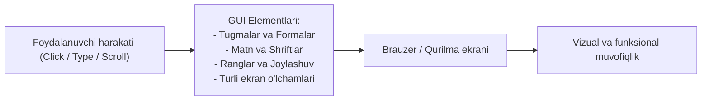
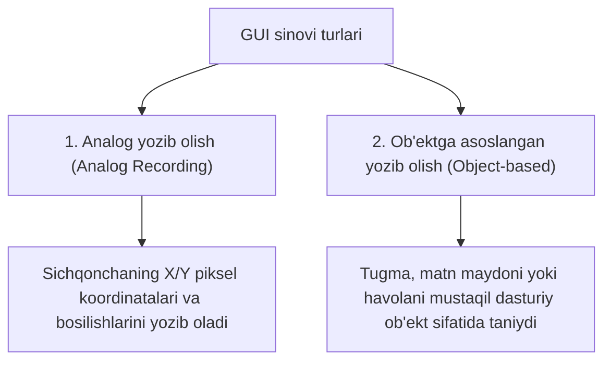

import { Callout } from 'nextra/components'

# GUI sinovi (GUI Testing)

**GUI sinovi (Graphical User Interface Testing)** — bu dasturiy ta'minotning grafik foydalanuvchi interfeysini, ya'ni ekranda ko'rinadigan barcha vizual elementlar (tugmalar, matn maydonlari, menyular, ranglar, shriftlar, rasmlar va tartib) oxirgi foydalanuvchi talablariga mosligini tekshirish jarayonidir.

Ilovaning backend qismi va ma'lumotlar bazasi benuqson ishlashi mumkin, ammo agar tugma bosilmasa, matnlar ustma-ust tushib ketsa yoki xato xabarlari noto'g'ri joylashsa, foydalanuvchi dasturdan foydalana olmaydi. GUI sinovi aynan shu ko'rinadigan qatlamni himoya qiladi.

---

## GUI sinovining ikkita asosiy turi

Grafik interfeysni avtomatlashtirilgan tarzda yozib olish va tekshirishda ikkita asosiy yondashuv mavjud:

### 1. Analog yozib olish (Analog Recording)
* Sinovchi vosita yordamida ekrandagi sichqonchaning harakat koordinatalarini (masalan, `X=700, Y=600` piksellar) va klaviatura bosilishlarini o'sha vaqtdagi nuqtalar bo'yicha yozib oladi va aynan takrorlaydi.
* **Kamchiligi:** Ekran o'lchami o'zgarsa yoki tugma 10 piksel pastga siljisa, test xato beradi.

### 2. Ob'ektga asoslangan yozib olish (Object-based Recording)
* Sinov vositasi ekrandagi har bir elementni DOM (Document Object Model) orqali ob'ekt sifatida taniydi (ID, XPath, CSS selector).
* Element ekranning qayeriga siljishidan qat'i nazar, test uning identifikatori orqali ob'ektni topadi va bosadi. Bu zamonaviy test avtomatlashtirishning asosidir.

---

## GUI sinovini o'tkazish usullari (Techniques)

1. **Qo'lda sinash (Manual-Based Testing):**  
   Test muhandislari interfeysning qulayligi, ko'rinishi, shriftlar uyg'unligi va dizayn talablariga mosligini bevosita inson ko'zi bilan baholaydilar.
2. **Modelga asoslangan sinov (Model-Based Testing):**  
   Tizim holatining vizual modellari (State machines, Decision tables) tuzilib, interfeysning har bir bosqichidagi o'tishlari tekshiriladi.
3. **Yozib olish va qayta ijro etish (Record and Replay):**  
   Foydalanuvchi harakatlari skriptsiz maxsus vositalar (masalan, Selenium IDE, Katalon) orqali yozib olinadi va qayta ishga tushiriladi.
4. **Kodga asoslangan avtomatlashtirish (Code-Based Testing):**  
   Selenium WebDriver, Playwright, Cypress kabi freymvorklar yordamida dasturlash tillarida (JavaScript, Python, Java) to'liq barqaror test kodlari yoziladi.
5. **Gibrid sinovlar (Hybrid Testing):**  
   Dastlabki ssenariylar yozib olinadi, so'ngra texnik muhandislar tomonidan kod bilan boyitiladi.

---

## GUI sinovida tekshiriladigan asosiy jihatlar

| Element / Jihat | Nimasi tekshiriladi? |
| :--- | :--- |
| **Ekran o'lchamlari (Responsiveness)** | Mobil, planshet va katta monitorlarda interfeysning buzilmasdan moslashishi |
| **Shrift va Ranglar** | Matn o'qilishi osonligi, ranglar kontrasti va brend shriftlariga mosligi |
| **Tugmalar va Formalar** | Barcha tugmalarning bosilishi, maydonlarning faol (enabled) yoki nofaol (disabled) holati |
| **Ogohlantirish va Xatolar** | Xatolik xabarlarining (qizil rangda, tushunarli matnda) to'g'ri joyda chiqishi |
| **Navigatsiya va Havolalar** | Menyu elementlari, ochiluvchi ro'yxatlar (Dropdown) va sahifalararo o'tishlar |

---

## GUI sinovidagi asosiy vositalar (Tools)

* **Playwright va Cypress:** Zamonaviy veb ilovalar uchun eng tezkor va ishonchli UI avtomatlashtirish vositalari.
* **Selenium WebDriver:** Barcha brauzerlar va dasturlash tillari bilan ishlovchi sanoat standarti.
* **Ranorex Studio va Squish:** Desktop va mobil ilovalarning murakkab grafik interfeyslarini sinash vositalari.
* **AutoIT:** Windows operatsion tizimidagi dialog oynalari va fayl yuklash elementlarini avtomatlashtirish vositasi.

<Callout type="warning">
  Grafik interfeys dasturning eng tez-tez o'zgarib turadigan qismi hisoblanadi. Shuning uchun GUI testlarini yozishda dinamik o'zgaruvchi IDlardan emas, barqaror `data-testid` yoki semantik atributlardan foydalanish tavsiya etiladi.
</Callout>
