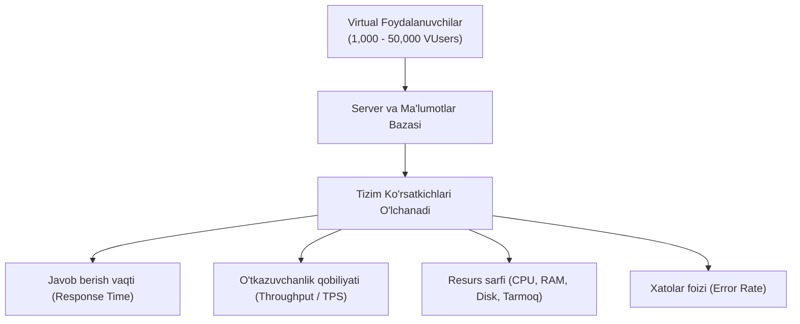
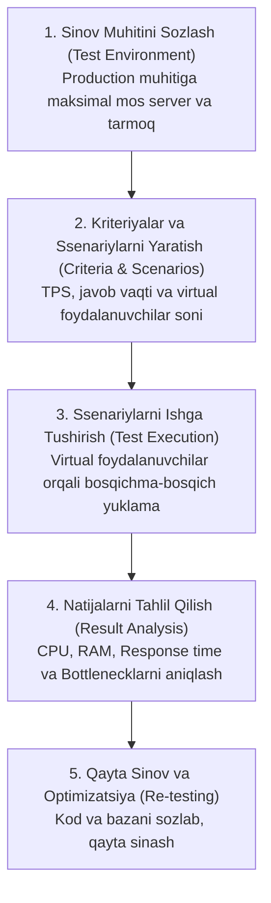

import { Callout } from 'nextra/components'

# Yuklama Sinovi (Load Testing)

**Yuklama sinovi (Load Testing)** — dasturiy ta'minotning kutilgan me'yordagi va maksimal rejalashtirilgan foydalanuvchilar oqimi (*Expected & Peak Concurrent Load*) ostida qanday ishlashini, javob berish tezligini (*Response Time*) hamda tizim tiqilinchlarini (*Bottlenecks*) aniqlash uchun o'tkaziladigan nofunksional sinov turidir.

Yuklama sinovi **Unumdorlik sinovining (Performance Testing)** ajralmas va eng muhim qismi hisoblanadi.

---

## Yuklama Sinovi Nima? (What is Load Testing?)

Dastur bir nafar sinovchi tomonidan tekshirilganda juda tez va benuqson ishlashi mumkin. Biroq bir vaqtning o'zida yuzlab, minglab yoki o'n minglab foydalanuvchilar (*Concurrent Users*) serverga so'rov yuborganda, tizim sekinlashishi, xotirasi to'lib qolishi yoki butunlay qulashi (*Crash*) mumkin.

Yuklama sinovida dasturga **rejalashtirilgan ishchi yuklamaga teng yoki undan bir oz kamroq** bo'lgan virtual foydalanuvchilar oqimi yuboriladi va tizimning quyidagi muhim ko'rsatkichlari baholanadi:

<Callout type="info">
**Yuklama (Load) nima degani?**  
Dasturiy ta'minotda "yuklama" deganda — N sonli foydalanuvchilarning bir vaqtda tizimdan foydalanishi, tranzaksiyalarni amalga oshirishi yoki serverga uzluksiz so'rovlar (*Requests*) yuborishi tushuniladi.
</Callout>

---

## Nega Yuklama Sinovi Juda Muhim? (Real Hayotiy Misollar)

Yuklama sinovini o'tkazmaslik biznes uchun ulkan moliyaviy va obro' yo'qotishlariga sabab bo'ladi:

- **Amazon falokati (2013-yil):** Kutilmagan foydalanuvchilar trafigi oqibatida Amazon serverlari 30 daqiqa davomida ishlamay qolgan va kompaniya daqiqasiga **66,000 dollardan ortiq** to'g'ridan-to'g'ri zarar ko'rgan.
- **Aksiya va chegirmalar kunlari:** "Qora juma" (*Black Friday*), katta mavsumiy savdolar yoki aviakompaniyalarning arzon chipta aksiyalarida serverlar 10,000 dan ortiq bir vaqtdagi so'rovlarni ko'tara olmay ishdan chiqadi.
- **Foydalanuvchilar psixologiyasi:** Tadqiqotlarga ko'ra, agar veb-sayt **3 soniyadan ortiq** vaqtda yuklansa, foydalanuvchilarning **40–50%** qismi darhol saytni tark etadi va raqobatchilardan xarid qiladi. Sayt qulaganda esa 75% foydalanuvchilar qaytib kelmaydi.

---

## Yuklama Sinovining Asosiy Maqsadlari

1. **Maksimal o'tkazuvchanlikni aniqlash:** Tizim sezilarli darajada sekinlashmasdan ko'tara oladigan maksimal yuklama miqdorini belgilash.
2. **Tor bo'g'izlarni (Bottlenecks) topish:** Qaysi SQL so'rovi, server konfiguratsiyasi yoki tarmoq parametri tizimni ushlab qolayotganini aniqlash.
3. **Kengayuvchanlikni (Scalability) tekshirish:** Foydalanuvchilar soni ortganda apparat va server resurslari to'g'ri taqsimlanishiga ishonch hosil qilish.
4. **Haqiqiy foydalanuvchilar oqimini simulyatsiya qilish:** Dastur ishlab chiqarishga (*Production*) chiqishidan oldin real sharoitdagi bosimga bardoshliligini tasdiqlash.

---

## Yuklama Sinovining 5 Bosqichli Jarayoni

Yuklama sinovi qat'iy reja asosida quyidagi 5 bosqichda amalga oshiriladi:

### 1. Sinov Muhitini Sozlash (Environment Setup)
Sinov muhiti ishlab chiqarish (*Production*) muhitiga apparat quvvati, tarmoq o'tkazuvchanligi va ma'lumotlar bazasi hajmi bo'yicha imkon qadar parallel bo'lishi shart. Aks holda olingan natijalar noaniq bo'ladi.

### 2. Kriteriyalar va Ssenariylarni Belgilash
- Qabul qilinadigan maksimal javob berish vaqti (masalan, 95% so'rovlar 2 soniyadan kam vaqtda javob berishi kerak);
- Kutilayotgan tranzaksiyalar soni (masalan, soniyasiga 500 ta xarid);
- Foydalanuvchi yo'li ssenariylari (Kirish -> Qidiruv -> Savat -> To'lov).

### 3. Ssenariylarni Bajarish (Execution)
Avtomatlashtirilgan vositalar yordamida virtual foydalanuvchilar (*Virtual Users / VUsers*) to'lqinlar bilan (masalan, har daqiqada 100 tadan qo'shib borish) serverga yo'naltiriladi.

### 4. Natijalarni Tahlil Qilish (Analysis)
Sinov davomida server resurslari (CPU, RAM xotira sizib chiqishi, Disk I/O) va tarmoq kechikishlari (*Latency*) doimiy nazorat qilinadi.

### 5. Optimizatsiya va Qayta Sinash (Re-testing)
Aniqlangan kamchiliklar (indekslanmagan sekin SQL so'rovlari, keshlanmagan API'lar) dasturchilar va DevOps muhandislari tomonidan tuzatilgach, yuklama sinovi qayta o'tkaziladi.

---

## Yuklama Sinovining Oltin Qoidalari

- **Faqat barqaror dasturda o'tkaziladi:** Ilova funksional jihatdan to'liq barqarorlashgachgina yuklama sinovi o'tkaziladi (xatolar to'la dasturda yuklama sinash befoyda).
- **Keraksiz og'ir rasmlarni yuklab olishdan qochish:** Yuklama test skriptlarida asosiy e'tibor server logikasi va API so'rovlariga qaratilishi lozim (statik banner rasmlari natijani chalg'itmasligi kerak).
- **Bosqichma-bosqich oshirish (Ramp-up):** Barcha virtual foydalanuvchilar birdaniga birinchi soniyada tashlanmaydi, balki yuklama pog'onama-pog'ona oshiriladi.

---

## Yuklama Sinovi (Load Testing) va Stress Sinovi (Stress Testing) Farqi

Ko'pincha bu ikki tushuncha adashtiriladi. Ularning tub farqi quyidagicha:

| Solishtirish Mezoni | Yuklama Sinovi (Load Testing) | Stress Sinovi (Stress Testing) |
| :--- | :--- | :--- |
| **Yuklama darajasi** | Kutilgan me'yordagi va eng yuqori rejalashtirilgan yuklama (*Expected / Peak Load*). | Tizim imkoniyatlaridan ancha yuqori bo'lgan haddan tashqari yuklama (*Extreme Overload*). |
| **Asosiy maqsadi** | Tizim kutilgan yuklamada me'yorda va tez ishlashini tekshirish. | Tizim qachon va qaysi nuqtada **qulashini (Breaking Point)** aniqlash. |
| **Fokus markazi** | Javob berish vaqti, unumdorlik va tor bo'g'izlar (*Bottlenecks*). | Tizimning qulashdan keyin o'zini qanday tutishi va qayta tiklanishi (*Robustness & Recovery*). |
| **Natija kutilmasi** | Dastur xatosiz va tezkor ishlashi shart. | Dasturning qulashi kutiladi, lekin u ma'lumotlarni yo'qotmasligi kerak. |

---

## Ommabop Yuklama Sinovi Vositalari (Tools)

- **Apache JMeter:** Butun dunyoda eng mashhur, bepul va ochiq manbali (*Open-Source*) yuklama sinovi vositasi. Web, REST API, FTP va ma'lumotlar bazalarini sinashda yetakchi.
- **k6 (Grafana k6):** Dasturchilar va test muhandislari uchun zamonaviy, JavaScript tilida yoziladigan yuqori unumdorlikka ega CLI vositasi.
- **Locust:** Python tilida kod yozish orqali millionlab parallel foydalanuvchilarni simulyatsiya qilishga mo'ljallangan yengil va qulay vosita.
- **OpenText LoadRunner (sobiq HP LoadRunner):** Katta korporativ tizimlar, bank ilovalari va murakkab protokollar uchun mo'ljallangan sanoat darajasidagi yetakchi pullik platforma.
- **Gatling:** Scala va Java asosidagi, juda kam apparat resursi sarflab ulkan yuklama hosil qila oladigan vosita.

---

## Xulosa

Yuklama sinovi (Load Testing) — foydalanuvchilar oqimi keskin ko'paygan paytda dasturning uzluksiz, barqaror va tezkor ishlashini kafolatlaydigan muhim qalqondir. Tizimni oldindan sinab, uning tor bo'g'izlarini bartaraf etish orqali kompaniyalar millionlab dollarlik zararlar va mijozlar ishonchini yo'qotishdan saqlanib qoladilar.
