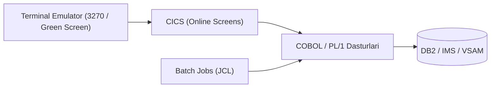
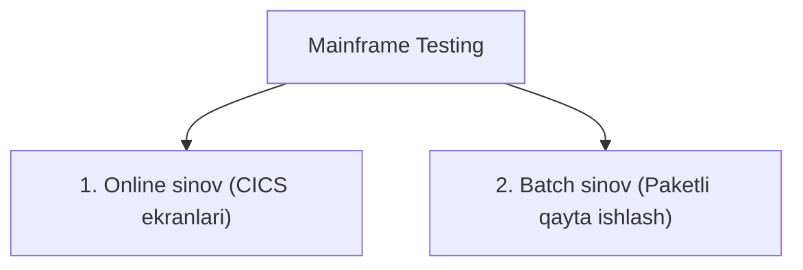

import { Callout } from 'nextra/components'

# Meynfreym sinovi (Mainframe Testing)

**Meynfreym sinovi (Mainframe Testing)** — bu IBM va boshqa yirik korporativ meynfreym (katta kompyuter) tizimlarida ishlaydigan dasturiy ilovalar, paketli ishlar (batch jobs) va xizmatlarning ishonchliligi, unumdorligi hamda to'g'riligini tekshirish jarayonidir.

Meynfreym tizimlari asosan banklar, sug'urta kompaniyalari, aviakompaniyalar va davlat soliq tizimlari kabi har soniyada millionlab kritik tranzaksiyalarni qayta ishlaydigan sohalarda qo'llaniladi.

---

## Meynfreym nima?

**Meynfreym (Mainframe)** — bu bir vaqtning o'zida minglab foydalanuvchilarga xizmat ko'rsatuvchi, yuqori xavfsizlik va beto'xtov ishlash barqarorligiga ega ulkan hisoblash mashinasidir. U soniyasiga yuz minglab va millionlab operatsiyalarni (MIPS — Million Instructions Per Second) bajarishga qodir.

### Meynfreymning asosiy atributlari:
* **Multiprogramming (Ko'p dasturlilik):** Markaziy protsessordan (CPU) maksimal samarali foydalanish uchun bir vaqtda bir nechta dasturni parallel bajarish.
* **Time-Sharing (Vaqtni taqsimlash / Foreground):** Foydalanuvchilarning terminal orqali tizim bilan to'g'ridan-to'g'ri interaktiv muloqot qilishi.
* **Virtual Storage (Virtual xotira):** Katta hajmdagi ma'lumotlarni qayta ishlash uchun operativ va disk xotirasini optimallashtirish.
* **Batch Processing (Paketli qayta ishlash / Background):** Foydalanuvchi ishtirokisiz, orqa fonda rejalashtirilgan va JCL (Job Control Language) orqali boshqariladigan yirik vazifalar majmui.
* **Spooling (SPOOL):** Kiritish-chiqarish ma'lumotlarini buferda to'plash va ularni printer yoki boshqa qurilmalarga ketma-ket uzatish.

---

## Veb ilovalar va Meynfreym ilovalarini sinash farqlari

| Xususiyat | Veb ilovalarni sinash | Meynfreym ilovalarini sinash |
| :--- | :--- | :--- |
| **Arxitektura** | 2 yoki 3 bosqichli (Mijoz / Server / Baza) | Markazlashgan server tizimi |
| **Interfeys** | Veb-brauzer yoki mobil UI | Terminal Emulator (3270 "Yashil ekran" - Green Screen) |
| **O'rnatish** | Mijoz tomoniga ko'p narsa o'rnatiladi | Mijoz mashinasida faqat Terminal Emulator bo'ladi |
| **Navigatsiya** | Sichqoncha va sensorli sensorlar | Maxsus klaviatura tugmalari (Enter, Tab, PF1-PF24 funksional tugmalar) |
| **Talab qilinadigan bilim** | HTML, CSS, DOM, REST API | CICS, COBOL, JCL, TSO/ISPF, DB2 |

---

## Meynfreym sinovi turlari

Meynfreym sinovlari asosan ikki asosiy yo'nalishga bo'linadi:

### 1. Online Testing (Onlayn sinov)
* CICS (Customer Information Control System) interfeyslarini tekshirish.
* Bu xuddi veb-sahifalarni tekshirish kabi bo'lib, foydalanuvchi ma'lumotlarni terminalga kiritadi, qidiruv beradi va ekranda tezkor natijani ko'radi.
* Validatsiya, ma'lumotlarning to'g'ri ko'rinishi va ekranlararo o'tishlar tekshiriladi.

### 2. Batch Job Testing (Paketli ishlarni sinash)
* Orqa fonda, ko'pincha tunda yoki jadval asosida ishlaydigan ulkan hisob-kitoblar (masalan, bank foizlarini hisoblash, kunlik xulosalar).
* Test muhandisi JCL skriptini ishga tushiradi (Submit) va natijaviy fayllar (Spool, Outfiles) hamda DB2 jadvallaridagi o'zgarishlarni solishtiradi.

---

## Meynfreymda tez-tez ishlatiladigan asosiy buyruqlar

| Buyruq | Vazifasi |
| :--- | :--- |
| **SUBMIT** | Fon rejimida ishni (Background Job) bajarishga yuborish |
| **CANCEL** | Ishlayotgan batch ishni bekor qilish |
| **COPY** | Ma'lumotlar to'plamini (Dataset) nusxalash |
| **RENAME** | Dataset nomini o'zgartirish |
| **DELETE** | Datasetni o'chirish |
| **ALLOCATE** | Yangi ma'lumotlar to'plami uchun xotira ajratish |
| **JOB SCAN** | JCL kodini ishga tushirmasdan kutubxonalar va fayllar sintaksisini tekshirish |

---

## Meynfreym sinovi bosqichlari

1. **Tutun sinovi (Smoke Testing):** O'rnatilgan yangi kod meynfreym test muhitida to'g'ri joylashganligi va asosiy menyular ochilishi tekshiriladi.
2. **Funksional va tizimli sinov:**
   * Online testlar (CICS ekranlari);
   * Batch testlar (JCL ishlari);
   * Online-Batch integratsiyasi (ekrandan kiritilgan ma'lumot tunda paketli ishda qanday qayta ishlangani);
   * Baza sinovi (DB2, VSAM ma'lumotlar yaxlitligi).
3. **Regressiya sinovi (Regression Testing):** Yangi kiritilgan o'zgarishlar meynfreymdagi boshqa o'nlab bog'langan jarayonlarni buzmaganligiga ishonch hosil qilish.
4. **Unumdorlik sinovi (Performance Testing):** Millionlab tranzaksiyalar yuborilganda tizimning javob berish vaqti va MIPS ko'rsatkichi tahlili.
5. **Xavfsizlik sinovi (Security Testing):** RACF, ACF2 kabi meynfreym xavfsizlik tizimlari orqali rollar va kirish huquqlarini tekshirish.

---

## Meynfreym testlarini avtomatlashtirish vositalari

* **Micro Focus UFT (avvalgi QTP):** Terminal Emulator plaginlari yordamida meynfreym 3270 ekranlarini avtomatlashtirish uchun eng keng tarqalgan tijoriy vosita.
* **REXX (Restructured Extended Executor):** IBM tizimlari uchun maxsus yuqori darajali buyruq va makro tili; test ma'lumotlarini tayyorlash va hisobotlarni avtomatlashtirishda qo'llaniladi.
* **IBM Application Performance Analyzer:** Meynfreym tizimlarida ishlash tezligi va samarasini o'lchash vositasi.
