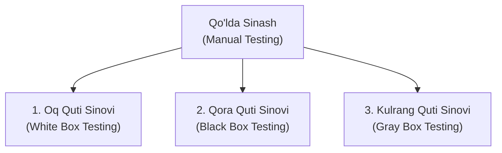
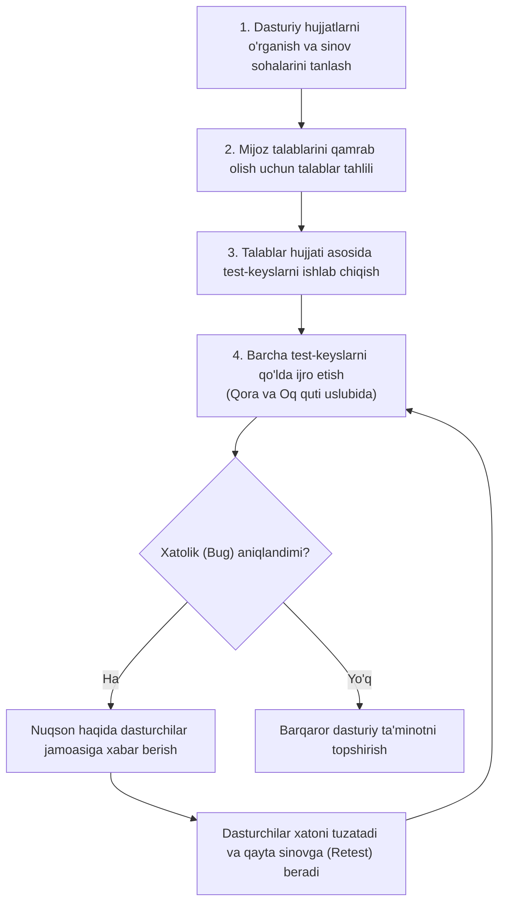
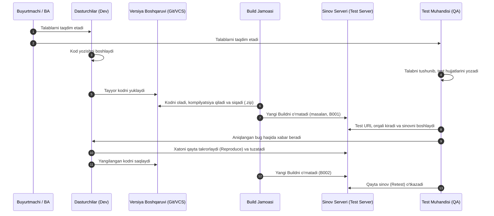

import { Callout } from 'nextra/components'

# Qo'lda Sinash (Manual Testing in Software Testing)

**Qo'lda sinash (Manual Testing)** — dasturiy ta'minotni hech qanday avtomatlashtirish vositalaridan foydalanmagan holda, test-keyslarni test muhandisi (QA) tomonidan inson omili yordamida qo'lda ijro etish jarayonidir.

Ushbu jarayonda dasturiy ta'minotning funksionalligi yakuniy foydalanuvchi (end-user) nuqtai nazaridan belgilangan talablarga muvofiqligi tekshiriladi. Ushbu qo'llanmada siz qo'lda sinash nima ekanligi, uning maqsadlari, jarayoni, yig'ilma (build) hayotiy sikli, afzalliklari, kamchiliklari hamda sohada keng qo'llaniladigan vositalar bilan batafsil tanishasiz.

---

## Qo'lda Sinash Nima? (What is Manual Testing?)

**Qo'lda sinash** — bu dasturiy ilovaning funksionalligi, foydalanish qulayligi (usability) va xatti-harakatlarini tekshirish uchun test muhandislari test-keyslarni bevosita qo'lda bajaradigan dasturiy ta'minotni sinash texnikasidir. Sinovchi nuqsonlarni (xatoliklarni) aniqlash uchun **amaldagi natija (Actual Result)** bilan **kutilayotgan natijani (Expected Result)** o'zaro taqqoslaydi.

Qo'lda sinash jarayonida test-keyslar dasturiy talablar spetsifikatsiyasi (SRS) asosida oldindan tayyorlanadi va avtomatlashtirish vositalarining yordamisiz ijro etiladi. Kutilgan va amaldagi natijalar o'rtasida har qanday tafovut yuzaga kelsa, u xatolik (**defect / bug**) sifatida ro'yxatga olinadi. Dasturchilar guruhi xatolikni bartaraf etgach, muammo to'liq hal qilinganligini tasdiqlash uchun ilova qayta sinovdan (**retest**) o'tkaziladi.

Qo'lda sinash odatda dasturiy ta'minotni ishlab chiqishning dastlabki bosqichlarida amalga oshiriladi va avtomatlashtirilgan testlarni joriy etishdan oldin majburiy hisoblanadi. Shuningdek, u tadqiqiy sinov (exploratory testing), qulaylik sinovi (usability testing) hamda insoniy kuzatuv va mulohazani talab qiladigan vaziyatlar uchun eng maqbul usuldir.

Qo'lda sinash dasturiy ta'minot sifatini ta'minlashning ajralmas qismi bo'lib qolmoqda, chunki foydalanuvchi tajribasi (UX), qulaylik va nostandart kashfiyot ssenariylari inson tomonidan baholanishi shart va ularni to'liq avtomatlashtirish imkonsizdir.

---

## Nima Uchun Qo'lda Sinash Zarur? (Why We Need Manual Testing)

Har qanday dasturiy ilova bozorga chiqarilganda, agar u beqaror bo'lsa, xatoliklarga ega bo'lsa yoki foydalanuvchilar undan foydalanishda muammolarga duch kelsa, bu biznes uchun katta yo'qotishlarga olib keladi.

Bunday salbiy oqibatlarning oldini olish uchun dasturiy ta'minotni xatolardan xoli, barqaror holatga keltirish va buyurtmachiga yuqori sifatli mahsulotni yetkazib berish maqsadida kamida bir raund sinov o'tkazishimiz shart. Ilova qanchalik xatolardan xoli bo'lsa, yakuniy foydalanuvchi undan shunchalik mamnuniyat bilan va qulay foydalanadi.

Agar test muhandisi qo'lda sinovni bajarsa:
1. U ilovani **yakuniy foydalanuvchi nigohi bilan** sinab ko'radi va mahsulot bilan yaqindan tanishadi.
2. Bu ularga dastur uchun eng to'g'ri va real test-keyslarni yozishga yordam beradi.
3. Ilovaning holati va sifati bo'yicha jamoaga eng tezkor fikr-mulohaza (feedback) taqdim etish imkonini yaratadi.

---

## Qo'lda Sinashning Asosiy Turlari (Types of Manual Testing)

Qo'lda sinashda turli xil yondashuvlar qo'llaniladi. Har bir texnika o'zining sinov mezonlariga muvofiq ishlatiladi:

### 1. Oq Quti Sinovi (White Box Testing)
Oq quti sinovi **dasturchi (Developer)** tomonidan amalga oshiriladi. Unda dasturchi kodni test muhandisiga topshirishdan oldin uning har bir satrini sinchiklab tekshirib chiqadi. Sinov paytida dastur kodi dasturchiga to'liq ko'rinib turganligi sababli, u "Oq quti sinovi" deb ataladi.

### 2. Qora Quti Sinovi (Black Box Testing)
Qora quti sinovi **test muhandisi (Test Engineer / QA)** tomonidan amalga oshiriladi. Unda test muhandisi ilova yoki dasturiy ta'minotning funksionalligini mijoz / buyurtmachining talablariga muvofiq tekshiradi. Ushbu jarayonda dastur kodi test muhandisiga ko'rinmaydi, shu sababli u "Qora quti sinovi" deb yuritiladi.

### 3. Kulrang Quti Sinovi (Gray Box Testing)
Kulrang quti sinovi — bu oq quti va qora quti sinovlarining kombinatsiyasidir. U ham dasturlashni, ham sinashni yaxshi tushunadigan mutaxassis tomonidan amalga oshiriladi. Agar bitta mutaxassis ilova uchun ham oq quti, ham qora quti sinovlarini bajarsa, bu jarayon kulrang quti sinovi hisoblanadi.

<Callout type="info">
Qo'lda sinash turlari (Oq quti, Qora quti va Kulrang quti) texnikalari va batafsil taqqosini o'rganish uchun alohida **[Qo'lda sinash turlari (Types of Manual Testing)](/docs/types-of-testing/manual-testing/types-of-manual-testing)** sahifasiga qarang.
</Callout>

---

## Qo'lda Sinash Qanday Bajariladi? (How to Perform Manual Testing)

Qo'lda sinov quyidagi tizimli ketma-ketlikda amalga oshiriladi:

1. Avvalo, test muhandisi sinov sohalarini tanlab olish uchun dasturiy ta'minotga tegishli barcha hujjatlarni kuzatadi va o'rganadi.
2. Mijoz tomonidan bildirilgan barcha talablarni to'liq qamrab olish maqsadida talablar hujjatlarini tahlil qiladi.
3. Talablar hujjati asosida batafsil test-keyslarni ishlab chiqadi.
4. Barcha test-keyslar qora quti va oq quti usullaridan foydalangan holda qo'lda ijro etiladi.
5. Agar xatoliklar (buglar) yuzaga kelsa, test jamoasi bu haqda ishlab chiquvchilar guruhiga xabar beradi.
6. Dasturchilar xatoliklarni bartaraf etadi va qayta sinovdan o'tkazish (**retest**) uchun dasturni qaytadan test guruhiga topshiradi.

---

## Dasturiy Yig'ilma Jarayoni (Software Build Process)

Dasturiy ta'minotni yaratish va sinashda **Build (yig'ilma)** jarayoni o'ta muhim bo'g'indir:

### Jarayon Bosqichlari:
1. Talablar yig'ilgach, ular bir vaqtning o'zida ikkita alohida jamoaga — ishlab chiqish (Dev) va sinov (QA) guruhlariga taqdim etiladi.
2. Talablarni olgach, tegishli dasturchi dastur kodini yozishga kirishadi.
3. Ayni shu vaqtda test muhandisi talablarni chuqur o'rganadi va kerakli sinov hujjatlarini (test-keyslarni) tayyorlaydi. Shu vaqtga kelib dasturchi kodni yozib tugatishi va uni **Versiyalarni Boshqarish Vositasi (Control Version Tool / VCS)**ga saqlashi mumkin.
4. Shundan so'ng, foydalanuvchi interfeysidagi (UI) o'zgarishlar alohida guruh — **Build jamoasi** tomonidan qabul qilinadi.
5. Build jamoasi ushbu kodni oladi va maxsus build vositalari yordamida uni kompilyatsiya qiladi hamda siqadi (compress). Olingan natija arxiv fayliga (zip) joylashtiriladi, bu esa **Build (yig'ilma)** deb ataladi. Har bir yig'ilma o'zining unikal raqamiga ega bo'ladi (masalan, `B001`, `B002`).
6. So'ngra ushbu maxsus Build sinov serveriga (Test Server) o'rnatiladi. Test muhandisi maxsus **Test URL** orqali ushbu sinov serveriga kiradi va ilovani sinashni boshlaydi.
7. Agar test muhandisi biron-bir nuqson topsa, u haqda tegishli dasturchiga xabar beradi.
8. Dasturchi xatolikni sinov serverida qayta takrorlaydi (reproduce), uni tuzatadi va kodni yana versiyalarni boshqarish vositasiga joylaydi. Tizimga yangi yangilangan fayl o'rnatiladi va eski fayl o'chiriladi. Ushbu jarayon to barqaror yig'ilma olinmaguncha uzluksiz davom etadi.
9. Barqaror yig'ilma olingach, u mijozga topshiriladi.

---

## Yig'ilma Jarayoniga Oid Muhim Eslatmalar

### 1-Eslatma: Kompilyatsiya va Test Serveri
Kodni versiyalarni boshqarish vositasidan olganimizdan so'ng, yuqori darajali tildan (High-level language) mashina tiliga (Machine level language) o'girish uchun build vositasidan foydalanamiz. Kompilyatsiyadan keyin fayl hajmi oshsa, u siqiladi (zip) va test serveriga yuklanadi.

Bu jarayon Build jamoasi, dasturchi (agar build jamoasi bo'lmasa) yoki test yetakchisi (Test Lead) tomonidan amalga oshiriladi.

<Callout type="warning">
Odatda har bitta kichik xatolik (bug) uchun alohida yangi Build chiqarilmaydi. Aks holda, vaqtning asosiy qismi faqat build yaratishga sarflanib ketgan bo'lardi.
</Callout>

### 2-Eslatma: Asosiy Tushunchalar

- **Build Jamoasi (Build Team):** Ularning asosiy vazifasi — dastur yoki Buildni yaratish hamda yuqori darajadagi dasturlash tilini quyi darajadagi mashina tiliga o'tkazishdan iborat.
- **Build (Yig'ilma):** Bu dastur kodini ishchi ilova formatiga aylantirish natijasidir. U dastur barqaror bo'lguncha sinov o'tkazish maqsadida test muhandisiga topshiriladigan ma'lum bir funksiyalar to'plami va tuzatilgan xatoliklardan iborat dasturiy versiyadir.
- **Versiyalarni Boshqarish Vositasi (Control Version Tool / VCS):**
  - Turli xil fayllarni xavfsiz saqlash imkonini beradi.
  - Har doim himoyalangan, chunki fayllarga faqat tasdiqlangan login ma'lumotlari orqali kiriladi.
  - Asosiy vazifasi — mavjud fayllarga kiritilgan har bir o'zgarishni tarix bo'yicha kuzatib borishdir (tracking).

### Real Hayotiy Misol: Yig'ilma Jarayoni Qanday Ishlaydi?

Test muhandisi nuqsonni aniqlagan zahoti dasturchiga yuboradi. Dasturchiga uni tahlil qilish uchun ma'lum vaqt kerak bo'ladi va shundan keyingina u xatoni tuzatadi (test muhandisi bir vaqtning o'zida hamma xatolar to'plamini birdaniga berib bo'lmaydi).

Dasturchi o'z vaqt imkoniyatidan kelib chiqib qancha xatoni tuzata olishini belgilaydi. Test muhandisi esa o'z ehtiyojlariga qarab qaysi xato birinchi navbatda tuzatilishi kerakligini (**ustuvorlik / priority**) hal qiladi, chunki test muhandislari sinovni to'xtatib tura olmaydilar.

Test muhandisi xatlar orqali qaysi xatolar tuzatilganligini (tuzatilgan buglar ro'yxatini) bilib oladi. Dastlabki yig'ilmalarda vaqt ko'proq ketadi, chunki dasturchilar turli funksiyalarni yangidan yozadilar. Yakuniy bosqichlarda esa faqat xatolar tuzatiladi va kunlar sarfi qisqarib boradi.

### 3-Eslatma: Sinov Sikli va Yig'ilmalar Statistikasi

- **Sinov Sikli (Test Cycle):** Har bir yangi yig'ilmani (Build) sinash uchun test muhandisiga ajratilgan vaqt davomiyligi.
- **Ikki Yig'ilma O'rtasidagi Farq:** Bitta buildda topilgan xatolar keyingi istalgan yangi buildda tuzatilishi mumkin. Har bir yangi yig'ilma eskisining o'zgartirilgan versiyasi bo'lib, bu o'zgarishlar tuzatilgan xatolar yoki yangi qo'shilgan funksiyalardan iborat bo'ladi.
- **Yangi Yig'ilma Qanchalik Tez-tez Olinadi?** Dastlabki bosqichlarda yig'ilmalar **haftasiga bir marta** beriladi. Ilova barqarorlasha boshlagan kechki bosqichlarda esa yangi yig'ilma **har 3 kunda, 2 kunda yoki hatto har kuni** taqdim etiladi.
- **Nechta Yig'ilma Olinadi?** Bir yillik o'rtacha loyiha davomiyligi hisoblansa, jami taxminan **22 - 26 ta Build** olinadi.
- **Xatolar Tuzatilganini Qachon Bilamiz?** Odatda tuzatilgan xatoliklar sinov sikli to'liq yakunlangach yoki tuzatilgan xatolar to'plami keyingi yig'ilmaga kiritilib, test jamoasiga topshirilgandagina ma'lum bo'ladi.

---

## Qo'lda Sinashning Afzalliklari va Kamchiliklari

| Afzalliklari (Advantages) | Kamchiliklari (Disadvantages) |
| :--- | :--- |
| **Dasturlash bilimi shart emas:** Qora quti usulidan foydalanganda kodlash bilimi talab etilmaydi. | **Katta inson resurslari talab etiladi:** Ko'p sonli test muhandislarini jalb qilish kerak bo'ladi. |
| **Dinamik GUI dizaynini sinash:** Tez-tez o'zgarib turadigan foydalanuvchi interfeysini sinash uchun juda qulay. | **Vaqt sarfining kattaligi:** Har bir test-keysni odam o'zi qo'lda bajarishi uzoq vaqt oladi. |
| **Real foydalanuvchi nigohi:** Tester dastur bilan haqiqiy foydalanuvchidek ishlaydi va qulaylik (usability) muammolarini oson topadi. | **Kafolatning yo'qligi:** Test-keyslar testerning shaxsiy tajribasiga tayanadi, barcha funksiyalar qamrab olinganini isbotlash qiyin. |
| **Kam xarajatli boshlanish:** Boshlang'ich bosqichda murakkab va qimmat freymvorklarni xarid qilish shart emas. | **Test-keyslarni qayta ishlatib bo'lmasligi:** Har bir yangi dastur uchun alohida test-keyslar ishlab chiqilishi shart. |
| **Yangi boshlovchilar uchun oson:** Yangi testerlar uchun o'rganish va tushunish juda yengil. | **Barcha jihatlarni qamrab ololmaslik:** Minglab foydalanuvchilar yuklamasini qo'lda sinashning imkoni yo'q. |

---

## Qo'lda Sinashda Qo'llaniladigan Asosiy Vositalar (Tools)

Qo'lda sinash jarayonida birlik, integratsion, xavfsizlik, unumdorlik sinovlarini yengillashtirish va nuqsonlarni boshqarish uchun quyidagi mashhur vositalardan foydalaniladi:

### 1. LoadRunner
Unumdorlikni (Performance) sinash uchun eng ko'p qo'llaniladigan vositalardan biri. LoadRunner turli xil dasturiy muhitlar va protokollar bo'yicha unumdorlik muammolarini tezkor aniqlashga yordam beradi.
- **Xususiyatlari:** Hisobotlarni oson tushunish uchun ko'plab tahliliy modullarga ega; keng qamrovli unumdorlik hisobotlarini beradi; taqsimlangan yuklama sinovi xarajatlarini kamaytiradi.

### 2. Citrus
Integratsion sinovlar uchun keng qo'llaniladigan, Java dasturlash tilida yozilgan test freymvorki. Server va mijoz o'rtasidagi so'rov-javoblarni tekshirish hamda XML va JSON fayllarini tekshirish (validatsiya) uchun xizmat qiladi.
- **Xususiyatlari:** Xabarlarni jo'natish va qabul qilish; ochiq manbali va tejamkor yechim; ma'lumotlar bazasini autentifikatsiya qilish; HTTP, JMS va SOAP protokollarini qo'llab-quvvatlaydi.

### 3. ZAP (Zed Attack Proxy)
OWASP tomonidan yaratilgan, ochiq manbali veb-ilovalarning xavfsizlik skaneri. Java tilida yozilgan bo'lib, kiberzaifliklarni aniqlashda juda samarali.
- **Xususiyatlari:** Windows, Linux va macOS tizimlarida ishlaydi; plaginlarga asoslangan qulay arxitektura; yangi funksiyalarni yuklab olish uchun ichki onlayn do'kon; qulay grafik interfeys (GUI).

### 4. NUnit
.NET platformasi uchun eng mashhur birlik sinov (Unit Testing) vositasi bo'lib, Java'dagi JUnit asosida ishlab chiqilgan. To'liq C# tilida yozilgan va barcha .NET tillariga mos keladi.
- **Xususiyatlari:** Assertlarni statik metod sifatida qo'llash; ma'lumotlarga asoslangan testlarni (Data-driven tests) qo'llab-quvvatlash; testlarni bir vaqtda (simultaneous) parallel ishga tushirish imkoniyati.

### 5. JIRA
Dasturiy ta'minotdagi xatoliklarni kuzatish (bug tracking) va loyihalarni boshqarish uchun dunyodagi eng mashhur vosita. Test muhandislari tomonidan aniqlangan barcha nuqsonlar va vazifalar aynan Jira orqali yuritiladi.
- **Xususiyatlari:** Vaqtni sezilarli tejaydi; nuqsonlar va loyiha vazifalarini to'liq nazorat qiladi; hujjatlashtirish va jamoa hisobotlarini vizual kuzatish imkonini beradi.

### 6. SonarQube
Kod sifati (Code Quality) va kod xavfsizligini uzluksiz nazorat qilish uchun mo'ljallangan vosita. Java tilida yozilgan bo'lib, Ant, Maven, Gradle va CI/CD tizimlari bilan integratsiyalashadi.
- **Xususiyatlari:** Ko'plab dasturlash tillarini qo'llab-quvvatlaydi (C, C++, Python, Java, JS, PHP va h.k.); GNU litsenziyasi ostida erkin tarqatiladi; GitHub, LDAP bilan ulanadi; SonarLint plagini orqali VS Code, IntelliJ IDEA muhitlariga kiritiladi.

### 7. JMeter (Apache JMeter)
Statik va dinamik resurslar hamda veb-ilovalarning unumdorligini (Performance) sinash uchun yaratilgan ochiq manbali Java vositasi.
- **Xususiyatlari:** Platformaga bog'liq emas (JVM bor barcha tizimlarda — Windows, Mac, Linux ishlaydi); intuitiv va sodda grafik interfeys (GUI); bir nechta turli serverlarga yuklama berish uchun kengaytiriluvchanlik.

### 8. Bugzilla
Ko'plab yirik tashkilotlar tomonidan dasturdagi nuqsonlarni kuzatish uchun qo'llaniladigan ochiq manbali test-menejment va bug tracking tizimi.
- **Xususiyatlari:** Turli operatsion tizimlarni qo'llab-quvvatlaydi; xatoliklarni bir nechta formatlarda eksport qiladi; elektron pochta xabarnomalarini sozlash imkoniyati; ilg'or qidiruv mexanizmi.

### 9. Mantis (MantisBT)
PHP tilida yozilgan, veb-asosidagi yengil va qulay ochiq manbali xatoliklarni kuzatish tizimi (Mantis Bug Tracker).
- **Xususiyatlari:** To'liq matnli qidiruv (Full-text search); masalalar ustida qilingan o'zgarishlarning audit tarixi (Audit trails); versiyalarni boshqarish tizimlari bilan integratsiya.

### 10. Tessy
O'rnatilgan tizimlar (embedded software) uchun birlik va integratsion sinovlarni amalga oshiruvchi vosita. Shuningdek, dasturning kod qamrovini (Code Coverage) aniqlashda yordam beradi.
- **Asosiy qismlari:** Sinov interfeysi muharriri (TIE), Sinov ma'lumotlari muharriri (TDE) hamda Ish maydoni (Workspace).
- **Xususiyatlari:** C va C++ tillarini to'liq qo'llab-quvvatlaydi; test natijalari bo'yicha batafsil hisobotlar yaratadi; funksiyalarning interfeysini va o'zgaruvchilarini avtomatik baholaydi.
