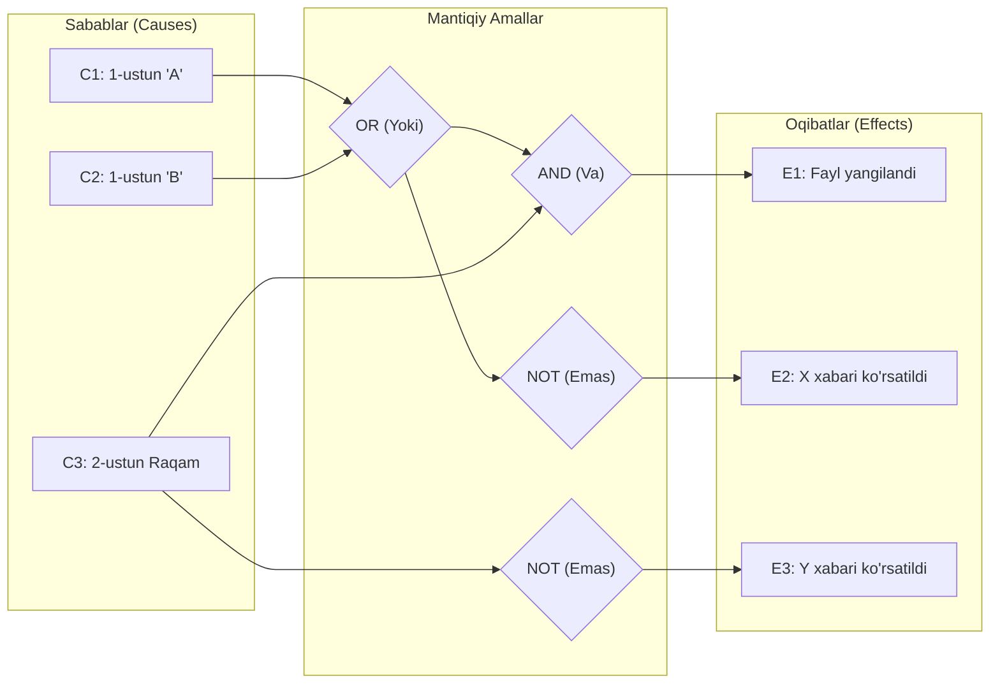

import { Callout } from 'nextra/components'

# Sabab-Oqibat Sinovi (Cause and Effect Graph Testing)

> Oxirgi yangilanish: 25-iyul, 2026

**Sabab-oqibat grafigi (Cause-Effect Graph)** — natija va ushbu natijaga ta'sir qiluvchi barcha omillar o'rtasidagi mantiqiy bog'liqlikni aniqlovchi qora quti sinov texnikasidir. U dinamik test keyslarni (dynamic test cases) loyihalash uchun keng qo'llaniladi.

Dinamik test holatlari dastur kodi foydalanuvchi kiritgan ma'lumotlarga qarab turlicha ishlaganda zarur bo'ladi. Masalan, elektron pochta tizimida to'g'ri manzil kiritilsa, tizim uni qabul qiladi; agar noto'g'ri manzil kiritilsa, xatolik xabarini chiqaradi. Ushbu texnikada kiruvchi shartlar **sabablar (causes)**, ushbu shartlar natijasida yuz beradigan xatti-harakatlar esa **oqibatlar (effects)** deb ataladi.

Ushbu usul dasturiy talablar to'plamiga asoslanib, tizimning maksimal sohasini qamrab oladigan eng minimal test keyslar sonini aniqlashga yordam beradi.

---

## Asosiy Afzalliklari

- **Vaqt va xarajatlarni tejash:** Testlarni bajarish vaqtini va sinov xarajatlarini sezilarli darajada kamaytiradi.
- **Maksimal qamrov:** Keraksiz takrorlanuvchi testlarni qisqartirgan holda dastur sifatini ta'minlash uchun zarur bo'lgan barcha muhim vaziyatlarni to'liq qamrab oladi.
- **Mantiqiy aniqlik:** Dastur talablarini `AND` (VA), `OR` (YOKI) va `NOT` (EMAS) mantiqiy operatorlari yordamida kiruvchi va chiquvchi holatlar o'rtasidagi qat'iy mantiqiy modelga aylantiradi.

---

## Sabab-Oqibat Grafigida Qo'llaniladigan Belgilar (Notations)

Sabab-oqibat grafigida asosiy mantiqiy amallar quyidagicha ifodalanadi:

1. **AND (VA):** `E1` — oqibat, `C1` va `C2` — sabablar. Agar `C1` ham, `C2` ham bir vaqtda rost (true) bo'lsagina, `E1` oqibati yuzaga keladi.
2. **OR (YOKI):** Agar `C1` yoki `C2` sabablaridan kamida bittasi rost bo'lsa, `E1` oqibati yuzaga keladi.
3. **NOT (INKOR / EMAS):** Agar `C1` sababi yolg'on (false) bo'lsa, `E1` oqibati yuzaga keladi.
4. **Mutually Exclusive (O'zaro bir-birini inkor etuvchi):** Bir vaqtning o'zida sabablardan faqat bittasi rost bo'lishi mumkin bo'lgan holat.

---

## Amaliy Misol (Situation)

Quyidagi amaliy vaziyatni ko'rib chiqamiz:

> **Vaziyat sharti:**  
> Dasturda fayl yangilanishi uchun 1-ustundagi belgi yo **"A"**, yo **"B"** bo'lishi, 2-ustundagi belgi esa albatta **raqam** bo'lishi kerak.
> - Agar 1-ustundagi belgi noto'g'ri bo'lsa ("A" ham, "B" ham emas), tizim **"X xabari"**ni ko'rsatadi.
> - Agar 2-ustundagi belgi noto'g'ri bo'lsa (raqam bo'lmasa), tizim **"Y xabari"**ni ko'rsatadi.

---

### Sabablar (Causes) va Oqibatlar (Effects) Ro'yxati

**Sabablar (Causes):**
- **C1:** 1-ustundagi belgi — "A"
- **C2:** 1-ustundagi belgi — "B"
- **C3:** 2-ustundagi belgi — raqam (digit)

**Oqibatlar (Effects):**
- **E1:** Fayl yangilandi `((C1 OR C2) AND C3)`
- **E2:** "X xabari" ko'rsatiladi `(NOT C1 AND NOT C2)`
- **E3:** "Y xabari" ko'rsatiladi `(NOT C3)`

---

### Sabab-Oqibat Grafigi Diagrammasi

---

## Oqibatlarning Mantiqiy Tahlili

1. **E1 oqibati — Fayl yangilandi:**  
   Ushbu natija hosil bo'lish mantig'i: `(C1 OR C2) AND C3`. `C1 OR C2` sharti bajarilishi uchun `C1` va `C2` dan kamida biri rost bo'lishi kifoya. `AND C3` esa 2-ustun albatta raqam bo'lishi shartligini anglatadi. Ya'ni, fayl yangilanishi uchun 1-ustun "A" yoki "B" bo'lishi VA 2-ustun raqam bo'lishi shart.
2. **E2 oqibati — "X xabari" ko'rsatildi:**  
   Ushbu natija mantig'i: `NOT C1 AND NOT C2`. Bu 1-ustundagi belgi "A" ham, "B" ham bo'lmagan holatda ishga tushadi. Grafikda ko'rinib turganidek, `C1 OR C2` inkor qilinib (`NOT`), natijada `E2` oqibati yuzaga keladi.
3. **E3 oqibati — "Y xabari" ko'rsatildi:**  
   Ushbu natija mantig'i: `NOT C3`. Bu 2-ustundagi belgi raqam bo'lmagan barcha holatlarda yuz beradi. Grafikda `C3` sababi `NOT` mantiqiy operatori orqali `E3` oqibatiga bog'langan.

---

## Xulosa

Test muhandisi avval talablardagi sabablar va oqibatlarni aniqlab, ularni mantiqiy ifodalarga aylantiradi, so'ngra sabab-oqibat grafigini tuzadi.

<Callout type="info">
Agar dastur kiritilgan sabablarga (input) muvofiq kutilgan oqibatlarni (output) to'g'ri bersa, funksiya nuqsonsiz hisoblanadi. Agar kutilgan va haqiqiy natijalar mos kelmasa, dasturchilar jamoasiga tuzatish uchun xatolik hisoboti (bug report) yuboriladi.
</Callout>
