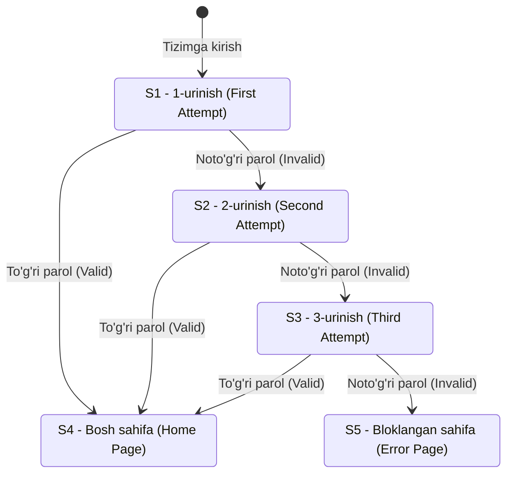

import { Callout } from 'nextra/components'

# Holat O'tishlari Sinovi (State Transition Testing)

**Holat o'tishlari sinovi (State Transition Testing)** — turli xil kiruvchi ma'lumotlar yoki hodisalar ta'sirida tizimning bir holatdan boshqa holatga o'tish xatti-harakatini tekshiradigan qora quti sinov texnikasidir. U dasturiy ta'minot ruxsat etilgan to'g'ri holatlar o'rtasida xatosiz harakatlanishini ta'minlaydi.

Ushbu bobda siz holat o'tishlari sinovi nima ekanligi, u qanday ishlashi hamda tizimga kirish (Login) urinishlari misolidagi amaliy o'tish jadvallari bilan tanishasiz.

---

## Holat O'tishlari Sinovi Nima? (What is State Transition Testing?)

**Holat o'tishlari sinovi** — tizimning chiqish natijasi nafaqat ayni paytdagi kiruvchi ma'lumotga, balki tizimning **joriy holatiga** ham bog'liq bo'lgan vaziyatlarda qo'llaniladigan qora quti sinov usulidir.

- **Holat (State):** dasturiy ta'minotning ayni vaqtdagi aniq sharti yoki vaziyati.
- **O'tish (Transition):** ma'lum bir hodisa (event) yoki kiritilgan ma'lumot (input) natijasida tizimning bir holatdan ikkinchi holatga ko'chishi.

### Hayotiy misol:
Masalan, bankomat (ATM) foydalanuvchi muvaffaqiyatli tranzaksiyani bajarganidan so'ng hisob tafsilotlarini ko'rsatadi. Agar foydalanuvchi yana bitta operatsiyani amalga oshirsa, aynan o'sha hisob tafsilotlari funksiyasi qayta ishga tushadi, lekin ekranda ko'rsatilayotgan ma'lumot o'zgaradi, chunki hisobdagi qoldiq balansi o'zgardi. Funksiya bir xil bo'lsa-da, natija hisobning **joriy holatiga** to'g'ridan-to'g'ri bog'liqdir.

Holat o'tishlari sinovi tizimning xatti-harakati oldingi amallarga qarab o'zgaradigan sohalarda keng qo'llaniladi:
- Avtorizatsiya va tizimga kirish tizimlari (Login systems)
- Bank va moliya ilovalari
- Ish jarayonlarini boshqarish (Workflow management) tizimlari
- O'rnatilgan tizimlar (Embedded systems)

---

## Amaliy Misol: Tizimga Kirish Urinishlari Cheklovi

Eng keng tarqalgan misollardan biri — tizimga kirishda noto'g'ri urinishlar sonining cheklanishidir. 

Aytaylik, ilovada foydalanuvchiga **ko'pi bilan 3 marta** urinish huquqi beriladi. Agar foydalanuvchi 3 marta ketma-ket noto'g'ri parol kiritsa, hisob bloklanadi va tizim xatolik sahifasiga o'tadi.

---

### 1-Holat O'tish Jadvali: Uchinchi urinish ham xato bo'lganda

Quyidagi jadvalda ketma-ket 3 marta noto'g'ri ma'lumot kiritilgandagi holat o'tishlari ko'rsatilgan:

| Holat (State) | Kirish urinishi (Login) | Tekshiruv (Validation) | Yangi holat (Redirected) |
| :---: | :--- | :---: | :---: |
| **S1** | 1-urinish (*First Attempt*) | Noto'g'ri (*Invalid*) | **S2** |
| **S2** | 2-urinish (*Second Attempt*) | Noto'g'ri (*Invalid*) | **S3** |
| **S3** | 3-urinish (*Third Attempt*) | Noto'g'ri (*Invalid*) | **S5** |
| **S4** | Bosh sahifa (*Home Page*) | — | — |
| **S5** | Xatolik sahifasi (*Error Page*) | — | — |

**Jarayon tahlili:**
- **S1** holati birinchi kirish urinishini bildiradi. Agar kiritilgan ma'lumot noto'g'ri bo'lsa, foydalanuvchi ikkinchi urinishga (**S2**) o'tkaziladi.
- Agar ikkinchi urinish ham noto'g'ri bo'lsa, tizim uchinchi urinish (**S3**) holatiga o'tadi.
- Agar uchinchi va oxirgi urinish ham noto'g'ri bo'lsa, foydalanuvchi to'g'ridan-to'g'ri xatolik sahifasiga (**S5**) yo'naltiriladi va hisob bloklanadi.

---

### 2-Holat O'tish Jadvali: Uchinchi urinish to'g'ri bo'lganda

Agar foydalanuvchi uchinchi urinishda to'g'ri ma'lumot kiritsa, u bosh sahifaga yo'naltiriladi:

| Holat (State) | Kirish urinishi (Login) | Tekshiruv (Validation) | Yangi holat (Redirected) |
| :---: | :--- | :---: | :---: |
| **S1** | 1-urinish (*First Attempt*) | Noto'g'ri (*Invalid*) | **S2** |
| **S2** | 2-urinish (*Second Attempt*) | Noto'g'ri (*Invalid*) | **S3** |
| **S3** | 3-urinish (*Third Attempt*) | To'g'ri (*Valid*) | **S4** |
| **S4** | Bosh sahifa (*Home Page*) | — | — |
| **S5** | Xatolik sahifasi (*Error Page*) | — | — |

---

## Xulosa

Holat o'tish jadvallari yordamida dasturiy ta'minotning murakkab o'tish mantiqlarini samarali sinovdan o'tkazish mumkin.

<Callout type="info">
Test muhandisi avval tizimning har bir holatida qanday kutilgan natija bo'lishi kerakligini aniqlab oladi va o'tish jadvalini tuzadi. So'ngra tizimni amalda sinab, u har bir hodisada kutilgan holatga to'g'ri o'tayotganligini tekshiradi.
</Callout>
