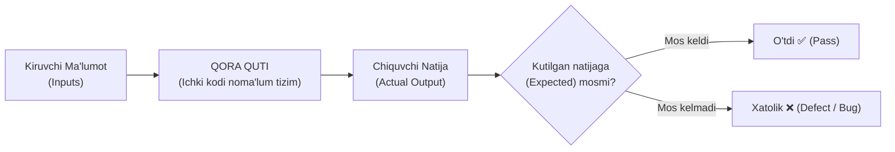
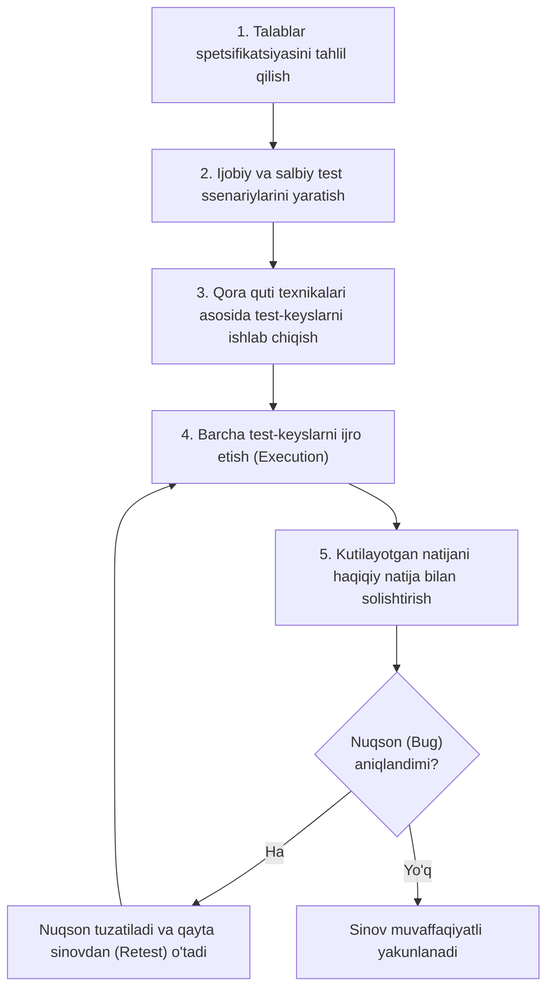
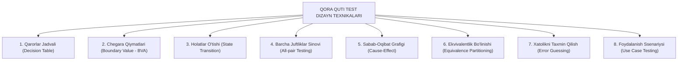

import { Callout } from 'nextra/components'

# Qora Quti Sinovi (Black Box Testing in Software Testing)

**Qora quti sinovi (Black Box Testing)** — dasturiy ta'minotning ichki kodi yoki implementatsiya tafsilotlarini o'rganmasdan turib, uning tashqi funksionalligini baholashga qaratilgan dasturiy sinov texnikasidir. U dasturiy ta'minotning belgilangan talablarga muvofiq to'g'ri ishlashini tekshiradi.

Ushbu bo'limda siz qora quti sinovi nima ekanligi, u qanday ishlashi, umumiy bosqichlari, sinov protsedurasi, test-keyslar yaratilishi hamda eng muhim sinov texnikalari bilan batafsil tanishasiz.

---

## Qora Quti Sinovi Nima? (What is Black Box Testing?)

**Qora quti sinovi** — bu test muhandisi tizimga kiruvchi ma'lumotlarni (Input) kiritib, olingan natijalar (Output) kutilayotgan natijalarga mos kelishini tekshirish orqali ilovaning funksionalligini tasdiqlaydigan sinov texnikasidir. Sinovchi ilovaning ichki manba kodi, arxitekturasi yoki dasturlash qanday amalga oshirilganligi haqida hech qanday ma'lumotga ega bo'lmaydi.

Test-keyslar dasturiy talablar spetsifikatsiyasi (SRS) va funksional talablar asosida tayyorlanadi. Sinov davomida tester turli xil foydalanuvchi ssenariylarini bajaradi, haqiqiy olingan natijani kutilgan natija bilan solishtiradi va har qanday tafovutni xatolik (**defect / bug**) sifatida ro'yxatga oladi.

Qora quti sinovining bosh maqsadi — dasturiy ta'minot yakuniy foydalanuvchi (end-user) nuqtai nazaridan to'g'ri ishlashini va belgilangan biznes hamda funksional talablarni to'liq qondirishini ta'minlashdir.

Odatiy sinov jarayonida test jamoasi ilovaning turli funksiyalari uchun mo'ljallangan funksional test-keyslarni bajaradi. Agar nuqsonlar aniqlansa, ular tuzatish uchun dasturchilar jamoasiga yuboriladi. Muammolar bartaraf etilgach, xatolar haqiqatan ham yo'qolganligini tasdiqlash uchun ilova qayta sinovdan (**retest**) o'tkaziladi.

---

## Qora Quti Sinovi Nimalarni Tekshiradi?

Qora quti sinovi quyidagi asosiy yo'nalishlarni tasdiqlash uchun keng qo'llaniladi:

1. **Funksional talablar (Functional requirements):** Tizimning har bir alohida xususiyati biznes talablariga mos ishlashi.
2. **Foydalanuvchi interfeysi xatti-harakati (UI behavior):** Tugmalar, menyular, oynalar va vizual elementlarning to'g'ri reaksiyasi.
3. **Kiritish va chiqarish validatsiyasi (Input & Output validation):** Ruxsat etilgan va taqiqlangan ma'lumotlar kiritilganda tizimning to'g'ri ishlov berishi.
4. **Xatoliklarni boshqarish (Error handling):** Noto'g'ri ma'lumotlar kiritilganda tushunarli xato xabarlarining (Error messages) chiqishi.
5. **Dasturiy komponentlar integratsiyasi (Component integration):** Turli modullar o'rtasida ma'lumotlar to'g'ri almashinayotganligi.
6. **Turli foydalanuvchi ssenariylarida tizim holati:** Foydalanuvchilarning real hayotdagi turli xatti-harakatlariga tizimning bardoshliligi.

---

## Qora Quti Sinovining Umumiy 6 Bosqichi (Generic Steps)

Qora quti sinovi quyidagi tartibli bosqichlar asosida amalga oshiriladi:

1. **1-bosqich:** Qora quti sinovi talablar spetsifikatsiyasiga asoslanadi, shuning uchun eng avvalo barcha talablar hujjati chuqur o'rganiladi.
2. **2-bosqich:** Dastur to'g'ri va noto'g'ri ma'lumotlarga qanday munosabat bildirishini tekshirish uchun sinovchi yaroqli (valid) qiymatlar asosida **ijobiy test ssenariylari (Positive scenarios)** hamda yaroqsiz (invalid) qiymatlar asosida **salbiy test ssenariylarini (Adverse/Negative scenarios)** shakllantiradi.
3. **3-bosqich:** Sinovchi qarorlar jadvali, barcha juftliklar sinovi, ekvivalentlik bo'linishi, xatolikni taxmin qilish, sabab-oqibat grafigi kabi texnikalardan foydalanib batafsil test-keyslarni ishlab chiqadi.
4. **4-bosqich:** Barcha ishlab chiqilgan test-keyslar dasturda ijro etiladi.
5. **5-bosqich:** Tester dasturdan olingan amaldagi natijani (Actual Output) kutilgan natija (Expected Output) bilan taqqoslaydi.
6. **6-bosqich:** Agar dasturda biron-bir nuqson aniqlansa, u dasturchilar tomonidan tuzatiladi va to'liq qayta sinovdan (**retest**) o'tkaziladi.

---

## Sinov Protsedurasi (Test Procedure)

Qora quti sinovining protsedurasi shunday jarayonki, unda test muhandisi dasturiy ta'minot qanday ishlashi bo'yicha aniq tushunchaga ega bo'ladi va funksiyalarning to'g'riligini tekshirish uchun test-keyslarni ishlab chiqadi.

Ushbu jarayonda dasturlash bilimlarini bilish talab etilmaydi. Barcha test-keyslar ma'lum bir funksiyaning **kiruvchi (Input)** va **chiquvchi (Output)** ma'lumotlarini hisobga olgan holda loyihalashtiriladi. Tester muayyan kirish qiymati uchun qanday aniq natija chiqishi kerakligini biladi, biroq bu natija kod darajasida qanday hosil bo'layotganini ko'rmaydi.

---

## Test-keyslar (Test Cases)

Test-keyslar talablar spetsifikatsiyasini hisobga olgan holda yaratiladi. Ular odatda dasturning ishchi tavsifi, jumladan talablar, dizayn parametrlari va boshqa texnik spetsifikatsiyalar asosida shakllantiriladi:
- Test dizayneri to'g'ri natijani tasdiqlash uchun yaroqli ma'lumotlar bilan **ijobiy test ssenariylarini (Positive scenarios)** hamda noto'g'ri ma'lumotlar bilan **salbiy test ssenariylarini (Adverse scenarios)** ishlab chiqadi.
- Test-keyslar asosan funksional sinov uchun mo'ljallangan, biroq ulardan nofunksional sinovlarda ham foydalanish mumkin.
- Barcha test-keyslar faqat test guruhi tomonidan yaratiladi va bu jarayonda dasturchilar jamoasi ishtirok etmaydi.

---

## Qora Quti Sinovida Qo'llaniladigan 8 Asosiy Texnika

Qora quti sinovida eng kam testlar bilan eng yuqori natijaga erishish uchun quyidagi 8 ta asosiy texnika qo'llaniladi:

### 1. Qarorlar Jadvali Texnikasi (Decision Table Technique)
Tizimli yondashuv bo'lib, unda turli xil kiruvchi parametrlar kombinatsiyasi va ularga mos tizim xatti-harakati jadval ko'rinishida tasvirlanadi. Ushbu usul ikkita yoki undan ortiq kirish qiymatlari o'rtasida mantiqiy bog'liqlik mavjud bo'lgan funksiyalarni sinash uchun juda mos keladi.

### 2. Chegara Qiymatlari Texnikasi (Boundary Value Analysis — BVA)
Chegaraviy qiymatlarni sinash uchun qo'llaniladi. Chegara qiymatlari — bu o'zgaruvchining quyi (minimal) va yuqori (maksimal) limitlarini o'z ichiga olgan nuqtalardir. Ushbu texnika chegara qiymatlari kiritilganda dasturiy ta'minot to'g'ri natija berayotganini yoki xatolikka yo'l qo'yayotganini tekshiradi.

### 3. Holatlar O'tishi Texnikasi (State Transition Technique)
Bir xil funksiyaga turli xil kiruvchi qiymatlar berilganda, dasturiy ilovaning holati bir holatdan ikkinchisiga qanday o'zgarishini kuzatish uchun ishlatiladi. Bu texnika tizimga kirish uchun ma'lum bir cheklangan urinishlar sonini taqdim etadigan ilovalar uchun qo'llaniladi (masalan, bankomat yoki foydalanuvchi akkauntida parolni 3 marta noto'g'ri kiritganda akkauntning bloklanishi).

### 4. Barcha Juftliklar Sinovi Texnikasi (All-pair Testing Technique)
Kiruvchi qiymatlarning barcha mumkin bo'lgan diskret kombinatsiyalarini juftliklar bo'yicha sinash uchun ishlatiladi. Ushbu kombinatorik usul belgilash katakchalari (checkbox), radiotugmalar (radio button), ochiluvchi ro'yxatlar (list box) va matn maydonlaridan (text box) foydalanadigan shakllarni samarali sinashda keng qo'llaniladi.

### 5. Sabab-Oqibat Texnikasi (Cause-Effect Technique)
Berilgan yakuniy natija (oqibat) va ushbu natijaga ta'sir qiluvchi barcha omillar (sabablar) o'rtasidagi bog'liqlikni aniqlaydi. U to'plangan talablar spetsifikatsiyasiga tayanadi va murakkab biznes qoidalarini vizual grafik ko'rinishida ifodalaydi.

### 6. Ekvivalentlik Bo'linishi Texnikasi (Equivalence Partitioning — EP)
Dasturiy ta'minotni sinash texnikasi bo'lib, unda kiruvchi ma'lumotlar to'plami yaroqli (valid) va yaroqsiz (invalid) guruhlarga (bo'laklarga) bo'linadi. Ushbu texnikada har bir bo'lakdagi barcha qiymatlar tizimda bir xil xatti-harakatni ko'rsatishi shart deb qabul qilinadi va har bir guruhdan bittadan qiymat tanlab olinadi.

### 7. Xatolikni Taxmin Qilish Texnikasi (Error Guessing Technique)
Xatoliklarni aniqlash uchun hech qanday qat'iy matematik qoidaga ega bo'lmagan usul. U to'liq test tahlilchisining (QA) shaxsiy tajribasi va mahoratiga tayanadi. Sinovchi o'z tajribasidan kelib chiqib, dasturchilar dasturning qaysi nozik qismlarida ko'proq xato qilishi mumkinligini taxmin qiladi (masalan, nolga bo'lish, bo'sh joy qoldirish, maxsus belgilar kiritish).

### 8. Foydalanish Ssenariysi Texnikasi (Use Case Technique)
Tizimdan foydalanish tartibiga muvofiq, tizimning boshidan to oxirigacha (End-to-End) bo'lgan test-keyslarni aniqlash uchun qo'llaniladi. Ushbu texnika yordamida test jamoasi har bir funksiyaning boshlang'ich nuqtasidan yakuniy natijasigacha bo'lgan butun dasturiy zanjirni to'liq tekshiruvchi yaxlit test ssenariylarini yaratadi.
