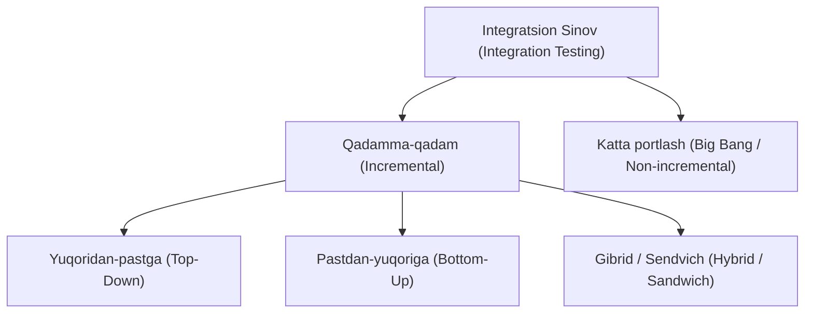

import { Callout } from 'nextra/components'

# Integratsion Sinov (Integration Testing)

**Integratsion sinov (Integration Testing)** — alohida sinovdan o'tkazilgan dasturiy birliklar yoki modullar birlashtirilib, guruh sifatida tekshiriladigan sinovning ikkinchi darajasidir. U integratsiya qilingan komponentlarning o'zaro to'g'ri aloqa qilishini va ma'lumotlarni xatosiz almashishini tekshiradi.

Ushbu bobda siz integratsion sinov nima ekanligi, u qanday ishlashi, qo'llaniladigan uslub va texnikalar, afzalliklari hamda kamchiliklari bilan tanishasiz.

---

## Integratsion Sinov Nima? (What is Integration Testing?)

**Integratsion sinov** — ikki yoki undan ortiq alohida sinovdan o'tgan modullar birlashtirilib, ularning o'zaro ta'sirini tekshiruvchi sinov bosqichidir. U **Birlik sinovi (Unit Testing)**dan so'ng va **Tizimli sinov (System Testing)**dan oldin amalga oshiriladi.

Integratsion sinovning asosiy maqsadi — integratsiya qilingan modullar o'rtasidagi aloqa jarayonida yuzaga keladigan nuqsonlarni aniqlashdir. Bu jarayonda:
- Ma'lumotlar to'g'ri uzatilishi,
- Interfeyslar kutilganidek ishlashi,
- O'zaro bog'liq modullar xatoliklarsiz muloqot qilishi tekshiriladi.

Dasturiy ta'minotda turli modullar ko'pincha mustaqil ravishda ishlab chiqiladi. Har bir modul birlik sinovlari orqali tasdiqlangandan so'ng, ular birlashtiriladi va to'liq funksionallik kutilgandek ishlashini ta'minlash uchun sinovdan o'tkaziladi.

---

## Amaliy Misol: Pul O'tkazmasi (Fund Transfer)

Bank ilovasida mablag' o'tkazish funksiyasini ko'rib chiqaylik:

1. Dastlab **P** foydalanuvchisi sifatida tizimga kirib, **Q** foydalanuvchisiga 200 so'm pul o'tkazamiz. Ekranda *"Mablag' muvaffaqiyatli o'tkazildi"* degan tasdiqlash xabari chiqishi kerak.
2. So'ngra **P** hisobidan chiqib, **Q** hisobiga kiramiz va uning balansini tekshiramiz: `Yangi balans = Dastlabki balans + Qabul qilingan summa`. Agar summa to'g'ri qo'shilgan bo'lsa, integratsion sinov muvaffaqiyatli hisoblanadi.
3. Shuningdek, **P** hisobidagi qoldiq mablag' ham 200 so'mga kamayganligi tekshiriladi.
4. Tranzaksiyalar tarixida **P** va **Q** foydalanuvchilari uchun pul o'tkazmasining aniq vaqti va sanasi to'g'ri aks etishi kerak.

---

## Integratsion Sinov Qoidalari (Guidelines)

- Ilovaning har bir modulida **funksional sinov to'liq yakunlangandan so'nggina** integratsion sinovga o'tiladi.
- Sinov har doim **modulma-modul** amalga oshiriladi, bu orqali to'g'ri ketma-ketlik ta'minlanadi va birorta ham integratsiya ssenariysi qolib ketmaydi.
- Dastlab sinov ma'lumotlariga ko'ra bajariladigan test keyslar strategiyasi ishlab chiqiladi.
- Dastur arxitekturasi tahlil qilinib, birinchi navbatda tekshirilishi lozim bo'lgan muhim modullar va barcha ehtimoliy ssenariylar aniqlanadi.
- Har bir interfeysni sinchkovlik bilan tekshirish uchun test keyslar yaratiladi.
- Sinov uchun kiruvchi ma'lumotlar (test data) to'g'ri tanlanadi.
- Aniqlangan xatolar dasturchilarga xabar qilinadi va tuzatilgach, qayta tekshiriladi (retesting).
- **Ijobiy va salbiy integratsion sinovlar** o'tkaziladi:
  - *Ijobiy sinov:* Balans 15 000 so'm bo'lsa va 1 500 so'm o'tkazilsa, o'tkazma muvaffaqiyatli bajarilishi kerak (Pass).
  - *Salbiy sinov:* Balans 15 000 so'm bo'lsa va 20 000 so'm o'tkazilmoqchi bo'lsa, tizim o'tkazmani rad etishi kerak (Pass). Agar o'tkazma amalga oshib ketsa, bu tizimdagi jiddiy xatodir (Fail).

<Callout type="warning">
**Muhim qoida:** Har qanday dasturda funksional sinov majburiy, biroq integratsion sinov faqatgina modullar bir-biriga bog'liq bo'lgan taqdirdagina o'tkaziladi.  
Har bir integratsiya ssenariysi majburiy ravishda quyidagi zanjirga ega bo'lishi kerak:  
**Manba (Source) → Ma'lumot (Data) → Manzil (Destination)**  
Ssenariy ma'lumot belgilangan manzilga to'g'ri saqlangandagina integratsion ssenariy hisoblanadi (masalan, Gmail'da: *Manba* — Xat yozish oynasi, *Ma'lumot* — Xat matni, *Manzil* — Qabul qiluvchining Inbox'i).
</Callout>

---

## Gmail Ilovasida Integratsion Sinov Ssenariylari

1. **1-Ssenariy:**  
   Foydalanuvchi P sifatida kirib, "Yangi xat" (Compose) tugmasi bosiladi va alohida komponentlar funksional tekshiriladi. So'ngra "Yuborish" (Send) va "Qoralamalarga saqlash" (Drafts) tekshiriladi. Q ga xat yuborilgach, P ning "Yuborilgan xabarlar" (Sent) bo'limida bor-yo'qligi tekshiriladi. So'ng Q foydalanuvchi hisobiga kirib, xat kelganligi tekshiriladi.
2. **2-Ssenariy (Spam papkasi):**  
   Agar ma'lum bir kontakt spam sifatida belgilangan bo'lsa, u yuborgan barcha xatlar Inbox'ga emas, to'g'ridan-to'g'ri Spam papkasiga tushishi kerak.

### Sinovlarni tartibga solish bo'yicha muhim eslatmalar:
- Ayrim funksiyalar faqat funksional sinovdan o'tkazilsa, boshqalari talabga qarab ham funksional, ham integratsion sinovdan o'tadi.
- **Prioritetlash muhim:** qaysi funksiya va komponentlar birinchi bo'lib tekshirilishi kerakligini oldindan rejalashtirish lozim.
- Bir funksiyani to'liq sinab bo'lmasdan turib keyingisiga o'tmaslik kerak.

---

## Integratsion Sinov Nega Zarur?

Barcha modullar birlik sinovidan (Unit Testing) muvaffaqiyatli o'tgan bo'lsa ham, quyidagi sabablarga ko'ra integratsiya xatoliklari yuzaga kelishi mumkin:

- Har bir modul alohida dasturchi tomonidan yaratiladi, ularning dasturlash va mantiqiy yondashuvlari farq qilishi mumkin.
- Modullarning ma'lumotlar bazasi (DB) bilan o'zaro aloqasida xatoliklar uchrashi mumkin.
- Modul ishlab chiqish jarayonida talablar o'zgarishi yoki yangilanishi mumkin.
- Dasturiy modullar o'rtasida muvofiqlik (incompatibility) muammolari bo'lishi mumkin.
- Dasturiy ta'minotning apparat vositalari (hardware) bilan mosligini tekshirish zarurati.
- Modullar o'rtasida istisnolarni ushlash (exception handling) to'liq bo'lmasligi xatolarga olib kelishi mumkin.

---

## Integratsion Sinovda Qo'llaniladigan Texnikalar

Integratsion sinovda ham Qora quti, ham Oq quti texnikalaridan foydalaniladi:

### Qora quti texnikalari:
- Holat o'tishlari sinovi (*State Transition*)
- Qarorlar jadvali (*Decision Table*)
- Chegaraviy qiymatlar tahlili (*BVA*)
- Barcha juftliklar sinovi (*All-pairs Testing*)
- Sabab-oqibat grafigi (*Cause-Effect Graph*)
- Ekvivalentlik sinflariga ajratish (*Equivalence Partitioning*)
- Xatolikni taxmin qilish (*Error Guessing*)

### Oq quti texnikalari:
- Ma'lumotlar oqimi sinovi (*Data Flow Testing*)
- Boshqaruv oqimi sinovi (*Control Flow Testing*)
- Tarmoqlar qamrovi sinovi (*Branch Coverage Testing*)
- Qarorlar qamrovi sinovi (*Decision Coverage Testing*)

---

## Integratsion Sinov Turlari (Yondashuvlar)

Integratsion sinov asosan ikki toifaga bo'linadi:
1. **Qadamma-qadam integratsion sinov (Incremental Integration Testing)**
2. **Bir martalik / Katta portlash usuli (Non-incremental / Big Bang Method)**

---

### 1. Qadamma-qadam yondashuv (Incremental Approach)

Ushbu yondashuvda modullar birin-ketin, mantiqiy bog'liqlik tartibida qo'shib boriladi. Avval ikkita yoki undan ortiq modul birlashtirilib tekshiriladi, muvaffaqiyatli bo'lsa, keyingi modullar qo'shiladi.

> **Misol:** Elektron tijorat ilovasida ketma-ketlik:  
> **Kirish (Login) → Bosh sahifa → Qidiruv → Savatchaga qo'shish → To'lov → Tizimdan chiqish**

Ushbu yondashuv 3 ta asosiy uslubga bo'linadi:

#### A) Yuqoridan-pastga yondashuv (Top-Down Approach)
Yuqori darajadagi modullar quyi darajadagi modullar bilan bosqichma-bosqich sinovdan o'tkaziladi.
- **Afzalliklari:** Asosiy arxitektura va dizayn xatoliklari erta bosqichda aniqlanadi; dastlabki prototipni tezroq ko'rsatish mumkin.
- **Kamchiliklari:** Quyi modullar tayyor bo'lmaganda ko'plab steblar (stubs) yozish talab etiladi, quyi qatlamlar yetarli darajada sinovdan o'tmasligi mumkin.

#### B) Pastdan-yuqoriga yondashuv (Bottom-Up Approach)
Quyi darajadagi modullardan boshlanib, yuqoridagi modullarga qarab bosqichma-bosqich sinovdan o'tkaziladi.
- **Afzalliklari:** Xatoliklarni aniqlash osonroq; barcha modullar tayyor bo'lishini kutish shart emas.
- **Kamchiliklari:** Yuqori darajadagi muhim modullar eng oxirida sinovdan o'tadi; dastlabki prototipni ko'rsatib bo'lmaydi; drayverlar (drivers) yozish talab etiladi.

#### C) Gibrid / Sendvich yondashuv (Hybrid / Sandwich Approach)
Top-Down va Bottom-Up uslublarining kombinatsiyasi. Yuqori va quyi qatlamlar bir vaqtning o'zida o'rta qatlamga qarab sinovdan o'tkaziladi.

---

### 2. Katta portlash usuli (Big Bang / Non-incremental)

Barcha modullar to'liq ishlab chiqilgandan so'ng bir vaqtning o'zida birlashtirilib sinovdan o'tkaziladi.

- **Afzalliklari:** Kichik hajmdagi dasturiy tizimlar uchun juda mos va qulay.
- **Kamchiliklari:** Xatolik yuz bersa, uning aynan qaysi modul yoki interfeysdan kelib chiqqanini aniqlash juda qiyin; sinovga juda kam vaqt qoladi; ayrim interfeyslar e'tibordan chetda qolishi mumkin.

---

## Yordamchi Modullar: Steblar va Drayverlar (Stubs & Drivers)

Integratsiya jarayonida hali to'liq ishlab chiqilmagan modullarni almashtirib turish uchun steblar va drayverlar qo'llaniladi:

- **Steb (Stub):** Quyi darajadagi modul hali tayyor bo'lmaganda ishlatiladigan soxta (dummy) modul. U yuqori moduldan ma'lumotni qabul qilib, kerakli taxminiy natijani qaytaradi.
- **Drayver (Driver):** Yuqori darajadagi modul hali tayyor bo'lmaganda quyi modulni chaqiruvchi va unga ma'lumot uzatuvchi soxta boshqaruvchi moduldir.
