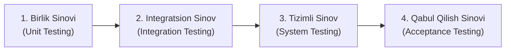

import { Callout } from 'nextra/components'

# Tizimli Sinov (System Testing)

> Oxirgi yangilanish: 25-iyul, 2026

**Tizimli sinov (System Testing)** — dasturiy ta'minot sinovining uchinchi darajasi bo'lib, unda to'liq va o'zaro integratsiya qilingan tizim yaxlit holda tekshiriladi. U tizimning belgilangan barcha funksional va nofunksional talablarga javob berishini tasdiqlaydi.

Ushbu bobda siz tizimli sinov nima ekanligi, u qanday ishlashi, sinov iyerarxiyasidagi o'rni, turlari, afzalliklari hamda amaliy misollar bilan batafsil tanishasiz.

---

## Tizimli Sinov Nima? (What is System Testing?)

**Tizimli sinov** — to'liq integratsiyalangan ilova ishlab chiqarish (production) muhitiga maksimal darajada yaqinlashtirilgan sharoitda sinovdan o'tkaziladigan texnikadir. U **Integratsion sinov (Integration Testing)**dan so'ng va **Qabul qilish sinovi (Acceptance Testing)**dan oldin o'tkaziladi.

Tizimli sinovning asosiy maqsadi — barcha dasturiy komponentlar birgalikda ishlaganda butun tizimning to'g'ri ishlashini tekshirishdir. U dasturning to'liq jarayonlarini (**End-to-End workflows**), biznes mantig'ini, interfeyslarini va tizimning umumiy xatti-harakatini belgilangan talablarga nisbatan baholaydi.

Alohida modullarni alohida sinash o'rniga, tizimli sinov dasturni yaxlit bir tizim sifatida ko'rib chiqadi. Barcha integratsiyalashgan qismlar, jumladan tashqi tizimlar va zaruriy apparat ta'minoti (hardware) bilan o'zaro aloqa to'g'ri yo'lga qo'yilganligi tekshiriladi.

Tizimli sinov davomida test muhandislari butun biznes ssenariylarini **oxirgi foydalanuvchi nigohi bilan** bajaradilar. Ular ilovaning turli modullari bo'ylab harakatlanib, har bir jarayon uchun kutilgan natijalar olinayotganligini tekshiradilar.

Tizimli sinov **Qora quti sinovi (Black Box Testing)** toifasiga kiradi, chunki bu bosqichda ichki kodga emas, balki tizimning tashqi xatti-harakatlariga va funksionalligiga qaraladi.

---

## Tizimli Sinovning Asosiy Bosqichlari

Tizimli sinov jarayoni quyidagi asosiy qadamlarni o'z ichiga oladi:

1. **Kirish funksiyalarini tekshirish:** Tizim kiritilgan ma'lumotlarga mos holda kutilgan natijani berayotganligini tekshirish.
2. **Integratsiyalangan dastur va tashqi qurilmalar o'zaro ta'sirini tekshirish:** Turli komponentlarning o'zaro uyg'un ishlashini baholash.
3. **Boshidan oxirigacha sinov (End-to-End Testing):** Foydalanuvchining butun harakat zanjirini to'liq tekshirish.
4. **Foydalanuvchi tajribasiga asoslangan xatti-harakat sinovi:** Tizimning foydalanishga qulayligi va barqarorligini baholash.

---

## 1-Amaliy Misol: Reklama Boshqaruv Tizimi (AMS)

Tasavvur qiling, biz yirik veb-portal (masalan, Rediff) va undagi Reklama Boshqaruv Tizimini (AMS) sinovdan o'tkazmoqdamiz.

### Tizimning ishlash zanjiri:
1. "Amazon" kompaniyasi 26-yanvar kuni soat 10:00 da Hindiston hududidagi foydalanuvchilar uchun bosh sahifada promo-reklama chiqarishni xohlaydi.
2. Sotuv menejeri tizimga kirib, ko'rsatilgan sana va vaqt uchun reklama arizasini yaratadi, reklama faylini (rasm yoki video) biriktiradi.
3. Reklama boshqaruvchisi (AMS menejeri) arizani ko'rib chiqadi, belgilangan vaqtda bo'sh reklama joyi borligini tekshiradi.
4. Agar joy bo'sh bo'lsa, narxni hisoblab chiqadi (masalan, soniyasiga $15, 10 soniyalik reklama uchun $150) va to'lov so'rovini yuboradi.
5. Amazon menejeri to'lov so'rovini tasdiqlab, to'lovni amalga oshiradi.
6. To'lov qabul qilingach, tizim avtomatik ravishda belgilangan vaqtda reklamani saytga joylashtiradi.

### Tizimli sinov ssenariylari:
- **1-Ssenariy (Standart oqim):** Yuqoridagi barcha qadamlar boshidan oxirigacha xatosiz o'tishi tekshiriladi.
- **2-Ssenariy (Bekor qilish va boshqa mijoz):** Agar Amazon menejeri narx qimmat deb arizani bekor qilsa, ayni o'sha vaqtga "Flipkart" arizasini kiritish mumkinligi tekshiriladi. Agar keyinchalik Amazon fikrini o'zgartirsa, o'sha vaqt allaqachon band bo'lgani sababli tizim yangi bo'sh vaqtlarni taklif qilishi kerak.
- **3-Ssenariy (Narxlarni boshqarish):** AMS menejeri tizimdan chiqish (Logout) sahifasidagi reklama narxini soniyasiga $10 qilib belgilasa, tizim 10 soniyalik reklama uchun to'g'ri $100 hisoblayotgani tekshiriladi.

---

## 2-Amaliy Misol: Bank Tizimidagi Overdraft Moduli

Bank tizimida **Kreditlar (Loans)**, **Sotuvlar (Sales)** va **Overdraft** kabi modullar mavjud bo'lib, ma'lumotlar oqimi ushbu modullar o'rtasida uzluksiz o'tishi kerak.

### Ssenariylar:
- **1-Ssenariy:**
  1. Mijoz P sifatida kirib, 15 000 so'm overdraft uchun ariza beradi va chiqadi.
  2. Menejer sifatida kirib, P ning arizasini tasdiqlaydi.
  3. P qayta kirib, hisobida 15 000 so'm paydo bo'lganini ko'radi.
  4. Tizim sanasi 30 kunga oldinga suriladi.
  5. P hisobida foiz va xizmat haqi qo'shilgan qarz ko'rinadi (15 000 + 300 + 200 = 15 500 so'm).
  6. P qarzni to'laydi va overdraft balansi 0 bo'ladi.
- **2-Ssenariy (Aksiya va istisnolar):** Birinchi marta 45 000 so'm olgan mijozdan xizmat haqi olinmaydi, ammo uchinchi marta olganda qaytarilmaydi. Ushbu biznes qoidasi to'g'ri ishlashi tekshiriladi.
- **3-Ssenariy (Talablar ziddiyati):** Agar mijoz 200 so'm xizmat haqi bo'lgan paytda ariza topshirgan bo'lsa, lekin menejer tasdiqlashidan oldin bank to'lovni 100 so'mga tushirsa, tizim qaysi stavkani qo'llashi kerak? Bunday holatlarda test jamoasi o'zboshimchalik bilan qaror qilmasdan, biznes tahlilchi (BA) yoki mijoz bilan aniqlik kiritishi shart.

---

## Tizimli Sinov Turlari

Tizimli sinovning 50 dan ortiq turlari mavjud bo'lib, amaliyotda eng ko'p qo'llaniladiganlari quyidagilardir:

- **Regressiya sinovi (Regression Testing):** Tizimning biror qismidagi o'zgarishlar mavjud funksiyalarga zarar yetkazmaganini va eski xatolar qaytmaganini tekshiradi.
- **Yuklama sinovi (Load Testing):** Tizim real foydalanuvchilar oqimi ostida qanday ishlashini aniqlaydi.
- **Funksional sinov (Functional Testing):** Tizimda barcha zaruriy funksiyalar mavjudligi va to'liq ishlashini tekshiradi.
- **Qayta tiklanish sinovi (Recovery Testing):** Tizim kutilmagan avariya, tizim qulashi (crash) yoki apparat nosozliklaridan keyin o'z holatini qanchalik tez va to'g'ri tiklay olishini tekshiradi.
  - Tizim qulaganda xatolik jurnali (log) yozilishi kerak (masalan, `C:/Program Files/.../crash.log`).
  - Dastur yopilishidan oldin o'z jarayonlarini xavfsiz to'xtatishi kerak.
  - Qayta ochilganda avvalgi holatni tiklash imkoniyatini taklif qilishi lozim (masalan, Google Chrome brauzerida elektr uzilgandan so'ng sessiyani qayta tiklash so'rovi).
- **Migratsiya sinovi (Migration Testing):** Tizimni yangi server yoki infratuzilmaga ko'chirganda muammosiz ishlashini tekshiradi.
- **Foydalanish qulayligi sinovi (Usability Testing):** Foydalanuvchi interfeysining qulay va tushunarli ekanligini tasdiqlaydi.
- **Dastur va uskunalar mosligi sinovi (Software and Hardware Testing):** Tizimning turli xil texnik vositalar bilan mosligini tekshiradi.

---

## Nega Tizimli Sinov O'ta Muhim?

1. Tizimning umumiy ishlashiga **100% kafolat** beradi, chunki barcha jarayonlar boshidan oxirigacha qamrab olinadi.
2. Dasturiy arxitektura va biznes talablarning to'liq uyg'unligini tekshiradi.
3. Mahsulot bozorga chiqqandan so'ng paydo bo'ladigan xavfli xatoliklarni oldindan kamaytiradi.
4. Yangi tizim bilan eski tizim natijalarini solishtirish imkonini yaratadi.

---

## To'liq Misol: Gmail Ilovasini Bosqichma-Bosqich Sinash

Gmail ilovasining turli modullarini (`Login`, `Compose`, `Draft`, `Inbox`, `Sent Item`, `Spam`, `Chat`, `Logout`) sinash:

Avval har bir modulda alohida **Funksional sinov**, so'ngra **Integratsion sinov**, oxirida esa **Tizimli sinov** o'tkaziladi.

### 1. Funksional Sinov — "Xat Yozish" (Compose) Moduli

#### "Kimga" (To) maydoni:
| Kiritish turi | Kiritilgan qiymat | Natija |
| :--- | :--- | :--- |
| **Ijobiy (Positive)** | `name@gmail.com`, `user.name@yahoo.com` | Qabul qilinadi |
| **Salbiy (Negative)** | `mike@yahoocom`, `@gmail.com` | Xatolik xabari |

*(CC va BCC maydonlari ham xuddi shu tartibda sinovdan o'tadi)*

#### "Mavzu" (Subject) maydoni:
| Kiritish turi | Kiritilgan qiymat | Natija |
| :--- | :--- | :--- |
| **Ijobiy (Positive)** | Chegaraviy matn, bo'sh joy, URL, nusxalab qo'yish | Qabul qilinadi |
| **Salbiy (Negative)** | Ruxsat etilgan uzunlikdan oshiq matn, rasm/video tashlash | Xatolik xabari |

#### Biriktirilgan fayllar (Attachment):
Faylning maksimal hajmi, turli formatlar, bir vaqtda bir nechta fayl yuklash, Drag & Drop, yuklashni bekor qilish va yuklangan faylni o'chirish sinovdan o'tkaziladi.

### 2. Integratsion Sinov

- **Login:** To'g'ri login/parol orqali kirib, bosh sahifada ism chiqishini tekshirish.
- **Compose → Sent:** Xat yozib yuborilgach, u jo'natuvchining "Yuborilganlar" (Sent) bo'limida ko'rinishi.
- **Compose → Inbox:** Xat yuborilgach, u qabul qiluvchining "Kiruvchi xabarlar" (Inbox) bo'limiga tushishi.
- **Compose → Drafts:** Yozilayotgan xat saqlanganda "Qoralamalar" (Drafts) bo'limiga joylashishi.
- **Inbox → Trash:** Xat o'chirilganda "Chiqindi qutisi" (Trash)ga tushishi.
- **Chat:** Onlayn va oflayn foydalanuvchilar bilan xabar almashish tarixi saqlanishi.

<Callout type="info">
**Eslatma:** Tizimli sinov barcha modullar to'liq ishlab chiqilib, birlik va integratsion sinovlar muvaffaqiyatli yakunlangandan keyingina to'liq quvvat bilan boshlanadi.
</Callout>
