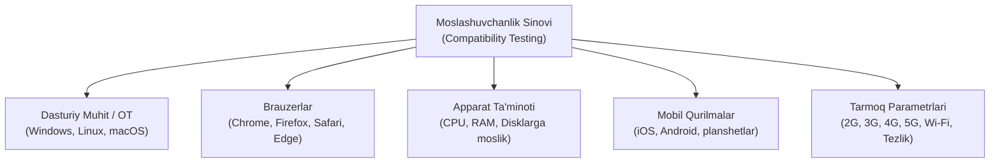

import { Callout } from 'nextra/components'

# Moslashuvchanlik Sinovi (Compatibility Testing)

> Oxirgi yangilanish: 25-iyul, 2026

Dasturiy ta'minot ishlab chiqilib, barqaror holatga kelgach, u ishlab chiqarish (*production*) muhitiga chiqariladi. Bu bosqichda ilovadan turli xil qurilmalar, operatsion tizimlar va brauzerlar orqali minglab foydalanuvchilar foydalana boshlaydi. 

Foydalanuvchilar o'z qurilmalarida qandaydir nosozlik yoki interfeys buzilishlariga duch kelmasliklari uchun mahsulot bozorga taqdim etilishidan oldin **Moslashuvchanlik sinovi (Compatibility Testing)** o'tkaziladi.

Ushbu bo'limda siz moslashuvchanlik sinovi nima ekanligi, u nima uchun va qachon o'tkazilishi, turlari, sinov jarayoni, uchraydigan nuqsonlar hamda zamonaviy sinov vositalari bilan tanishasiz.

---

## Moslashuvchanlik Sinovi Nima? (What is Compatibility Testing?)

**Moslashuvchanlik sinovi (Compatibility Testing)** — nofunksional sinovlar toifasiga kiruvchi dasturiy sinov texnikasi bo'lib, ilovaning turli xil operatsion tizimlar, apparat platformalari (hardware), tarmoq muhitlari va brauzerlarda to'g'ri ishlashini tekshiradi.

### Nega Moslashuvchanlik Sinovi Qo'llaniladi?
Dastur ishlab chiqarish serveriga yuklangach, undan turli xil platformalarda ko'plab insonlar foydalanadi. Agar dastur foydalanuvchining qurilmasida to'g'ri ochilmasa yoki uning brauzerida xatolik bersa, bu foydalanuvchini yo'qotishga olib keladi. Bunday muammolarni oldindan aniqlash va bartaraf etish uchun kamida bir raund moslashuvchanlik sinovi o'tkaziladi.

### Qachon O'tkaziladi?
Qoidaga ko'ra, dasturiy ta'minot avval **funksional jihatdan to'liq barqaror (functionally stable)** holatga kelishi lozim. Ilova o'z funksiyalarini xatosiz bajarganidan keyingina uning turli muhitlarda qanday ishlashi tekshiriladi.

<Callout type="info">
**Muhim eslatma:** Moslashuvchanlik sinovi har qanday dastur uchun ham o'tkazilavermaydi. U asosan yakuniy foydalanuvchilar qaysi platforma, qurilma yoki brauzerdan foydalanishini tashkilot nazorat qila olmaydigan ochiq ilovalar (ommaviy veb-saytlar, mobil ilovalar) uchun majburiydir.
</Callout>

---

## Moslashuvchanlik Sinovining Turlari

Moslashuvchanlik sinovi quyidagi asosiy toifalarga bo'linadi:

### 1. Dasturiy ta'minot va Operatsion tizimlar (Software / OS)
Ilovaning turli operatsion tizimlarda (Windows, Linux, macOS, Ubuntu, UNIX) hamda ularning turli xil versiyalarida to'g'ri ishlashi tekshiriladi.

Dasturiy ta'minot moslashuvchanligi ikki xil yo'nalishda o'tkaziladi:
- **Oldinga moslashuvchanlik sinovi (Forward Compatibility Testing):** Dasturni platformalarning yangi yoki eng oxirgi relizlarida sinash.  
  *Misol:* `Win 7 → Win 8 → Win 8.1 → Win 10 → Win 11`
- **Orqaga moslashuvchanlik sinovi (Backward Compatibility Testing):** Dasturni platformalarning eski yoki avvalgi versiyalarida sinash.  
  *Misol:* `Win 11 → Win 10 → Win 8 → Win 7 → Vista → XP`

Shuningdek, turli brauzerlar (Google Chrome, Mozilla Firefox, Apple Safari, Microsoft Edge) bo'yicha moslik ham tekshiriladi.

### 2. Apparat ta'minoti (Hardware)
Ilovaning turli xil texnik parametrlar bilan mosligi tekshiriladi:
- Operativ xotira hajmi (RAM: 4GB, 8GB, 16GB, 32GB);
- Protsessor turi va arxitekturasi (Intel, AMD, Apple Silicon — M1/M2/M3, ARM);
- Qattiq disk turlari (HDD, SSD);
- Videokarta (GPU) quvvati va ekran o'lchamlari.

### 3. Mobil moslashuvchanlik (Mobile)
Ilovaning iOS va Android operatsion tizimlarida, turli ekran nisbatlari, piksellar zichligi va planshetlarda to'g'ri ko'rinishi baholanadi.

### 4. Tarmoq moslashuvchanligi (Network)
Dasturiy ta'minotning turli tarmoq sharoitlarida ishlash qobiliyati tekshiriladi:
- Tarmoq tezligi va o'tkazuvchanligi (*bandwidth*);
- Ma'lumot uzatish hajmi (*capacity*);
- Ulanish turlari (Wi-Fi, 5G, 4G, 3G, zaif 2G tarmoqlari).

---

## Moslashuvchanlik Sinovining Eng Qiyin Qismi Nima?

Moslashuvchanlik sinovidagi eng murakkab vazifa — **aynan qaysi platformalarni sinash kerakligini to'g'ri tanlay bilishdir**.

Dunyoda mavjud barcha operatsion tizimlar, qurilmalar va brauzerlar kombinatsiyasida dasturni sinab chiqish juda ko'p vaqt va ulkan byudjet talab qiladi. Shu sababli, test muhandislari bozor tahlili va analitika ma'lumotlariga tayangan holda, maqsadli auditoriya eng ko'p foydalanadigan ommabop platformalarni tanlab oladilar.

---

## Operatsion Tizimlar Bo'yicha Sinov Jarayoni (Process)

Operatsion tizimlarda moslashuvchanlik sinovi odatda quyidagi tartibda amalga oshiriladi:

1. **Talablarni qabul qilish:** Buyurtmachi funksional va nofunksional talablarni taqdim etadi.
2. **Baza platformasini tanlash:** Nofunksional talablar asosida foydalanuvchilar eng ko'p ishlatadigan bitta platforma **baza platformasi** sifatida belgilanadi.
3. **Baza platformasida sinash:** Test muhandisi ilova funksional jihatdan to'liq barqarorlashguncha baza platformasida funksional sinovni o'tkazadi.
4. **Virtualizatsiya muhitini (VMware) sozlash:** Ilovani boshqa ko'plab operatsion tizimlarda tekshirish uchun virtual mashinalardan foydalaniladi.
5. **Masofaviy ulanish orqali sinash:** Test muhandisi **VM Server**ga masofaviy ish stoli (*Remote Desktop Connection*) orqali ulanadi va ilovaning to'liq jarayonini (**End-to-End flow**) turli platformalarda ketma-ket tekshirib chiqadi.
6. **Mijozga topshirish:** Barcha zaruriy platformalarda muammolar to'liq bartaraf etilgach, mahsulot buyurtmachiga topshiriladi.

<Callout type="warning">
**Brauzerlar va VMware:**  
- Bir xil tizimga turli xil brauzerlarni (Chrome, Firefox, Edge) bir vaqtda o'rnatish va bir vaqtda ishlatish mumkin, shuning uchun oddiy brauzerlar sinovi uchun VMware shart emas.  
- Ammo bir xil brauzerning **har xil versiyalarini** (masalan, Chrome 90 va Chrome 115) bitta operatsion tizimda bir vaqtda ishga tushirib bo'lmaydi. Bunday hollarda virtual mashinalar (VMware) yoki maxsus bulutli vositalardan foydalanish shart.
</Callout>

---

## Moslashuvchanlik Xatoliklari va Nuqsonlari (Compatibility Bugs)

Moslashuvchanlik xatoliklari — bu **bitta platformada yuzaga keladigan, ammo boshqa platformalarda kuzatilmaydigan** nosozliklardir.

Ko'pincha bu nuqsonlar foydalanuvchi interfeysi (UI) bilan bog'liq bo'ladi:

- **Tekislanish xatosi (Alignment issue):** Sahifadagi matnlar, rasmlar yoki tugmalarning o'z o'rnidan siljib, assimetrik bo'lib qolishi.
- **Ustma-ust tushish xatosi (Overlap issue):** Biror yozuv yoki blok boshqa elementning ustiga chiqib, matn o'qilmay qolishi.
- **Sochilib ketish xatosi (Scattered issue):** Ilova muayyan brauzer yoki platformaga moslashtirilmaganligi sababli sahifa bloklarining ekranda tartibsiz, sochilib ko'rinishi.
- **Tashqi ko'rinish buzilishi (Look and feel issue):** Ranglarning, shriftlarning yoki fon tasvirlarining xato aks etishi.

### Moslashuvchanlik muammosi va Funksional muammo farqi:
| Mezon | Moslashuvchanlik Muammosi (*Compatibility Issue*) | Funksional Muammo (*Functionality Issue*) |
| :--- | :--- | :--- |
| **Qamrovi** | Funksiya bir operatsion tizimda ishlamaydi, biroq boshqa barcha tizimlarda bekamu-ko'st ishlaydi. | Funksiya **hech qaysi** operatsion tizimda yoki platformada ishlamaydi. |
| **Sababi** | Yozilgan kod aynan o'sha muayyan platforma xususiyatiga to'g'ri kelmagan. | Dasturning asosiy biznes mantig'ida yoki kodida umumiy xatolik mavjud. |

---

## Moslashuvchanlik Sinovi Vositalari (Compatibility Testing Tools)

Kross-platformali va kross-brauzerli sinovlarni yengillashtirish uchun quyidagi ommabop vositalar qo'llaniladi:

### 1. LambdaTest
Bulutli muhitda ishlovchi ochiq manbali kross-brauzer sinov platformasi. Uning yordamida veb-ilovalarni deyarli har qanday mobil va desktop brauzerlarida, real qurilmalarda sinash mumkin. Sahifaning to'liq ekranli skrinshotlarini bir vaqtda turli o'lchamlarda olish imkonini beradi.

### 2. BrowserStack
Bozordagi eng mashhur va keng qo'llaniladigan platformalardan biri. Veb-saytlar va mobil ilovalarni yuzlab real brauzerlar, iOS va Android qurilmalarida masofadan sinash imkonini beradi.
- Asosiy mahsulotlari: **Live**, **Automate**, **App Live** va **App Automate**.
- Tashkilotga real qurilmalarni sotib olish xarajatlarini tejashga hamda sinov vaqtini qisqartirishga yordam beradi.

### 3. BrowseEMAll
Turli xil operatsion tizimlarda (Linux, Windows, macOS) kross-brauzer sinovlarini amalga oshiruvchi vosita. U lokal kompyuterda va ichki lokal tarmoqda internet kechikishlarisiz ishlaydi. Avtomatlashtirilgan testlarni yozib olish va ko'plab brauzerlarda ijro etish imkonini beradi.

### 4. TestingBot
Firefox, Chrome, Edge, Safari kabi ko'plab brauzerlar va ularning turli versiyalarida testlarni bajarish uchun qo'llaniladi. Turli brauzerlardagi skrinshotlarni o'zaro solishtirish hamda ilovaning responsiv (moslashuvchan) tartibini tekshirish uchun qulaydir.
